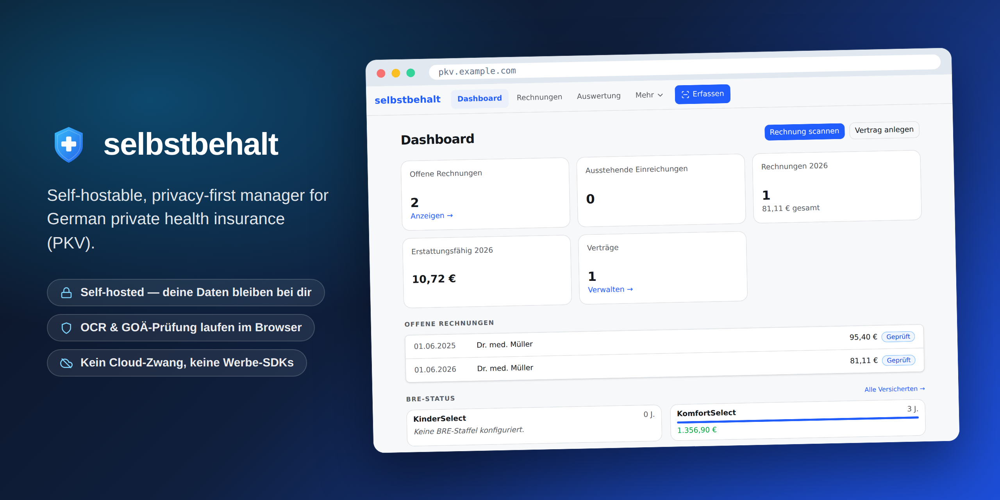

<p align="center">
  
</p>

<h1 align="center">selbstbehalt</h1>

<p align="center">
  Self-hostable, privacy-first manager for German private health insurance (PKV).
</p>

<p align="center">
  
</p>

---

> **Status:** Early development. The complete technical and functional specification lives in [`docs/design.md`](docs/design.md) (German) and is the single source of truth. Application code is still being scaffolded.

## What it does

Privately insured people in Germany juggle several administrative tasks for which no complete, privacy-compliant, self-hostable tool exists. **selbstbehalt** ("deductible") covers three of them:

- **Manage contracts** — keep multiple PKV contracts (full coverage, supplementary tariffs, Beihilfe) in one place.
- **Capture & check invoices** — scan doctor invoices, parse the line items against the GOÄ/GOZ/GOT fee schedules, and flag charges whose Steigerungsfaktor (multiplier) exceeds the legal limits (§5 GOÄ).
- **Günstigerprüfung** — decide, per invoice, whether to **submit it to the insurer** or **self-pay** to preserve your Beitragsrückerstattung (BRE, premium refund) — comparing the net reimbursement against the present value of the refund you'd forfeit by breaking your claim-free streak.

## Design principles

- **Privacy by design** — sensitive health data (invoice images, diagnoses) never leaves your device unencrypted. OCR runs entirely client-side in the browser.
- **Offline-first** — core data is available without an active server connection.
- **Minimal server** — the backend is only a persistent database and REST API. No AI/LLM workloads server-side (~128 MB RAM, no GPU).
- **DSGVO-compliant** — full self-hostability means no transfer of Art. 9 health data to third parties.

## Architecture

A pnpm monorepo with two workspaces:

- **`frontend/`** — SvelteKit (Svelte 5, TypeScript) Progressive Web App. Installable on Android/desktop, offline-capable. OCR runs in a Web Worker via PaddleOCR.js (PP-OCRv5) with WebGPU + WASM fallback.
- **`backend/`** — Hono (TypeScript) REST API on port 8080, backed by SQLite via Drizzle ORM.

Deployed via Docker Compose, intended for a home network (Proxmox LXC / NAS) with optional VPN access.

```
Browser PWA  ──(JSON metadata only, no images)──>  REST API  ──>  SQLite
   │
   └── Camera → client-side OCR → GOÄ parser → Günstigerprüfung
```

See [`docs/design.md`](docs/design.md) for the full data model, REST surface, OCR pipeline, and the Günstigerprüfung formula.

## Getting started (development)

Prerequisites: **Node.js 22 LTS** (see [`.nvmrc`](.nvmrc)) and **pnpm 10+**. With [Corepack](https://nodejs.org/api/corepack.html) enabled (`corepack enable`), the pinned pnpm version is used automatically.

```bash
pnpm install        # install all workspace dependencies
pnpm dev            # run frontend + backend dev servers (parallel)
pnpm build          # build every workspace package
pnpm lint           # lint every workspace package
pnpm test           # test every workspace package
pnpm typecheck      # type-check every workspace package
```

The repository is a [pnpm workspace](https://pnpm.io/workspaces) monorepo. The root scripts are pass-throughs that fan out to the workspace packages:

- [`frontend/`](frontend/) — SvelteKit PWA
- [`backend/`](backend/) — Hono REST API + SQLite

Both packages are currently placeholder scaffolds; their tooling (build, lint, test, type-check) is added in the follow-up Phase 0 / Phase 1 issues.

### License headers

Source files carry an [SPDX](https://spdx.dev/) short-form identifier as the first line (the full text lives in [`LICENSE`](LICENSE)):

```ts
// SPDX-License-Identifier: Apache-2.0
```

Use the comment syntax of the respective language (`#` for YAML/shell, `<!-- -->` for HTML/Svelte markup, etc.).

## Contributing

Contributions — code, data, docs, or bug reports — are welcome. See
[`CONTRIBUTING.md`](CONTRIBUTING.md) for setup, conventions, and the quality bar.

Every pull request is reviewed and approved by the maintainer
([@justb81](https://github.com/justb81)) before merge. The GOÄ/GOZ/GOT
fee-schedule tables are maintained exclusively by the maintainer (regenerated
from the official source XML under [`data/input/`](data/input/)) — please
[report data errors as an issue](.github/ISSUE_TEMPLATE/data_error.yml) rather
than hand-editing the generated tables. Found a vulnerability? See
[`SECURITY.md`](SECURITY.md).

## License

[Apache License 2.0](LICENSE).
