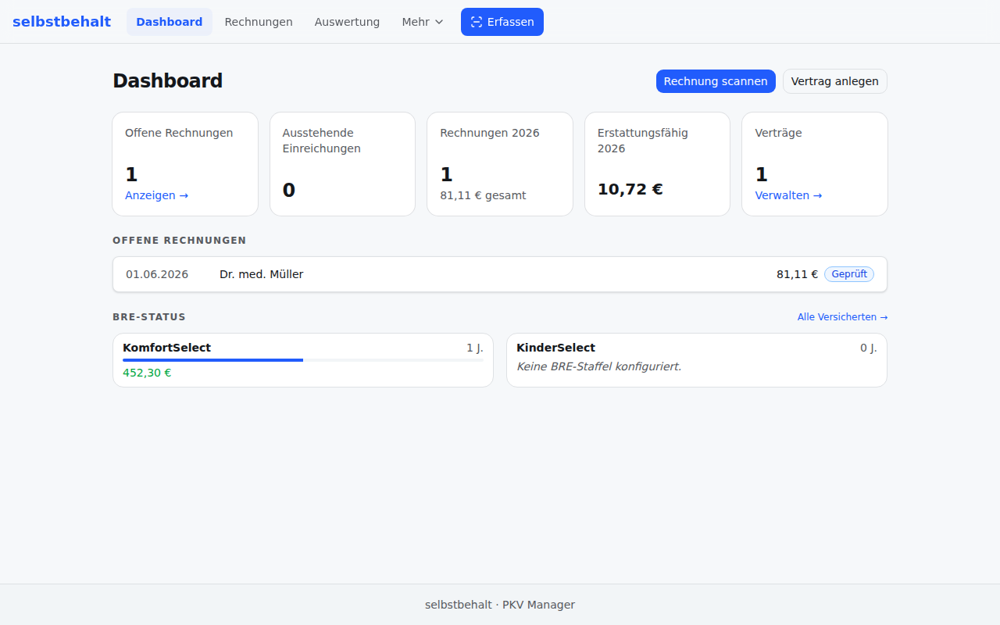
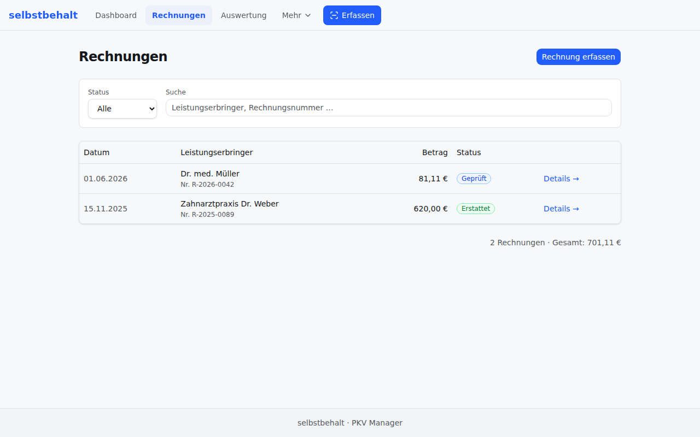
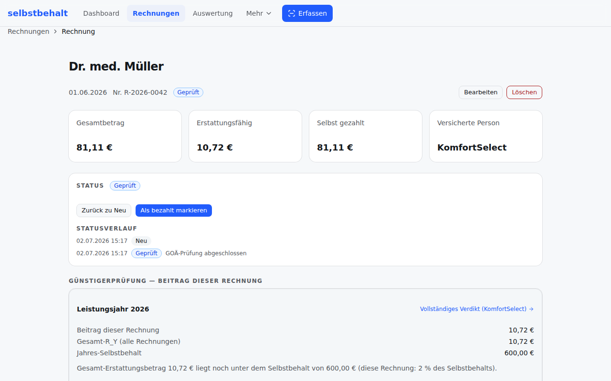
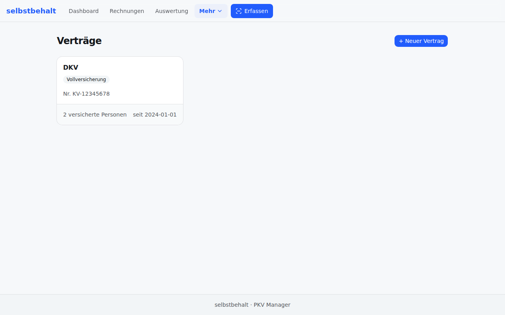

<p align="center">
  
</p>

<h1 align="center">selbstbehalt</h1>

<p align="center">
  Self-hostable, privacy-first manager for German private health insurance (PKV).
</p>

<p align="center">
  
</p>

<p align="center">
  <a href="https://github.com/justb81/selbstbehalt/actions/workflows/ci.yml"></a>
  <a href="https://github.com/justb81/selbstbehalt/actions/workflows/codeql.yml"></a>
  <a href="https://github.com/justb81/selbstbehalt/actions/workflows/security.yml"></a>
  <a href="LICENSE"></a>
  <a href="https://justb81.github.io/selbstbehalt/"></a>
</p>

---

> **Status:** Early development. The complete technical and functional specification lives in [`docs/design.md`](docs/design.md) (German) and is the single source of truth. Application code is still being scaffolded.

## What it does

Privately insured people in Germany juggle several administrative tasks for which no complete, privacy-compliant, self-hostable tool exists. **selbstbehalt** ("deductible") covers three of them:

- **Manage contracts** — keep multiple PKV contracts (full coverage, supplementary tariffs, Beihilfe) in one place.
- **Capture & check invoices** — scan doctor invoices, parse the line items against the GOÄ/GOZ/GOT fee schedules, and flag every rule violation those fee schedules define: Steigerungsfaktor (multiplier) limits (§5 GOÄ), excluded/duplicate code combinations, missing base services, Höchstwert amount caps, frequency limits, and more.
- **Günstigerprüfung** — decide, per invoice, whether to **submit it to the insurer** or **self-pay** to preserve your Beitragsrückerstattung (BRE, premium refund) — comparing the net reimbursement against the present value of the refund you'd forfeit by breaking your claim-free streak.

## Live demo

**[GOÄ-Wächter](https://justb81.github.io/selbstbehalt/)** is a free, standalone
demo of the invoice-check engine above: scan or upload a doctor's invoice and
get the full GOÄ/GOZ rule check — §5 Steigerungsfaktor limits, excluded code
combinations, Höchstwerte, frequency limits, and more — right in your browser,
no installation, no account, no backend. It's a fully static, 100&nbsp;%
offline-capable PWA; the invoice image never leaves your device (see
[Design principles](#design-principles)).

## Screenshots

Everything shown below runs against your own self-hosted instance — no
screenshot, model, or asset is loaded from a third party at runtime (see
[Design principles](#design-principles) below).

| Dashboard                                      | Rechnungen (invoices)                          |
| ---------------------------------------------- | ---------------------------------------------- |
|  |  |

| Günstigerprüfung (per-invoice verdict)                         | Verträge (contracts)                          |
| -------------------------------------------------------------- | --------------------------------------------- |
|  |  |

## Design principles

- **Privacy by design** — sensitive health data (invoice images, diagnoses) never leaves your device unencrypted. OCR runs entirely client-side in the browser.
- **Offline-first** — core data is available without an active server connection.
- **Minimal server** — the backend is only a persistent database and REST API. No AI/LLM workloads server-side (~128 MB RAM, no GPU).
- **DSGVO-compliant** — full self-hostability means no transfer of Art. 9 health data to third parties.

## Architecture

A pnpm monorepo with two workspaces:

- **`apps/frontend/`** — SvelteKit (Svelte 5, TypeScript) Progressive Web App. Installable on Android/desktop, offline-capable. OCR runs in a Web Worker via `ppu-paddle-ocr` (PP-OCRv5 on ONNX Runtime) with WebGPU + WASM fallback.
- **`apps/backend/`** — Hono (TypeScript) REST API on port 8080, backed by SQLite via Drizzle ORM.

Deployed via Docker Compose, intended for a home network (Proxmox LXC / NAS) with optional VPN access.

```
Browser PWA  ──(JSON metadata only, no images)──>  REST API  ──>  SQLite
   │
   └── Camera → client-side OCR → GOÄ parser → Günstigerprüfung
```

See [`docs/design.md`](docs/design.md) for the full data model, REST surface, OCR pipeline, and the Günstigerprüfung formula.

## Getting started (development)

Prerequisites: **Node.js 24 LTS** (see [`.nvmrc`](.nvmrc)) and **pnpm 10+**. With [Corepack](https://nodejs.org/api/corepack.html) enabled (`corepack enable`), the pinned pnpm version is used automatically.

```bash
pnpm install        # install all workspace dependencies
pnpm dev            # run frontend + backend dev servers (parallel)
pnpm build          # build every workspace package
pnpm lint           # ESLint across the whole monorepo
pnpm format         # format with Prettier (format:check to verify only)
pnpm typecheck      # type-check every workspace package
pnpm test           # run unit/component tests (test:coverage for coverage)
pnpm test:e2e       # run Playwright end-to-end tests (frontend)
```

The repository is a [pnpm workspace](https://pnpm.io/workspaces) monorepo:

- [`apps/frontend/`](apps/frontend/) — SvelteKit (Svelte 5, TypeScript) PWA
- [`apps/backend/`](apps/backend/) — Hono REST API + SQLite

Tooling is shared from the repo root to stay DRY: a single [`tsconfig.base.json`](tsconfig.base.json) (strict mode), one flat [`eslint.config.js`](eslint.config.js), and one [`.prettierrc.json`](.prettierrc.json). Each package extends/runs these. Unit and component tests use [Vitest](https://vitest.dev/) (with `@testing-library/svelte`); E2E uses [Playwright](https://playwright.dev/). Coverage is enforced via v8 thresholds — the domain-critical helpers under `apps/frontend/src/lib/utils/` (GOÄ parser, Günstigerprüfung) carry a stricter ≥90% bar.

### Git hooks

[husky](https://typicode.github.io/husky/) installs hooks on `pnpm install` (via the `prepare` script):

- **pre-commit** — runs [lint-staged](https://github.com/lint-staged/lint-staged): ESLint `--fix` + Prettier on staged files.
- **commit-msg** — runs [commitlint](https://commitlint.js.org/) against the [Conventional Commits](https://www.conventionalcommits.org/) convention (e.g. `feat:`, `fix:`, `chore:`).

### Continuous integration & branch protection

[`.github/workflows/ci.yml`](.github/workflows/ci.yml) runs on every push to `main` and every pull request, with a per-ref concurrency group that cancels superseded runs. It executes lint → format check → typecheck → test (with coverage) → build (matrixed over the active Node LTS), plus a separate Playwright E2E job that uploads its report on failure.

`main` should be protected so these checks are **required** before merge. In **Settings → Branches → Branch protection rules** for `main`, enable _Require status checks to pass before merging_ and select **`Lint · Typecheck · Test · Build`** and **`E2E (Playwright)`**.

### Dependency hygiene (supply-chain cooldown)

To avoid pulling in freshly published — and potentially compromised — releases, a **7-day cooldown** applies everywhere: [Dependabot](.github/dependabot.yml) (`cooldown.default-days: 7`) and pnpm itself ([`minimumReleaseAge: 10080`](pnpm-workspace.yaml) minutes). A package version must be at least 7 days old before it is adopted by an update or a manual `pnpm add`/`pnpm update`. Frozen-lockfile installs (CI) are unaffected.

### Security & supply-chain automation

Because the app handles Art. 9 DSGVO health data and forbids runtime third-party
dependencies, vulnerabilities and license/supply-chain risks are caught
automatically. Two workflows run on every push to `main` and every pull request
(plus a weekly schedule):

- [`codeql.yml`](.github/workflows/codeql.yml) — GitHub **CodeQL** static analysis
  for JavaScript/TypeScript (`security-and-quality` query suite); results appear
  under the repository's **Security → Code scanning** tab.
- [`security.yml`](.github/workflows/security.yml) — three jobs:
  - **Dependency audit** — `pnpm audit --prod --audit-level high` fails the build
    on any high/critical advisory in a production dependency (`pnpm audit` locally).
  - **License compliance** — [`scripts/check-licenses.mjs`](scripts/check-licenses.mjs)
    enforces an OSI-compatible allowlist over all production dependencies
    (`pnpm licenses:check` locally); see [`docs/design.md`](docs/design.md) §10.
  - **SBOM** — a [CycloneDX](https://cyclonedx.org/) SBOM (`sbom.cdx.json`) is
    generated per build and uploaded as the `sbom-cyclonedx` artifact.

[Dependabot](.github/dependabot.yml) keeps npm packages and GitHub Actions
patched with grouped, cooldown-gated PRs (see above).

**GitHub-side settings** (enable once, in **Settings → Code security**):
**Secret scanning** and **Push protection** should be on so credentials cannot be
committed or pushed. Report vulnerabilities via [`SECURITY.md`](SECURITY.md).

The privacy-by-design and DSGVO review — the documented proof that invoice images
never leave the device, that nothing third-party loads at runtime, and that
erasure/portability work for every entity, plus the threat model and Art.-9
processing overview — lives in
[`docs/privacy-threat-model.md`](docs/privacy-threat-model.md).

### License headers

Source files carry an [SPDX](https://spdx.dev/) short-form identifier as the first line (the full text lives in [`LICENSE`](LICENSE)):

```ts
// SPDX-License-Identifier: Apache-2.0
```

Use the comment syntax of the respective language (`#` for YAML/shell, `<!-- -->` for HTML/Svelte markup, etc.).

## Running with Docker (self-hosting)

The stack ships as two lean, non-root container images orchestrated by
[`docker-compose.yml`](docker-compose.yml) — a Hono/SQLite backend and an
nginx-served static PWA — sized for a home network (Proxmox LXC / NAS /
Coolify / Portainer). Prerequisite: Docker with the Compose v2 plugin.

```bash
cp .env.example .env          # then edit .env for your host (see below)
docker compose up -d --build  # build images and start both services
```

Prefer not to build locally? Every [release](https://github.com/justb81/selbstbehalt/releases)
publishes multi-arch (amd64/arm64) images to GHCR — use
[`docker-compose.release.yml`](docker-compose.release.yml) instead:

```bash
cp .env.example .env
SELBSTBEHALT_VERSION=1.2.3 docker compose -f docker-compose.release.yml up -d
```

- The services **do not publish host ports**. They are meant to sit behind a
  reverse proxy (e.g. Coolify/Traefik), which routes to them over the Docker
  network; the internal ports are documented via `expose` (frontend `3000`,
  backend `8080`). In the default **single-origin** setup you only route the
  reverse proxy to the **frontend** — its nginx proxies `/api` to the backend
  over the Docker network, so the browser only ever talks to one origin and the
  proxy's Basic Auth covers the API too (no CORS, no separate backend route).
  Add a `ports:` mapping locally if you want to reach a service directly.
- SQLite and any saved invoice files live in bind-mounted volumes
  (`./data/db`, `./data/files`), so data survives `docker compose restart`,
  `down`/`up`, and image rebuilds. The backend entrypoint repairs the
  ownership of these directories on startup (they are created root-owned by
  the Docker daemon) and then runs the server as the unprivileged `node`
  user, so no manual `chown` is needed.
- Leave **`PUBLIC_API_URL`** empty for the single-origin setup above. Set it
  only to point the browser at a **separate** backend origin (e.g.
  `https://api.example.com`); it is baked into the frontend bundle at build
  time, so re-run `docker compose build frontend` after changing it (or override
  it at runtime in the app's settings). A separate origin also requires
  `PKV_API_KEY` (the SPA does not send Basic Auth cross-origin) and
  `CORS_ORIGINS`.
- Set **`PKV_API_KEY`** to require an `X-API-Key` header (for external/VPN
  access, or a separate backend origin); leave it empty when relying on the
  reverse proxy's auth in the single-origin setup.

The backend exposes an unauthenticated `/api/health` endpoint that drives the
container healthcheck; the frontend only starts once the backend reports
healthy (`depends_on: service_healthy`). For HTTPS + HTTP Basic Auth in front
of the app, the CSP/security headers already baked into both services, and
when you actually need `PKV_API_KEY`, see [`docs/hardening.md`](docs/hardening.md)
and the checklist in [`SECURITY.md`](SECURITY.md#hardening-checklist).

**[`docs/self-hosting.md`](docs/self-hosting.md)** is the full guide: Proxmox
LXC/NAS deployment notes, the complete `.env` reference, VPN/Tailscale remote
access, backup/restore (including the `/api/export/db` + `/api/import/db`
endpoints), updating, and a troubleshooting/FAQ section (OCR/WebGPU, the
handwriting limitation, camera/HTTPS requirements).

## Releases

Versioned with [SemVer](https://semver.org/), fully automated from
[Conventional Commits](https://www.conventionalcommits.org/) via
[release-please](https://github.com/googleapis/release-please) — no manual
changelog editing or tagging. See [`docs/release.md`](docs/release.md) for how
a `vX.Y.Z` tag turns into GHCR images, a signed SBOM, and a GitHub Release.

## Contributing

Contributions — code, data, docs, or bug reports — are welcome. See
[`CONTRIBUTING.md`](CONTRIBUTING.md) for setup, conventions, and the quality bar.

Every pull request is reviewed and approved by the maintainer
([@justb81](https://github.com/justb81)) before merge. The GOÄ/GOZ/GOT
fee-schedule tables are maintained exclusively by the maintainer (regenerated
from the official source XML under [`data/input/`](data/input/)) — please
[report data errors as an issue](.github/ISSUE_TEMPLATE/data_error.yml) rather
than hand-editing the generated tables. Found a vulnerability? See
[`SECURITY.md`](SECURITY.md).

## License

[Apache License 2.0](LICENSE).
