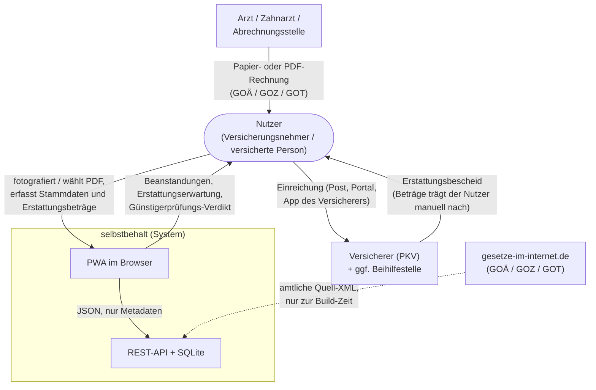
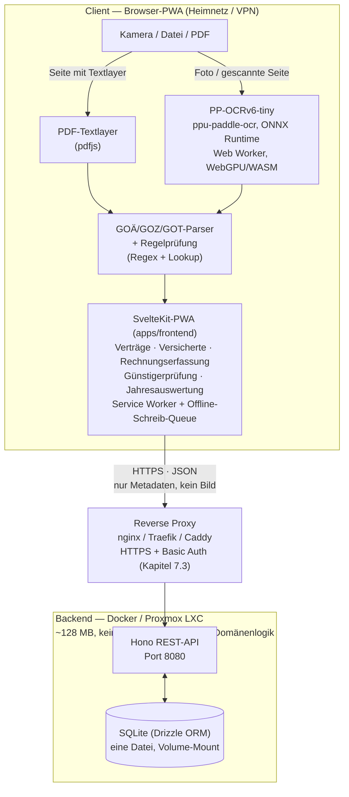
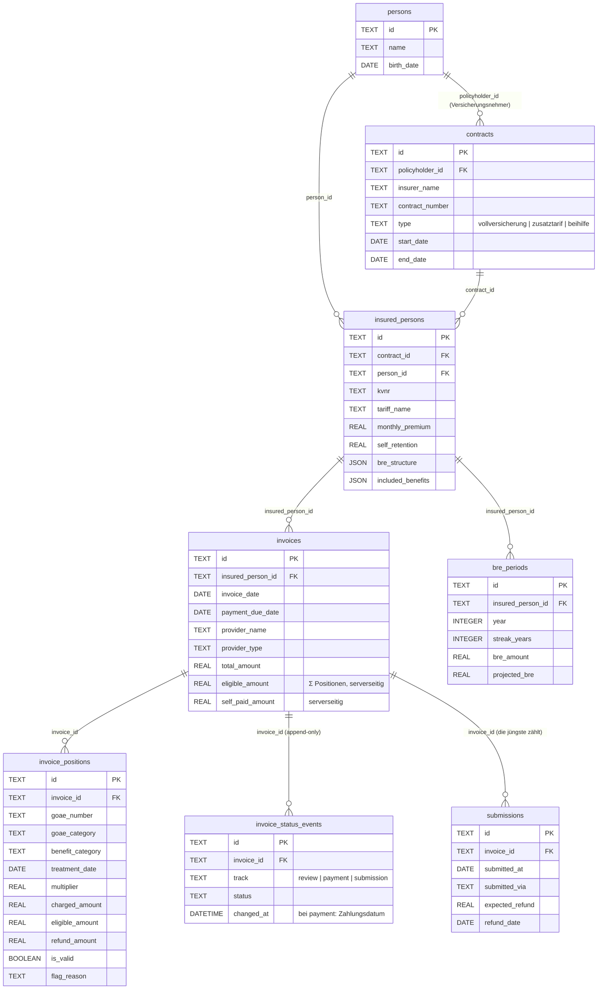
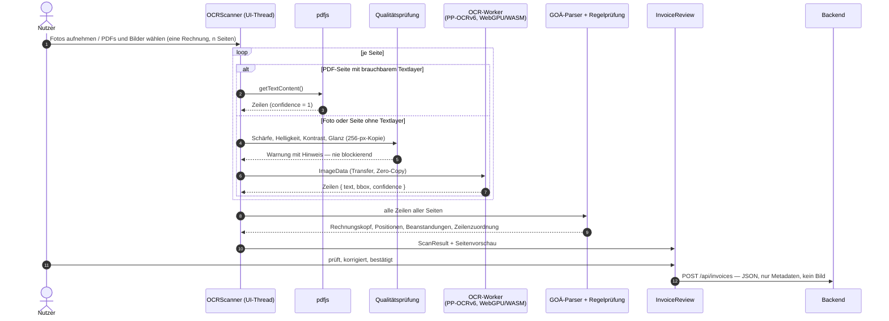
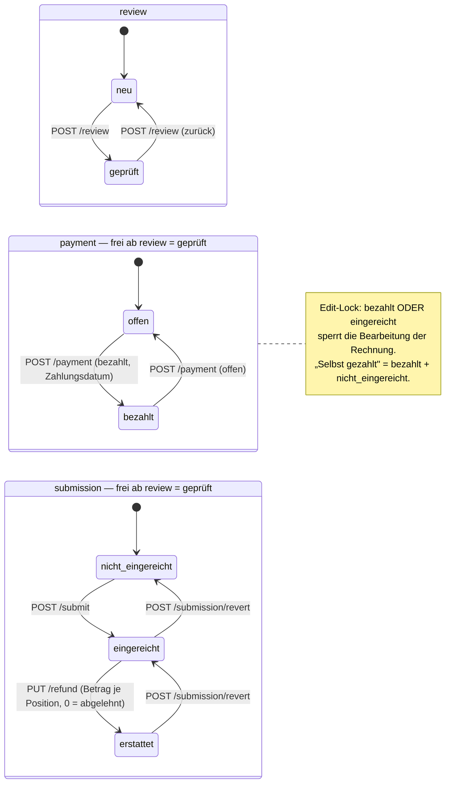
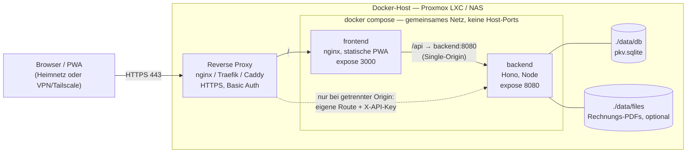

<!-- SPDX-FileCopyrightText: 2026 Bastian Rang and contributors -->
<!-- SPDX-License-Identifier: Apache-2.0 -->
# selbstbehalt – Architekturdokumentation

> **Zweck dieses Dokuments:** Vollständige technische und fachliche Spezifikation des
> selbst-gehosteten PKV-Verwaltungs-Managers als Progressive Web App (PWA). Dieses
> Dokument ist die maßgebliche Quelle für Architektur, Datenmodell und Domänenlogik
> und dient zugleich als Entwicklungsbasis für einen AI-Coding-Agenten.

Gegliedert nach **[arc42](https://arc42.org/)**. Die Vorlage entscheidet, wo ein Inhalt
hingehört — wer etwas ergänzt, sortiert es in das passende Kapitel ein, statt es hinten
anzuhängen. Ein Inhalt steht an **genau einer** Stelle; alle anderen Stellen verweisen.

| Kapitel | Inhalt |
|---|---|
| [1. Einführung und Ziele](#1-einführung-und-ziele) | Aufgabenstellung, Qualitätsziele, Stakeholder |
| [2. Randbedingungen](#2-randbedingungen) | Was nicht verhandelbar ist — technisch, regulatorisch, organisatorisch |
| [3. Kontextabgrenzung](#3-kontextabgrenzung) | Akteure, Nachbarsysteme, Schnittstellen |
| [4. Lösungsstrategie](#4-lösungsstrategie) | Leitentscheidungen und Technologie-Stack |
| [5. Bausteinsicht](#5-bausteinsicht) | Workspaces, Frontend, Prüf-Engine, Backend, Datenmodell |
| [6. Laufzeitsicht](#6-laufzeitsicht) | Scan-Ablauf, Rechnungs-Lebenszyklus, Erstattung, Offline, Backup |
| [7. Verteilungssicht](#7-verteilungssicht) | Infrastruktur, Compose-Topologie, Reverse Proxy, Demo-Deployment |
| [8. Querschnittliche Konzepte](#8-querschnittliche-konzepte) | Datenschutz, OCR, Gebührenordnungen, Erstattung, Günstigerprüfung, PWA, UI, Testbarkeit |
| [9. Architekturentscheidungen](#9-architekturentscheidungen) | Entscheidungs-Log mit Begründung und Fundstelle |
| [10. Qualitätsanforderungen](#10-qualitätsanforderungen) | Qualitätsbaum und -szenarien |
| [11. Risiken und technische Schulden](#11-risiken-und-technische-schulden) | Offene Fragen, Grenzen, Restrisiken |
| [12. Glossar](#12-glossar) | Die Domänenbegriffe |

Eigenständige Dokumente, auf die aus den Kapiteln verwiesen wird — sie werden hier
**nicht** wiederholt:

| Dokument | Inhalt | Kapitel |
|---|---|---|
| [`data-format.md`](./data-format.md) | Datenformat der GOÄ/GOZ/GOT-Tabellen (eigene §-Nummerierung) | 8.3 |
| [`privacy-threat-model.md`](./privacy-threat-model.md) | Datenfluss-Audit, Bedrohungsmodell, Art.-9-Verarbeitungsübersicht | 8.1, 11 |
| [`hardening.md`](./hardening.md) | CSP/Security-Header, Reverse Proxy, `X-API-Key` | 7.3, 8.1 |
| [`self-hosting.md`](./self-hosting.md) | Betriebsanleitung: Compose, `.env`, Backup, Proxy, VPN | 7 |
| [`deploy-goae-waechter.md`](./deploy-goae-waechter.md) | GitHub-Pages-Deployment der GOÄ-Wächter-Demo | 7.4 |
| [`release.md`](./release.md) | Release-Prozess (release-please, GHCR, SBOM) | 2.3 |
| [`roadmap.md`](./roadmap.md) | Umsetzungsstand und Reihenfolge der Issues | 11 |
| [`adr/`](./adr/README.md) | Architecture Decision Records — je Entscheidung Kontext, Alternativen, Konsequenzen | 9 |

***
## 1. Einführung und Ziele

### 1.1 Aufgabenstellung

Privat Krankenversicherte (PKV) in Deutschland stehen vor mehreren Verwaltungsaufgaben, für die es keine vollständige, datenschutzkonforme und selbst-hostbare Softwarelösung gibt:

- Mehrere PKV-Verträge (Vollversicherung + Zusatztarife, ggf. Beihilfe) zentral verwalten
- Arztrechnungen nach GOÄ, GOZ, GOT etc. erfassen, prüfen und archivieren
- Die sogenannte **Günstigerprüfung** durchführen: Soll eine Rechnung bei der PKV eingereicht werden, oder lohnt es sich, sie selbst zu zahlen, um die Beitragsrückerstattung (BRE) zu erhalten?

Bestehende Apps (PKV Go, RechnungsDoc Mobil, Belegkompass) lösen Teile davon, sind jedoch iOS-only, nicht self-hostbar und proprietär [^1][^2][^3]. Eine Open-Source-Alternative existiert nicht in produktionsreifem Zustand [^4].

### 1.2 Qualitätsziele

Die fünf Ziele, an denen jede Architekturentscheidung gemessen wird — in dieser
Reihenfolge. Bei Konflikt gewinnt das höher stehende Ziel; Vertraulichkeit gewinnt
immer.

| # | Qualitätsziel | Warum es für dieses System zählt |
|---|---|---|
| 1 | **Vertraulichkeit (Privacy by Design)** | Rechnungsbilder und Diagnosen sind Gesundheitsdaten nach Art. 9 DSGVO. Sie verlassen das Gerät nicht — das ist der Grund, warum es diese Anwendung überhaupt gibt und nicht eine der bestehenden Cloud-Apps. |
| 2 | **Offline-Verfügbarkeit** | Erfasst wird in der Arztpraxis oder am Küchentisch, nicht am Schreibtisch mit stabiler Verbindung. Lesen muss immer gehen, Schreiben darf nachlaufen. |
| 3 | **Betreibbarkeit auf Kleinsthardware** | Zielumgebung ist ein LXC-Container oder ein NAS im Heimnetz. Ein Server, der 128 MB RAM und kein GPU braucht, wird betrieben; einer, der mehr braucht, wird abgeschaltet. |
| 4 | **Fachliche Korrektheit** | Die Regelprüfung nach GOÄ/GOZ/GOT und die Günstigerprüfung sind der eigentliche Nutzen. Ein falsch berechneter BRE-Verlust kostet den Nutzer echtes Geld. |
| 5 | **Nachvollziehbarkeit** | Jede Beanstandung und jedes Verdikt muss am Papier überprüfbar sein, sonst wird der Anwendung nicht geglaubt — und zu Recht nicht. |

Als bindende Vorgaben formuliert stehen diese Ziele in Kapitel 2, als überprüfbare
Szenarien in Kapitel 10.

### 1.3 Stakeholder

| Rolle | Erwartung an das System |
|---|---|
| **Privat Krankenversicherte** (Einzelpersonen und Familien mit PKV-Vollversicherung oder Zusatztarifen) | Rechnungen erfassen, Beanstandungen erkennen, die Einreichungsentscheidung belastbar treffen — ohne Gesundheitsdaten aus der Hand zu geben. |
| **Selbst-Hoster** (Proxmox, Docker, NAS) | Ein Compose-Stack, der auf vorhandener Hardware läuft, sich sichern lässt und keine externen Dienste braucht. |
| **Android-Nutzer** | Eine installierbare App — bestehende PKV-Apps sind iOS-only. |
| **Maintainer** (@justb81) | Änderungen sind reviewbar; die Gebührenordnungs-Tabellen bleiben reproduzierbar aus den amtlichen Quellen erzeugt und ausschließlich in seiner Hand. |
| **Contributors** | Eine auffindbare Spezifikation, aus der hervorgeht, wo ein neuer Inhalt hingehört und welche Vorgaben nicht verhandelbar sind. |

***

## 2. Randbedingungen

Was das System einhalten **muss** — unabhängig davon, was bequemer wäre. Diese
Randbedingungen überstimmen Komfort und werden nicht durch einen Einzelfall aufgeweicht.

### 2.1 Technische Randbedingungen

**Server** (Zielgröße, aus der Betreibbarkeit auf Kleinsthardware):

- **CPU:** 1 vCore reicht
- **RAM:** 128–256 MB
- **Speicher:** 1–5 GB (SQLite + hochgeladene PDF-Kopien optional)
- **Netzwerk:** Nur im Heimnetz erreichbar + optional Tailscale/VPN für mobilen Zugriff
- **Kein GPU, kein LLM-Backend** – alle KI-Aufgaben laufen client-seitig [^6][^8]

**Client:** ein aktueller Browser mit Kamera-Zugriff (`getUserMedia`) und
WebAssembly; WebGPU wird genutzt, wenn vorhanden, ist aber nie Voraussetzung
(WASM-Fallback). Die Anwendung ist installierbar (PWA), Zielplattform ist
ausdrücklich auch Android.

**Keine Laufzeit-Abhängigkeit von Dritten:** kein CDN, kein Analytics, keine
externen Schriften, kein externer Modell-Download. Alles, was der Browser lädt,
kommt von der eigenen Origin; OCR-Modelle und die ONNX-Runtime-WASM werden zur
Build-Zeit hereingeholt (Kapitel 8.2). Erzwungen wird das per CSP
([`hardening.md`](./hardening.md)) und in einem E2E-Test.

### 2.2 Fachliche und regulatorische Randbedingungen

Die vier Designprinzipien — die Herkunft aller übrigen Vorgaben in diesem Dokument:

1. **Privacy by Design:** Sensible Gesundheitsdaten (Rechnungsbilder, Diagnosen) verlassen das Gerät des Nutzers nie unverschlüsselt. OCR und KI-Verarbeitung erfolgen client-seitig im Browser.
2. **Offline-first:** Kerndaten sind auch ohne aktive Serververbindung zugänglich.
3. **Minimal-Server:** Der Backend-Server dient nur als persistente Datenbank und REST-API; keine KI-Workloads serverseitig.
4. **DSGVO-konform:** Gemäß Art. 9 DSGVO gilt für Gesundheitsdaten erhöhter Schutzbedarf. Durch vollständige Selbst-Hostebarkeit entfällt eine Datenübertragung an Dritte.

Daraus folgt unmittelbar und ohne Ausnahme:

- **Rechnungsbilder verlassen den Client nicht.** OCR läuft im Browser; an das
  Backend gehen ausschließlich strukturierte JSON-Metadaten, kein Bild. Das
  vollauflösende Bild wird verworfen, sobald die Erkennung fertig ist; die
  heruntergerechnete Review-Kopie lebt nur im Komponentenzustand (Kapitel 8.1).
- **Keine serverseitige KI/LLM-Verarbeitung** — auch nicht optional, auch nicht
  „nur für schwer lesbare Handschriften" (Issue #37, als *not planned*
  geschlossen).
- **Gesundheitsdaten nach Art. 9 DSGVO** sind der Maßstab für Rechnungsinhalte und
  Diagnosen: maximaler Schutzbedarf, Datenminimierung, Löschbarkeit, Portabilität.

**Rechtsgrundlage der Prüfung:** die Gebührenordnungen GOÄ, GOZ und GOT in ihrer
geltenden Fassung. Sie sind amtliche Werke und öffentlich; die Prüfung braucht
deshalb kein Modell, sondern Tabellen und Regeln (Kapitel 8.3). Die Tabellen werden
reproduzierbar aus den amtlichen Quell-XML unter `data/input/` erzeugt und
**ausschließlich vom Maintainer** gepflegt — Datenfehler werden als Issue gemeldet,
nicht per Hand in die JSON geschrieben.

### 2.3 Organisatorische Randbedingungen und Konventionen

- **Lizenz:** Apache-2.0. Jede erstklassige Datei trägt zwei SPDX-Zeilen
  (Copyright + Lizenz); `pnpm headers:check` und
  `.github/workflows/headers.yml` erzwingen das bei **jeder** Änderung — auch bei
  reinen Doku-Änderungen, für die `ci.yml` bewusst nicht läuft.
- **Sprache:** Domänen- und Feldnamen bleiben deutsch, wo dieses Dokument sie
  deutsch nennt (`selbstbehalt`, `bre_structure`, `eligible_amount`); die
  Oberfläche ist durchgehend `de-DE`. Quellcode-Kommentare sind englisch.
- **UI-Standard:** ausschließlich shadcn-svelte-Komponenten (gemeinsam in
  `packages/ui`, Frontend-eigene unter `$lib/components/ui/`) und
  Tailwind-CSS-Utilities — kein Custom-CSS, keine `<style>`-Blöcke in
  `.svelte`-Dateien (Kapitel 8.7).
- **Commits und Releases:** Conventional Commits (commitlint) treiben Changelog
  und Versionsanhebung über release-please; siehe [`release.md`](./release.md).
- **Review:** jeder Pull Request braucht die Freigabe des Maintainers
  (`CODEOWNERS` + Branch-Protection).
- **Qualitätsschranken in CI:** Lint, Typecheck, Unit-/Komponententests, Build,
  Playwright-E2E inklusive `axe`-Audit; die Domänen-Helfer unter
  `src/lib/utils/**` müssen ≥ 90 % Abdeckung halten (Kapitel 8.8).

***

## 3. Kontextabgrenzung

Das System ist eine Insel: es kommuniziert mit **keinem** Fremdsystem automatisiert.
Alles, was nach außen geht, geht durch den Nutzer — er reicht bei seinem Versicherer
ein, er zahlt seine Rechnung. Das ist keine Lücke, sondern die Konsequenz aus
Kapitel 2.2: eine automatische Schnittstelle zum Versicherer wäre eine Übermittlung
von Art.-9-Daten an Dritte.

### 3.1 Fachlicher Kontext



| Akteur / Nachbar | Rolle | Was fließt | Richtung |
|---|---|---|---|
| **Nutzer** (Versicherungsnehmer bzw. versicherte Person) | bedient das System, entscheidet und reicht selbst ein | Rechnungsfotos/PDFs, Stammdaten, Erstattungsbeträge hinein; Beanstandungen, Erstattungserwartung, Günstigerprüfungs-Verdikt hinaus | ein/aus |
| **Arzt, Zahnarzt, Abrechnungsstelle** | Rechnungssteller | die Rechnung nach GOÄ/GOZ/GOT — auf Papier oder als PDF, über den Nutzer | herein |
| **Versicherer (PKV)**, ggf. **Beihilfestelle** | Empfänger der Einreichung, Absender des Erstattungsbescheids | Einreichung und Bescheid laufen **außerhalb** des Systems; die Beträge trägt der Nutzer manuell nach | keine direkte Verbindung |
| **gesetze-im-internet.de** | Quelle der Gebührenordnungs-Texte | die amtlichen Quell-XML — **nur zur Build-Zeit**, nie zur Laufzeit (Kapitel 8.3) | herein, offline |
| **Reverse Proxy** (nginx, Traefik, Caddy) | vorgelagerter Zugang: HTTPS und Basic Auth | der gesamte HTTP-Verkehr des Nutzers | davor (Kapitel 7.3) |
| **VPN / Tailscale** (optional) | Fernzugriff von außerhalb des Heimnetzes | derselbe Verkehr, getunnelt | davor |
| **GHCR / GitHub Pages** | Bezugsquelle der Container-Images bzw. Host der GOÄ-Wächter-Demo | Artefakte des Release-Prozesses | herein, zur Deploy-Zeit |

Was **nicht** angebunden ist und aus welchem Grund: Versicherer-APIs oder -Portale
(keine Übermittlung von Art.-9-Daten, keine öffentlichen Schnittstellen), E-Mail-
oder Workflow-Automatisierung für Einreichungen (Issue #38, *not planned*), externe
OCR- oder LLM-Dienste (Kapitel 2.2), Telemetrie und Analytics (keine).

### 3.2 Technischer Kontext

| Schnittstelle | Technisch | Nutzlast | Anmerkung |
|---|---|---|---|
| Nutzer → PWA (Kamera) | `getUserMedia` / `ImageCapture` | Videoframes, Fotos | bleiben im Browser (Kapitel 8.2) |
| Nutzer → PWA (Datei) | `<input type="file" multiple>`, PWA-Share-Target | Bilder, PDFs | werden nicht hochgeladen |
| PWA → Backend | HTTPS, JSON-REST auf `/api/**` | ausschließlich strukturierte Metadaten — **kein Bild** | Single-Origin, daher kein CORS (Kapitel 7.3) |
| Backend → Datenbank | Drizzle ORM auf SQLite (`better-sqlite3`) | die Datei unter `DATABASE_PATH` | Kapitel 5.5 |
| Backup | `GET /api/export/db`, `POST /api/import/db` | die SQLite-Datei als Ganzes | Art.-20-Portabilität (Kapitel 6.5) |
| Modelle und WASM | statische Dateien unter `/models/**` derselben Origin | PP-OCRv6-tiny (~6 MB), ONNX-Runtime-WASM (~38 MB) | zur Build-Zeit hereingeholt, per Service Worker gecacht (Kapitel 8.6) |
| Gebührenordnungs-Daten | JSON-Lookup-Tabellen im Bundle | ~4.500 Ziffern GOÄ/GOZ/GOT | versioniert im Repo, kein Laufzeit-Abruf (Kapitel 8.3) |

***

## 4. Lösungsstrategie

### 4.1 Leitentscheidungen

Wie die fünf Qualitätsziele aus Kapitel 1.2 architektonisch beantwortet werden. Die
Begründungen im Einzelnen stehen im Entscheidungs-Log (Kapitel 9).

| Qualitätsziel | Lösungsansatz |
|---|---|
| Vertraulichkeit | **Verarbeitung dorthin, wo die Daten schon sind:** OCR und Regelprüfung laufen im Browser, das Backend sieht nur Metadaten. Damit gibt es keinen Datenfluss, der abgesichert werden müsste — er existiert nicht. |
| Vertraulichkeit | **Kein Laufzeit-Dritter:** Modelle, WASM, Schriften und Diagramm-Bibliothek liegen im Bundle bzw. auf der eigenen Origin; die CSP verbietet den Rest. |
| Offline-Verfügbarkeit | **PWA mit Service Worker:** Shell und Gebührentabellen „Cache First", API „Network First" mit einer Schreib-Queue, die bei Wiederverbindung abgespielt wird (Kapitel 8.6). |
| Betreibbarkeit | **Backend als reine Persistenzschicht:** Hono + SQLite, keine Domänenlogik, kein Hintergrundjob, kein GPU. Die Fachlogik lebt im Client bzw. in `packages/shared`. |
| Fachliche Korrektheit | **Statische Tabellen statt Modell:** die Gebührenordnungen sind öffentlich und regelbasiert — reproduzierbar erzeugte JSON plus ein deterministischer Parser sind prüfbar, ein Sprachmodell wäre es nicht. |
| Fachliche Korrektheit | **Eine Quelle je Größe:** Zod-Schemas und Domänen-Helfer in `packages/shared`; die Günstigerprüfung ist eine Engine, die alle Aufrufer benutzen, statt einer Formel, die jede Ansicht neu rechnet. |
| Nachvollziehbarkeit | **Ereignisse statt Zustand:** der Rechnungsstatus wird aus einem append-only Ereignisprotokoll abgeleitet (Kapitel 5.5); die Seitenvorschau zeigt jede erkannte Zeile am Bild, sodass ein Fehlleser überprüfbar ist. |

### 4.2 Technologie-Stack

| Schicht | Technologie | Begründung |
|---|---|---|
| **Frontend** | SvelteKit (TypeScript) | Leichtgewichtig, SSR optional, PWA-Support nativ |
| **OCR Engine** | PP-OCRv6 via `ppu-paddle-ocr` (ONNX Runtime) | Browser-native, WebGPU + WASM Fallback, Web-Worker-tauglich, kein Server [^6] |
| **AI-Beschleunigung** | WebGPU API (Chrome/Edge) + WebNN (Android NPU) | Standard in Chrome seit 2025, ~82% Browser-Coverage [^7] |
| **Fallback OCR** | WASM-Execution-Provider (ONNX Runtime) | Wenn kein WebGPU verfügbar |
| **GOÄ-Prüfung** | Statische JSON-Lookup-Tabelle + Regex-Parser | GOÄ ist öffentlich, kein LLM nötig |
| **Backend API** | Hono (TypeScript) | Minimal, Docker-freundlich, dieselbe Sprache wie das Frontend — ein Typ-Modell über `packages/shared` |
| **Datenbank** | SQLite (via Drizzle ORM) | Kein separater DB-Dienst nötig, Backup trivial |
| **Deployment** | Docker Compose | Kompatibel mit Proxmox LXC, Portainer |
| **PWA-Features** | Service Worker, Web App Manifest | Installierbar auf Android/Desktop, Offline-Cache |

Ergänzend, seit der ursprünglichen Auswahl hinzugekommen:

| Schicht | Technologie | Begründung |
|---|---|---|
| **UI-Kit** | shadcn-svelte + Tailwind CSS v4 | Komponenten liegen im Repo statt in einer Abhängigkeit; kein Custom-CSS (Kapitel 8.7) |
| **Validierung** | Zod (in `packages/shared`) | ein Schema für API-Nutzlast und Formulare, Typen daraus abgeleitet |
| **Datums-/Fristenrechnung** | `date-fns` | BRE-Staffel, Leistungsjahr, Zahlungsziel |
| **Diagramme** | `layerchart` | im Bundle, kein CDN (Issue #28) |
| **PDF-Textlayer** | `pdfjs` | digital erzeugte PDFs brauchen kein OCR (Kapitel 6.1) |

Bewusst **nicht** gewählt: PostgreSQL (kein separater Dienst für einen
Einzelhaushalt), ein serverseitiges OCR- oder LLM-Backend (Kapitel 2.2), eine
Docs-Site (die Struktur zuerst, das Rendering später).

***

## 5. Bausteinsicht

### 5.1 Ebene 1: Gesamtsystem



Die enthaltenen Bausteine sind die sechs pnpm-Workspaces:

| Workspace | Paketname | Verantwortung | Kapitel |
|---|---|---|---|
| `apps/frontend/` | `@selbstbehalt/frontend` | SvelteKit-PWA: alle Seiten, API-Client, Erstattungs- und Günstigerprüfungs-Engine, Service Worker und Offline-Queue | 5.2 |
| `apps/backend/` | `@selbstbehalt/backend` | Hono-REST-API, Drizzle-Schema und Migrationen, Auth-Middleware, Backup-Endpunkte | 5.4 |
| `apps/goae-waechter/` | `@selbstbehalt/goae-waechter` | eigenständige, backendfreie Demo der Rechnungsprüfung (GitHub Pages) | 5.6 |
| `packages/medic-invoice-check/` | `@selbstbehalt/medic-invoice-check` | On-Device-OCR, Gebührenordnungs-Parser und Regelprüfung, Scan-/Review-Oberfläche — von Frontend **und** Demo genutzt | 5.3 |
| `packages/shared/` | `@selbstbehalt/shared` | Zod-Schemas und abgeleitete Typen aller Entitäten, gemeinsame Enums, Domänen-Helfer (BRE-Staffel, Leistungsbereich, Zahlungsziel, Statusableitung) | 5.5 |
| `packages/ui/` | `@selbstbehalt/ui` | die von mehr als einem Paket genutzten shadcn-svelte-Primitiven (je Komponente ein Subpath-Export, z. B. `@selbstbehalt/ui/button`) und der `cn()`-Klassenhelfer — **eine** vendored Kopie statt dreier driftender | 8.7 |

Werkzeuge liegen im Repo-Wurzelverzeichnis und werden geteilt: eine
`tsconfig.base.json` (strict), eine flache `eslint.config.js`, eine
`.prettierrc.json`. Regeneriert bzw. hereingeholt werden zur Build-Zeit die
Gebührenordnungs-JSON (`pnpm fees:build`), die OCR-Modelle (`pnpm ocr:models`) und
die ONNX-Runtime-WASM (`scripts/copy-ort-wasm.mjs`).

### 5.2 Baustein `apps/frontend` (SvelteKit-PWA)

#### Seitenstruktur / Routing

```
/                       → Dashboard (offene Aktionen, BRE-Schnellstatus — kein Ersatz für Auswertung)
/contracts              → Vertragsliste
/contracts/[id]         → Vertragsdetail + Verwaltung der versicherten Personen
/contracts/new          → Neuer Vertrag
/insured                → Alle versicherten Personen (Top-Level-Einstieg, gruppiert nach Vertrag)
/insured/[id]           → Versicherte Person: BRE-Staffel + Günstigerprüfungs-Verdikt je Leistungsjahr + Rechnungsliste
/invoices               → Rechnungsarchiv (Filter, Suche)
/invoices/new           → Rechnung erfassen (manuell oder via OCR-Scan)
/invoices/[id]          → Rechnungsdetail + Positionen + Status-Workflow + GP-Marginalanzeige
/invoices/[id]/submit   → Einreichungsformular
/persons                → Personen (Versicherungsnehmer und Haushaltsmitglieder als Identitäten)
/persons/[id]           → Personendetail + Bearbeitung
/stats                  → Jahresauswertung (Kosten, Erstattungen, BRE — vollständige Analyse)
/settings               → Server-URL, Diskontrate, Leistungsfrei-Wahrscheinlichkeit, Zahlungsziel (Standardfrist + Fälligkeits-Hinweise), Datenbankexport
```

**Filter in der URL (Deep-Link-Vertrag):** Filterzustand ist Teil der Adresse,
nicht des Komponenten-States — eine gefilterte Ansicht ist damit verlinkbar und
übersteht Reload und Zurück-Navigation ([ADR-0019](./adr/0019-filterzustand-in-der-url.md)).
Diese Parameter sind vergeben; sie umzubenennen bricht bestehende Lesezeichen:

| Route | Parameter | Werte |
|---|---|---|
| `/stats` | `year` | Leistungsjahr, vierstellig (nur Jahre mit Rechnungen bzw. das laufende) |
| `/stats` | `person` | ID der versicherten Person (steuert den BRE-Verlauf) |
| `/invoices` | `submission` | `nicht_eingereicht` \| `eingereicht` \| `erstattet` |
| `/invoices` | `payment` | `offen` \| `bezahlt` |

Ein fehlender Parameter heißt „Default", ein unbekannter Wert fällt auf den
Default zurück, ohne die URL umzuschreiben. Das Dashboard verlinkt darüber auf
vorgefilterte Listen (z. B. `/invoices?submission=eingereicht`).

**Informationsarchitektur und Rollentrennung:**

- **Dashboard** (`/`) — offene Aktionen (unbearbeitete / eingereichte Rechnungen) und BRE-Schnellstatus (kompakt, verlinkt auf `/insured/[id]`). Keine vollständige Jahresanalyse — das ist Aufgabe der Auswertung.
- **Auswertung** (`/stats`) — vollständige Jahresanalyse (Kosten, Erstattungen, BRE-Jahresverlauf). Der CSV-/PDF-Export für die Steuererklärung ist ausgegliedert (Issue #184).
- **Versicherte** (`/insured`, `/insured/[id]`) — zentraler Knoten für versicherte Personen: Tarif, KVNR, Selbstbehalt, BRE-Staffel, Günstigerprüfungs-Verdikt je Leistungsjahr, Rechnungsliste. Primärer Ort für BRE-Information (vollständig).
- **Verträge** (`/contracts/[id]`) — Verwaltung des Vertrags und seiner versicherten Personen (kompakter BRE-Status mit Link auf `/insured/[id]`).
- **Personen** (`/persons`) — Verwaltung natürlicher Personen (Versicherungsnehmer, Haushaltsmitglieder). Versicherungsspezifische Daten (KVNR, Tarif, BRE) leben ausschließlich in `insured_persons`, nicht hier.

**Begriffliche Trennung (UI-Labels):**

| Begriff | Bedeutung | Primäre Route |
|---|---|---|
| Person | Natürliche Person (Name, Geburtsdatum) | `/persons` |
| Versicherungsnehmer (VN) | Person als Vertragsinhaber | `/contracts/[id]` |
| Versicherte Person | Person mit Tarif, KVNR, BRE auf einem Vertrag | `/insured/[id]` |

Das **maßgebliche Günstigerprüfungs-Verdikt** liegt auf `/insured/[id]` (pro Leistungsjahr,
aggregiert über alle Rechnungen der Person, §8.5). `/invoices/[id]` zeigt nur die Marginalanzeige
(Beitrag dieser Rechnung je Leistungsjahr) sowie den Status-Workflow (§5.5).

#### Kern-Komponenten

| Komponente | Datei | Zweck |
|---|---|---|
| `OCRScanner` | `packages/medic-invoice-check/src/lib/components/OCRScanner.svelte` | Kamera-Aufnahme + PaddleOCR-Aufruf |
| `InvoicePagePreview` | `packages/medic-invoice-check/src/lib/components/InvoicePagePreview.svelte` | Seitenvorschau je Dokumentseite (§6.1): gescannte Seite mit eingezeichneten erkannten Textzeilen, Textlayer-Seite als benannter Zustand ohne Bild; hebt in beiden Fällen die Quellzeile der geprüften Position hervor |
| `GCPCard` | `lib/components/GCPCard.svelte` | Günstigerprüfungs-Verdikt je Leistungsjahr (auf `/insured/[id]`) |
| `GCPContributionCard` | `lib/components/GCPContributionCard.svelte` | Marginalanzeige auf der Einzelrechnung (Beitrag je Leistungsjahr) |
| `InvoiceStatusFlow` | `lib/components/InvoiceStatusFlow.svelte` | Orchestriert den Status-Workflow: eine Karte je Track, das Erstattungsformular und den Statusverlauf; hält das gemeinsame `busy` und lädt die Status-Events nach jeder Aktion neu (Issue #419) |
| `InvoiceReviewTrack` / `InvoicePaymentTrack` / `InvoiceSubmissionTrack` | `lib/components/Invoice{Review,Payment,Submission}Track.svelte` | Je eine Karte der drei unabhängigen Lifecycle-Tracks (Kapitel 6.2); der Submission-Track enthält „Letzter Schritt" (Löschen/Bearbeiten, Issue #230) |
| `InvoiceRefundForm` | `lib/components/InvoiceRefundForm.svelte` | Erstattungs-Erfassung je Leistungsbereich (Default) oder je Position; Zeilenaufbau und Payload in `lib/utils/refund-rows.ts` |
| `InvoiceStatusHistory` | `lib/components/InvoiceStatusHistory.svelte` | Statusverlauf: alle Events der drei Tracks in Aufzeichnungsreihenfolge |
| `ContractCard` | `lib/components/ContractCard.svelte` | Vertragszusammenfassung |
| `BRETracker` | `lib/components/BRETracker.svelte` | BRE-Staffel-Fortschrittsanzeige; `compact` + optionaler `href` für verlinkte Kompaktkarten (Dashboard, Vertragsdetail) |
| `InvoiceBadge` | `lib/components/InvoiceBadge.svelte` | Status-Badge für Rechnungen |

`InvoiceForm` umschließt das `InvoiceReview` aus
`packages/medic-invoice-check` (Kapitel 5.3) und ergänzt es um das, was die Demo
nicht hat: Auswahl der versicherten Person, Notizen, den tarifabhängigen
`eligible_amount` und das Speichern. Das visuelle System ist das von
shadcn-svelte und Tailwind (Kapitel 8.7); einen eigenen Styleguide gibt es nicht.

#### Oberfläche der Günstigerprüfung

Das **Verdikt** lebt auf der **Person-×-Jahr-Ansicht** (§5.2): pro Leistungsjahr eine Karte mit
`R_Y`, Selbstbehalt, Schwellenstatus, NPV(ΔBRE) und der Empfehlung für *alle* Rechnungen dieses
Jahres zusammen. Die einzelne Rechnung zeigt **kein** eigenes Verdikt mehr, sondern nur eine
**Marginalanzeige**: ihren Beitrag je Leistungsjahr und ob das Jahr dadurch die Schwelle reißt.

**Person-×-Jahr-Verdikt (maßgeblich):**

```
┌─────────────────────────────────────────────┐
│  💡 Günstigerprüfung — Max Müller · 2025     │
│───────────────────────────────────────────── │
│  Erstattungsfähig 2025 (R):     1.240,00 €   │
│  Selbstbehalt (S):                500,00 €   │
│  Nettoerstattung max(0, R−S):     740,00 €   │
│───────────────────────────────────────────── │
│  Aktuelle Staffel:               3 Jahre     │
│  NPV BRE-Verlust (inkl. Leiter):  751,00 €   │
│   davon Sofort (j=0):             485,00 €   │
│   davon Wiederaufstieg:           266,00 €   │
│───────────────────────────────────────────── │
│  ⚠️ Knapp: Einreichen +ø, prüfen             │
│  [Alle 2025er einreichen]                    │
└─────────────────────────────────────────────┘
```

**Marginalanzeige auf der Einzelrechnung (kein Verdikt):**

```
┌─────────────────────────────────────────────┐
│  Beitrag dieser Rechnung zur Günstigerprüfung│
│───────────────────────────────────────────── │
│  Leistung 2024:  120,00 €                    │
│   2024: R 480 € / SB 500 € → unter Schwelle  │
│   Staffel sicher                             │
│  Leistung 2025:  310,00 €                    │
│   2025: R 1.240 € / SB 500 € → Schwelle      │
│   gerissen — Einreichen bricht 2025er-Staffel│
│───────────────────────────────────────────── │
│  → volles Verdikt: Max Müller · 2024 / 2025  │
└─────────────────────────────────────────────┘
```

### 5.3 Baustein `packages/medic-invoice-check` (Scan- und Prüf-Engine)

Der framework-leichte, backendfreie Kern der Rechnungsprüfung — bewusst
herausgezogen, damit `apps/frontend` und die GOÄ-Wächter-Demo dieselbe Engine
benutzen und die Demo ohne Server auskommt. Er kennt weder Tarife noch Erstattung:
was er liefert, sind erkannte Positionen und Beanstandungen.

| Modul | Aufgabe |
|---|---|
| `ocr/capture.ts`, `ocr/preprocess.ts`, `ocr/quality.ts` | Aufnahme, Bildvorverarbeitung, Qualitätsbewertung vor dem OCR-Lauf |
| `ocr/pdf.ts` | Textlayer-zuerst-Pfad für digital erzeugte PDFs (`pdfjs`) |
| `ocr/engine.ts`, `ocr/ocr-client.ts`, `workers/ocr.worker.ts` | injizierbare Engine-Naht, Worker-Protokoll, ONNX-Runtime-Anbindung (Kapitel 8.2) |
| `ocr/scan-flow.ts`, `ocr/scan-ocr.ts` | Verkettung Aufnahme → Erkennung → Parsen → Ergebnis |
| `ocr/preview.ts` | heruntergerechnete Seitenkopie für den Review (nie persistiert) |
| `utils/goae-parser.ts` | Strukturparser und Regelprüfung (Kapitel 8.3) |
| `data/{goae,goz,got}.json`, `data/fee-schedule.ts` | die versionierten Lookup-Tabellen und ihr Zugriff |
| `components/OCRScanner.svelte`, `InvoiceReview.svelte`, `InvoicePagePreview.svelte` | Scan- und Review-Oberfläche |

Die Engine-Naht ist der Grund, warum das Paket testbar ist: die eigentliche
ONNX-Runtime hängt hinter einer injizierbaren Schnittstelle und landet in einem
reinen Worker-Chunk, sodass Unit-Tests ohne WASM laufen und der Hauptthread das
Modell nie lädt.

### 5.4 Baustein `apps/backend` (Hono-REST-API)

Absichtlich dünn: Validierung der Nutzlast gegen die geteilten Zod-Schemas,
Persistenz, Statusableitung, Backup. **Keine** Domänenrechnung — Erstattung und
Günstigerprüfung laufen im Client (Kapitel 8.4/8.5), damit das Backend klein bleibt
und keine Gesundheitsdaten interpretieren muss.

Aufbau: `src/app.ts` (Hono-App, Security-Header), `src/config.ts` (Konfiguration aus
Umgebungsvariablen), `src/middleware/auth.ts` (optionaler `X-API-Key`),
`src/lib/validation.ts` (Body-/Query-Validierung als Middleware über
`@hono/zod-validator`, deutsche Fehlermeldungen über deren Hook),
`src/db/schema.ts` + `src/db/migrations/` (Drizzle, Kapitel 5.5), `src/routes/*.ts`.

#### REST-Endpunkte

```
GET    /api/persons                   → Alle Personen
POST   /api/persons                   → Neue Person anlegen
GET    /api/persons/:id               → Persondetail
PUT    /api/persons/:id               → Person aktualisieren
DELETE /api/persons/:id               → Person löschen

GET    /api/contracts                 → Alle Verträge
POST   /api/contracts                 → Neuen Vertrag anlegen (mit Versicherungsnehmer)
GET    /api/contracts/:id             → Vertragsdetail inkl. versicherter Personen
PUT    /api/contracts/:id             → Vertrag aktualisieren
DELETE /api/contracts/:id             → Vertrag löschen

GET    /api/insured                   → Alle versicherten Personen über alle Verträge
                                         (optional ?contract_id=; ein Request statt einem je Vertrag, Issue #463)
GET    /api/contracts/:id/insured     → Versicherte Personen eines Vertrags
POST   /api/contracts/:id/insured     → Versicherte Person hinzufügen (mit KVNR, Tarif, SB, BRE)
GET    /api/insured/:id               → Detail einer versicherten Person
PUT    /api/insured/:id               → Versicherte Person aktualisieren
DELETE /api/insured/:id               → Versicherte Person entfernen

GET    /api/invoices                  → Alle Rechnungen (mit Filter-Query-Params);
                                         ?include=positions liefert sie inkl. Positionen in einem
                                         Request — die Günstigerprüfung braucht die Positionen jeder
                                         Rechnung (Issue #463)
POST   /api/invoices                  → Neue Rechnung speichern
GET    /api/invoices/:id              → Rechnungsdetail inkl. Positionen + abgeleitetem Status
PUT    /api/invoices/:id              → Rechnung aktualisieren (gesperrt sobald bezahlt oder eingereicht)
DELETE /api/invoices/:id              → Rechnung löschen

POST   /api/invoices/:id/review       → Prüf-Track schalten (neu ↔ geprüft)
POST   /api/invoices/:id/payment      → Zahlungs-Track schalten (offen ↔ bezahlt; changed_at = Zahlungsdatum)
POST   /api/invoices/:id/submit       → Einreichung erfassen (→ submission 'eingereicht'; erfordert 'geprüft')
GET    /api/invoices/:id/submission   → Aktuelle Einreichung lesen
PUT    /api/invoices/:id/submission   → Einreichung korrigieren (submission bleibt 'eingereicht')
PUT    /api/invoices/:id/refund       → Erstattung je Position erfassen (→ submission 'erstattet') oder,
                                         bei bereits 'erstattet', korrigieren (Track bleibt gleich)
POST   /api/invoices/:id/submission/revert → Submission-Track einen Schritt zurücknehmen
                                         (erstattet→eingereicht→nicht_eingereicht), verwirft dessen Zusatzdaten (#230)
GET    /api/invoices/:id/events       → Status-Event-Log (Quelle der Wahrheit für den Lebenszyklus)

GET    /api/stats/year/:year          → Jahresauswertung
GET    /api/stats/bre/:insuredPersonId → BRE-Verlauf einer versicherten Person
GET    /api/stats/positions/:insuredPersonId → Positions-Jahres-Roll-up nach Leistungsjahr (§8.5.1-Statusregel, Issue #239)
GET    /api/stats/reductions?group_by=tariff|provider_name|provider_type|goae_number
                                       → Kürzungs-/Ablehnungs-Roll-up über erstattete Positionen (Issue #239)
GET    /api/stats/validations         → Beanstandungen nach flag_reason-Kategorie + Steigerungsfaktor-Verteilung (Issue #239)

GET    /api/export/db                 → SQLite-Datenbank-Download (für Backup)
POST   /api/import/db?confirm=true    → Datenbank-Wiederherstellung (roher Binär-Body, kein Formular — §7.3)
```

Die Lese-Antworten der `insured`-Routen (`GET /api/insured`,
`GET /api/contracts/:id/insured`, `GET /api/insured/:id` sowie die Rückgaben von `POST`/`PUT`)
tragen zusätzlich zu den Spalten aus
`insured_persons` das Feld **`person_name`** — der Anzeigename der Person, per Join aus `persons`.
Eine versicherte Person ist zuerst eine Person; Tarifname und KVNR sind Vertragsdaten und für
Geschwister im selben Tarif identisch, taugen also nicht als Benennung (Issues #351, #358). Das
Feld ist ausschließlich lesend: geschrieben wird der Name über `/api/persons/:id`, die
Create-/Update-Schemata weisen ihn zurück. Die UI benennt eine versicherte Person nirgends selbst,
sondern über `insuredPersonLabel(...)` aus `packages/shared` (Name → Tarif → KVNR → „Versicherte
Person").

**Konstante Anzahl Requests je Seite.** Die flache Liste `GET /api/insured` und der
Parameter `?include=positions` existieren genau dafür (Issue #463): eine Einstiegsseite
holt die versicherten Personen in *einem* Request und gruppiert client-seitig nach
`contract_id`, statt `GET /api/contracts/:id/insured` je Vertrag zu rufen; wer die
Positionen jeder Rechnung braucht — Günstigerprüfung und `aggregatePriorClaims` —
nimmt `?include=positions` statt eines `GET /api/invoices/:id` je Zeile. Das Backend
lädt die Positionen dabei mit einer einzigen `inArray`-Abfrage nach. Die geschachtelte
Route bleibt für die Detailansicht *eines* Vertrags, wo sie ohnehin ein Request ist.
Die Anzahl der Anfragen einer Seite hängt damit nicht an der Zahl der Verträge oder
Rechnungen.

Authentifizierung und Zugangsschutz sind Betriebsthemen und stehen in Kapitel 7.3.

### 5.5 Baustein `packages/shared` und das Datenmodell

`packages/shared` ist die kanonische Quelle der Entitätsformen: je Entität ein
Zod-Schema mit daraus abgeleiteten Typen, dazu die gemeinsamen Enums und die
Domänen-Helfer, die Frontend und Backend gleich benutzen müssen — BRE-Staffel
(`utils/bre.ts`), Leistungsbereich (`utils/benefit-category.ts`), Zahlungsziel
(`utils/payment-due.ts`) und die Statusableitung (`deriveInvoiceStatus`).

#### Entitäts-Übersicht



Die Attribute sind auf die Schlüssel und fachlich tragenden Spalten gekürzt; die
vollständigen Spalten stehen in den Tabellenabschnitten unten, maßgeblich ist
`apps/backend/src/db/schema.ts`. Die View `invoice_current_status` (abgeleitet
aus `invoice_status_events`, Kapitel 6.2) ist keine Tabelle und daher nicht
gezeichnet.

Ein **Vertrag** (Hauptvertrag/Versicherungsschein) hat genau einen **Versicherungsnehmer**
(`persons`-Eintrag, der den Vertrag hält und die Beiträge zahlt) und ein oder mehrere
**versicherte Personen**. Jede versicherte Person hat eine eigene **Krankenversichertennummer
(KVNR)** sowie einen eigenen Tarif, Beitrag, Selbstbehalt und eigene Beitragsrückerstattung auf
dem gemeinsamen Vertrag. Rechnungen und BRE-Perioden hängen daher an der **versicherten Person**,
nicht am Vertrag.

#### Tabellen-Schema (SQLite / Drizzle ORM)

#### `persons`
```sql
id          TEXT PRIMARY KEY  -- UUID
name        TEXT NOT NULL
birth_date  DATE
created_at  DATETIME
```

Eine natürliche Person. Ob sie Versicherungsnehmer und/oder versicherte Person ist, ergibt sich
aus den Verknüpfungen (`contracts.policyholder_id` bzw. `insured_persons.person_id`) — derselbe
`persons`-Eintrag kann beides zugleich sein.

#### `contracts`

Der Hauptvertrag (Versicherungsschein): Versicherer, Vertragsnummer und Versicherungsnehmer. Die
tarifspezifischen Größen (Tarif, Beitrag, Selbstbehalt, BRE, Leistungen) liegen je versicherter
Person in `insured_persons`.

```sql
id                    TEXT PRIMARY KEY
policyholder_id       TEXT REFERENCES persons(id)  -- Versicherungsnehmer
insurer_name          TEXT NOT NULL          -- z.B. "DKV", "Allianz"
contract_number       TEXT                   -- Vertrags-/Versicherungsscheinnummer
type                  TEXT NOT NULL          -- 'vollversicherung' | 'zusatztarif' | 'beihilfe'
start_date            DATE NOT NULL
end_date              DATE                   -- NULL = laufend
notes                 TEXT
created_at            DATETIME
```

#### `insured_persons`

Eine versicherte Person auf einem Vertrag — die Verknüpfung von `persons` und `contracts`, die den
individuellen Versicherungsschutz trägt. Jeder Eintrag hat eine eigene KVNR und eigene Tarif-,
Beitrags-, Selbstbehalt- und BRE-Werte.

Der Anzeigename steht **nicht** hier, sondern in `persons` — die Lese-DTOs joinen ihn als
`person_name` dazu (siehe 5.4).

```sql
id                    TEXT PRIMARY KEY
contract_id           TEXT REFERENCES contracts(id)
person_id             TEXT REFERENCES persons(id)
kvnr                  TEXT                   -- Krankenversichertennummer dieser Person auf dem Vertrag
tariff_name           TEXT                   -- z.B. "KomfortSelect"
monthly_premium       REAL NOT NULL          -- Monatsbeitrag dieser Person in EUR
self_retention        REAL DEFAULT 0         -- Selbstbehalt p.a. dieser Person in EUR
bre_structure         TEXT                   -- JSON: Staffelung der Beitragsrückerstattung
included_benefits     TEXT                   -- JSON: Objekt { benefits: [...] } der enthaltenen Leistungen
start_date            DATE                   -- Beginn des Versicherungsschutzes dieser Person
end_date              DATE                   -- NULL = laufend
notes                 TEXT
created_at            DATETIME
```

**`bre_structure` JSON-Beispiel:**
```json
{
  "type": "staffel",
  "levels": [
    { "claim_free_years": 1, "bre_years": 1, "pct_of_premium": 100 },
    { "claim_free_years": 2, "bre_years": 2, "pct_of_premium": 100 },
    { "claim_free_years": 3, "bre_years": 3, "pct_of_premium": 100 }
  ],
  "current_streak_start": "2024-01-01"
}
```

Jede Stufe (`level`) bindet eine Anzahl **leistungsfreier Kalenderjahre** (`claim_free_years`) an
eine Rückerstattung — entweder im Prozent-Modus (`bre_years × Monatsbeitrag × pct_of_premium / 100`)
oder als Festbetrag (`fixed_amount_eur`). `current_streak_start` ist der Beginn der aktuell
laufenden leistungsfreien Strähne (ISO `YYYY-MM-TT`).

**`included_benefits` JSON-Beispiel:**

Bildet die tarifspezifischen Erstattungsregeln je Leistungsbereich ab. Pro Baustein lassen sich
die vier in der PKV-/Zusatzwelt üblichen Stellschrauben kombinieren: **Erstattungssatz** (Prozent),
**Schwellen-Staffel** innerhalb eines Falls/Jahres (z.B. „bis 500 € zu 100 %, darüber 70 %"),
**Summenbegrenzungen** (pro Fall / pro Jahr / lebenslang, optional altersabhängig) und die
**Aufbaujahres-Staffel** (Zahnstaffel: kumuliertes Limit, das in den ersten Jahren ansteigt und
dann entfällt) sowie **Wartezeiten**. Für beihilfekonforme Tarife ist `pct` die Restquote zum
Beihilfeanspruch (`beihilfe_satz`).

```json
{
  "benefits": [
    {
      "category": "kieferorthopaedie",
      "waiting_period_months": 8,
      "beihilfe_satz": 0,
      "tiers": [
        { "up_to": 500, "pct": 100 },
        { "up_to": null, "pct": 70 }
      ],
      "limits": [
        { "scope": "behandlung", "max_amount": 3000 },
        { "scope": "jahr", "max_amount": null, "age_max": 18 }
      ],
      "annual_staffel": [
        { "policy_year": 1, "cumulative_cap": 1000 },
        { "policy_year": 2, "cumulative_cap": 2000 },
        { "policy_year": 5, "cumulative_cap": null }
      ]
    }
  ]
}
```

| Feld | Bedeutung |
|---|---|
| `category` | Leistungsbereich: `ambulant` \| `stationaer` \| `zahnbehandlung` \| `zahnersatz` \| `kieferorthopaedie` \| `heilmittel` \| `hilfsmittel` \| `wahlleistung` \| `sonstiges` |
| `waiting_period_months` | Wartezeit in Monaten ab Vertragsbeginn; Rechnungen davor sind nicht erstattungsfähig (`0` = keine) |
| `beihilfe_satz` | Beihilfe-Bemessungssatz in % (0 = kein Beihilfeanspruch); der Tarif trägt die Restquote |
| `tiers` | Schwellen-Staffel: erstattet `pct` % bis zum Betrag `up_to` (EUR), darüber der nächste Eintrag; `up_to: null` = darüber hinaus |
| `limits` | Höchstgrenzen; `scope`: `behandlung` \| `jahr` \| `lebenslang`; `max_amount: null` = unbegrenzt; optional `age_max`/`age_min` |
| `annual_staffel` | Aufbaujahres-Staffel (Zahnstaffel): kumuliertes Limit `cumulative_cap` (EUR) je `policy_year`; letzter Eintrag mit `cumulative_cap: null` = ab diesem Jahr unbegrenzt |

#### `invoices`

Die Summen-Felder der Rechnung (`eligible_amount`, `self_paid_amount`) sind **abgeleitet** und
werden ausschließlich aus den Positionen neu berechnet (read-only in der API, bei jeder
Positionsänderung aktualisiert). Quelle der Wahrheit für Erstattungsfähigkeit und tatsächliche
Erstattung sind die **Positionen** — denn das für BRE/Selbstbehalt maßgebliche Leistungsjahr hängt
am `treatment_date` der Position, nicht an der Rechnung (§8.5). `total_amount` bleibt der erfasste
Kopfbetrag der Rechnung (Abgleich gegen Σ `charged_amount`).

```sql
id                TEXT PRIMARY KEY
insured_person_id TEXT REFERENCES insured_persons(id)  -- welche versicherte Person die Rechnung betrifft
invoice_date      DATE NOT NULL        -- Ausstellungsdatum der Rechnung (NICHT BRE-relevant, siehe §8.5)
payment_due_date  DATE                 -- Zahlungsziel; NULL = aus invoice_date + Standardfrist ableiten
invoice_number    TEXT
provider_name     TEXT NOT NULL        -- Name des Arztes / der Einrichtung
provider_type     TEXT                 -- 'arzt' | 'zahnarzt' | 'kieferorthopaede' | 'krankenhaus' | 'apotheke' | 'sanitaetshaus' | 'sonstiges'
total_amount      REAL NOT NULL        -- Rechnungsbetrag brutto in EUR (erfasster Kopfbetrag)
eligible_amount   REAL                 -- ABGELEITET: Σ positions.eligible_amount (read-only)
self_paid_amount  REAL DEFAULT 0       -- ABGELEITET: selbst getragener Anteil aus den Positionen (read-only)
-- KEINE status-Spalte: der Lebenszyklus wird aus invoice_status_events abgeleitet (s. u.)
file_path         TEXT                 -- Pfad zur gespeicherten PDF/Bild-Datei (optional)
ocr_raw           TEXT                 -- Roh-OCR-Text (für Debugging)
notes             TEXT
created_at        DATETIME
```

**Zahlungsziel (`payment_due_date`, Issue #288):**

Eine Arztrechnung ist formal sofort fällig, in **Verzug** gerät der Empfänger aber erst 30 Tage nach
Rechnungsdatum (§286 Abs. 3 BGB) — realistisch ist das Zahlungsziel also `invoice_date + 30 Tage`,
solange die Rechnung nichts anderes nennt. Nennt sie ein eigenes Ziel, gilt dieses.

- **Erkennung beim Einlesen** (`extractPaymentDueDate`, §8.3): ausschließlich **außerhalb der
  Positionen**, in dieser Reihenfolge — (1) beschriftetes Datum („Zahlbar bis 15.08.2026",
  „Fälligkeit: …"), (2) beschriftete Frist in Tagen („zahlbar innerhalb 14 Tagen", „30 Tage netto")
  ab `invoice_date`, (3) sonst das früheste unbeschriftete Datum, das nach dem Rechnungsdatum und
  innerhalb von 180 Tagen liegt. „Sofort fällig" gilt **nicht** als Zahlungsziel (Verzug erst nach
  30 Tagen) und fällt auf den Standard zurück.
- **Feld in der Rechnungsmaske**: vorbelegt mit `invoice_date` + Standard-Zahlungsfrist und dieser
  folgend, solange es nicht per OCR erkannt oder manuell gesetzt wurde.
- **`NULL`** heißt „aus `invoice_date` + der eingestellten Standardfrist ableiten"
  (`resolvePaymentDueDate`) — Alt-Rechnungen folgen damit der aktuellen Einstellung statt einem
  eingefrorenen Wert.
- **Abgrenzung zu `status.paid_on`**: `payment_due_date` sagt, *wann gezahlt werden muss*;
  `paid_on` (der `changed_at` des `bezahlt`-Events), *wann gezahlt wurde*. Eine
  **Terminüberweisung** wird als `payment = bezahlt` mit einem `paid_on` **in der Zukunft** erfasst:
  die Zahlung ist beauftragt, aber noch nicht ausgeführt. Solche Rechnungen sind darum **nie
  überfällig**; markiert wird nur ein Zahltermin **nach** dem Zahlungsziel.
- **UI-Kennzeichnung** ist bewusst *still* (kein Push, keine OS-Benachrichtigung — es gibt keinen
  Server, der sie senden könnte): Badge an der Rechnung und Zähler im Dashboard, gesteuert über die
  Einstellungen (Standard-Zahlungsfrist, Hinweis-Schwelle in Tagen, Hinweise ganz abschaltbar, §5.2).

**Status-Workflow — drei unabhängige Tracks:**

Der Lebenszyklus wird nicht als *ein* linearer Status geführt, sondern als **drei unabhängige
Tracks**, weil Bezahlung an den Arzt und Einreichung beim Versicherer real **parallel** laufen (die
Erstattung trifft meist *vor* der Zahlung ein). Der aktuelle Zustand je Track wird aus dem
Event-Log `invoice_status_events` **abgeleitet** (jüngstes Event je Track, `deriveInvoiceStatus` /
View `invoice_current_status`) — es gibt **keine** denormalisierte `status`-Spalte.

```
review:      neu ↔ geprüft            (Anlage/Prüfung)
payment:     offen ↔ bezahlt          (Bezahlung an den Arzt)
submission:  nicht_eingereicht → eingereicht → erstattet
```

- **`review`** — `neu`/`geprüft`; in der Günstigerprüfung wird **nur `review = neu` ignoriert**.
  `payment` und `submission` verlassen ihren Grundzustand erst, wenn `review = geprüft`.
- **`payment`** — `offen`/`bezahlt`. Das **Zahlungsdatum** ist der `changed_at`-Zeitstempel des
  `bezahlt`-Events (kein eigenes Feld). **Ab `bezahlt` oder sobald eingereicht ist die Rechnung
  gesperrt** (nicht mehr editierbar).
- **`submission`** — `nicht_eingereicht`/`eingereicht`/`erstattet`. **„Selbst zahlen"** ist kein
  eigener Status, sondern `payment = bezahlt` bei `submission = nicht_eingereicht`. Bei `erstattet`
  wird der **tatsächliche Erstattungsbetrag je Position** gespeichert (`positions.refund_amount`);
  **„Abgelehnt"** ist `erstattet` mit `refund_amount = 0`. Da die PKV-Leistungsabrechnung meist
  **einen Betrag je Leistungsbereich** ausweist, erfasst die UI die Erstattung standardmäßig **je
  Kategorie** (gruppiert über `positions.benefit_category`) und verteilt jeden Kategoriebetrag
  proportional (Gewicht `eligible_amount`, ersatzweise `charged_amount`) zurück; ein Umschalter
  erlaubt die Erfassung je Position. Das für BRE/Selbstbehalt maßgebliche Leistungsjahr am
  `treatment_date` der Position bleibt erhalten.
- Jeder Track-Wechsel wird mit Track + Zeitstempel in `invoice_status_events` protokolliert (s. u.).
- **Endpunkte:** `POST /api/invoices/:id/review` und `.../payment` schalten den jeweiligen Track;
  `POST .../submit` (nur bei `review = geprüft`, `submission = nicht_eingereicht`) legt die
  Einreichung an; `PUT .../refund` erfasst die Erstattung.
- **Schritt zurück (Issue #230):** Eine Zahlung nimmt `POST /api/invoices/:id/payment {status:'offen'}`
  zurück. `POST /api/invoices/:id/submission/revert` setzt den Submission-Track je einen Schritt
  zurück (`erstattet → eingereicht`, `eingereicht → nicht_eingereicht`) und verwirft die dort
  erfassten Zusatzdaten (per-Position `refund_amount`/`refund_date` bzw. die `submissions`-Zeile).
  Alternativ korrigieren `PUT .../submission` (im `eingereicht`) und erneutes `PUT .../refund` (auch
  im `erstattet`) die zuletzt erfassten Werte **ohne** Track-Wechsel.

#### `invoice_positions`

Trägt sowohl den **geschätzten** erstattungsfähigen Betrag (`eligible_amount`, aus der
Erstattungs-Engine §8.4) als auch den **tatsächlichen** Erstattungsbetrag (`refund_amount`, erfasst
beim Übergang nach `erstattet`). Das **`treatment_date` (Leistungsdatum) ist Pflicht** — es ordnet
die Position ihrem BRE-/Selbstbehalt-Jahr zu (§8.5). Eine Sammelrechnung kann Positionen aus
mehreren Leistungsjahren enthalten.

```sql
id               TEXT PRIMARY KEY
invoice_id       TEXT REFERENCES invoices(id)
treatment_date   DATE NOT NULL      -- Leistungsdatum; bestimmt das BRE-/Selbstbehalt-Jahr (§8.5)
goae_number      TEXT NOT NULL      -- GOÄ-Ziffer, z.B. "0340"
goae_category    TEXT               -- 'GOÄ' | 'GOZ' | 'GOT' | 'Auslagenersatz' | 'Arznei-/Hilfsmittel' | 'Material-/Laborkosten'
benefit_category TEXT               -- Tarif-Leistungsbereich (ambulant, zahnbehandlung, kieferorthopaedie, …); Default aus GebüV-Lookup bzw. provider_type, pro Position manuell korrigierbar (§8.4); gruppiert die Erstattungs-Erfassung je Kategorie
description      TEXT               -- Leistungsbeschreibung aus GOÄ-Lookup (bzw. Bezeichnung bei Rezept-Belegen)
quantity         INTEGER DEFAULT 1  -- Anzahl
multiplier       REAL NOT NULL      -- Steigerungsfaktor, z.B. 2.3 (bei Nicht-GO-Kategorien fix 1)
base_amount      REAL NOT NULL      -- 1-facher Betrag laut GOÄ (bzw. Einzelpreis/Basis bei Nicht-GO-Kategorien)
charged_amount   REAL NOT NULL      -- In Rechnung gestellter Betrag
eligible_amount  REAL               -- Geschätzt erstattungsfähig (Erstattungs-Engine, §8.4)
refund_amount    REAL               -- Tatsächlich erstattet (erfasst bei Status 'erstattet'); 0 = abgelehnt
is_valid         BOOLEAN            -- Verstößt gegen keine GOÄ/GOZ/GOT-Regel (§5 Steigerungsfaktor, Ausschlüsse, Höchstwerte, Frequenzlimits, ...)?
flag_reason      TEXT               -- Begründung bei Auffälligkeit
```

`goae_category` trägt neben den drei Gebührenordnungen drei **Nicht-Gebührenordnungs-Kategorien**:

- **`Auslagenersatz`** für §10 GOÄ — Porto-/Versandkosten **und Materialkosten**, die zum tatsächlichen
  Betrag statt zu einem GOÄ-Satz abgerechnet werden. Der GOÄ-Parser erkennt Auslagenersatz-
  Schlüsselwörter (Porto, Versand, Verpackung, Postgebühr, …) in der Beschreibung und setzt die
  Kategorie beim Einlesen automatisch; sie bleibt in der UI jederzeit manuell umstellbar.
- **`Arznei-/Hilfsmittel`** für per Rezept eingereichte Belege (Apotheke/Sanitätshaus): erfasst mit
  Bezeichnung, Menge und Einzelpreis — ohne Ziffer/Steigerungsfaktor. Wird ausschließlich manuell
  gewählt (keine OCR-Schlüsselwort-Erkennung). Für die Erstattung zählt allein die
  `benefit_category`; sie ergibt sich standardmäßig aus dem `provider_type` (Apotheke → `ambulant`,
  Sanitätshaus → `hilfsmittel`) und ist pro Position umstellbar.
- **`Material-/Laborkosten`** für §9-GOZ-Praxislabor-Auslagen: zahnärztliche/kieferorthopädische
  Rechnungen führen diese als **eine Summenzeile** („Auslagen nach §9 GOZ gemäß Praxislaborbeleg:
  1.001,91"). Der Parser übernimmt sie als **eine** Sammelposition (Anzahl 1 × Basis) und schließt
  den beigefügten „Eigenlabor-/Materialbeleg" (BEB/BEL-Zeilen, nur zur Information) von der
  Positionsextraktion aus — dessen Beträge sind bereits in der Summenzeile enthalten (§8.3, #251).

Alle drei Nicht-GO-Kategorien haben **keine Ziffer/keinen Steigerungsfaktor**; ihr Betrag ist
`quantity × base_amount` (Anzahl × Basis, `multiplier` fix 1), was das geteilte Zod-Schema auf Cent
genau prüft (`isNonScheduleCategory`). Sie durchlaufen keine Ziffer-/Steigerungsfaktor-Prüfung gegen
ein Gebührenverzeichnis (`is_valid = true` ohne Lookup).

Für die **Erstattung** gibt es dagegen keine Sonderbehandlung: `goae_category` bestimmt allein die
Betragsarithmetik. Alle Positionen — auch die Nicht-GO-Kategorien — laufen über ihre
`benefit_category` durch die normale §8.4-Pipeline. `Auslagenersatz` und `Material-/Laborkosten` sind
fachlich **kein** pauschaler Auslagenersatz (zahntechnische Leistungen werden quotal erstattet) und
leiten ihre `benefit_category` aus dem Rechnungskontext ab (§8.4,
`deriveAuslagenBenefitCategory`); `Arznei-/Hilfsmittel` erhält sie aus dem `provider_type` bzw. der
Auswahl des Nutzers.

##### Generell nicht erstattungsfähige Rechnungen

Manche Belege sind im Tarif **generell nicht erstattungsfähig** — der Regelfall ist eine reine
Hilfsmittel-Rechnung (Sanitätshaus: Einlagen, Bandagen) in einem Tarif ohne Hilfsmittel-Baustein. Sie
werden trotzdem vollständig erfasst; dafür braucht es **kein** Kennzeichen an der Rechnung:

- Die Positionen tragen die `benefit_category`, für die der Tarif keine Regel hat. Die
  Erstattungs-Engine liefert dafür `eligible_amount = 0` (§8.4). Damit fallen sie aus `R_Y` heraus —
  sie verbrauchen keinen Selbstbehalt, verändern die Ampel nicht und lösen keine
  Einreichungs-Empfehlung aus.
- `total_amount` und `self_paid_amount` bleiben unverändert, die Kosten erscheinen also vollständig
  in der Jahresauswertung (Gesamtkosten, „Selbst getragen").
- `eligible_amount = 0` heißt „nachweislich nichts erstattungsfähig", `NULL` dagegen „unbekannt"
  (kein Tarif konfiguriert oder keine Positionen). Die UI unterscheidet beides: eine Rechnung mit
  `eligible_amount = 0` und `submission = nicht_eingereicht` wird als **„Nicht erstattungsfähig"**
  statt als offene Einreichung angezeigt, und die Einreichen-Aktion tritt hinter eine Erklärung
  zurück (bleibt aber möglich). Der Zustand ist rein **abgeleitet** — es gibt weder eine
  Rechnungs-Spalte noch einen vierten `submission`-Wert dafür (`isNonReimbursable`).

#### `invoice_status_events`

**Quelle der Wahrheit** für den Lebenszyklus: eine append-only-Tabelle, aus der der aktuelle
Zustand je Track abgeleitet wird (jüngstes Event je Track). Jeder Track-Wechsel — inklusive eines
Reverts zurück in den Grundzustand — schreibt eine Zeile.

```sql
id               TEXT PRIMARY KEY
invoice_id       TEXT REFERENCES invoices(id)
track            TEXT NOT NULL        -- 'review' | 'payment' | 'submission'
status           TEXT NOT NULL        -- neuer Wert des Tracks (z.B. 'geprüft' | 'bezahlt' | 'eingereicht' | 'erstattet' | 'offen' | 'nicht_eingereicht' | 'neu')
changed_at       DATETIME NOT NULL    -- Zeitpunkt des Wechsels; beim payment-Event zugleich das Zahlungsdatum
note             TEXT                 -- optionale Notiz
```

Der aktuelle Zustand wird **nach Einfüge-Reihenfolge** (rowid), nicht nach `changed_at` abgeleitet:
ein payment-Event trägt in `changed_at` das benutzerangegebene Zahlungsdatum (evtl. rück-/vordatiert),
das die Reihenfolge der Transitionen nicht bestimmen darf. Die View `invoice_current_status` liefert
je Rechnung `review`/`payment`/`submission`/`paid_on` als abfragbare Spalten (für Liste/Statistik).

#### `submissions`

Hält die Einreichungs-Metadaten. Der **tatsächliche Erstattungsbetrag liegt je Position**
(`invoice_positions.refund_amount`); `submissions` führt deshalb keinen aggregierten Erstattungs-
oder Ablehnungsbetrag mehr.

```sql
id               TEXT PRIMARY KEY
invoice_id       TEXT REFERENCES invoices(id)
submitted_at     DATETIME
submitted_via    TEXT          -- 'app' | 'post' | 'email'
expected_refund  REAL          -- Erwartete Erstattung (Schätzung zum Einreichungszeitpunkt)
refund_date      DATE          -- Datum des Erstattungseingangs
```

#### `bre_periods`
```sql
id                TEXT PRIMARY KEY
insured_person_id TEXT REFERENCES insured_persons(id)
year              INTEGER NOT NULL
streak_years      INTEGER DEFAULT 0    -- Leistungsfreie Jahre
bre_amount        REAL DEFAULT 0       -- Bereits erzielte BRE in diesem Jahr
projected_bre     REAL                 -- Erwartete BRE bei Leistungsfreiheit
```

### 5.6 Baustein `apps/goae-waechter` (GOÄ-Wächter-Demo)

Eine eigenständige PWA, die **nur** `packages/medic-invoice-check` benutzt: scannen,
prüfen, Beanstandungen anzeigen — kein Backend, keine Persistenz, keine Tarife und
damit auch kein `eligible_amount`. Sie ist gleichzeitig der öffentliche Beweis der
Privacy-Zusage: eine Anwendung, die ohne Server läuft, kann keine Rechnungsbilder
verschicken. Sie unterscheidet sich von `apps/frontend` genau in zwei Punkten: der
Leistungsbereichs-Wähler je Position ist aus (`showBenefitCategory`), und der
Basispfad ist nicht hartkodiert, weil sie unter einem Unterpfad auf GitHub Pages
liegt ([`deploy-goae-waechter.md`](./deploy-goae-waechter.md)).

***

## 6. Laufzeitsicht

Fünf Abläufe, die die Architektur tragen. Die Bausteine dazu stehen in Kapitel 5,
die Konzepte in Kapitel 8.

### 6.1 Rechnung scannen und prüfen



1. **Aufnahme.** Der Nutzer fotografiert die Rechnung (Kamera, mehrere Seiten
   in Folge) oder wählt PDF(s)/Bild(er) — auch gemischt; alle Seiten bilden
   **eine** Rechnung.
2. **Textlayer-Pfad** für digital erzeugte PDFs (Praxissoftware, „als PDF
   drucken"): `pdfjs` liest den Textlayer je Seite direkt aus
   (`getTextContent()`, Issue #278) — kein Rasterisieren, kein OCR nötig. Eine
   Brauchbarkeits-Heuristik (Zeichenzahl, Anteil druckbarer Zeichen, Vorkommen
   von GOÄ/GOZ-Ziffern/EUR/Datumsmustern) entscheidet je Seite; fällt sie
   durch (dünn, verrauscht/CID-Font-Müll, reines Scan-PDF), läuft genau diese
   Seite über den Bildpfad.
3. **Aufnahmequalität** (Issue #279), je zu rasterndem Bild auf einer
   heruntergerechneten Kopie (längste Kante 256 px): Schärfe (Varianz des
   Laplace-Operators), Helligkeit (mittlere Luma) und Kontrast
   (Luma-Standardabweichung), Glanz/Überbelichtung (Anteil geclippter Pixel).
   Bei schlechter Bewertung eine Warnung mit konkreten Hinweisen **vor** dem
   OCR-Lauf; nie blockierend („Trotzdem erkennen", ADR-0012).
4. **Bildvorverarbeitung** (Canvas API): Graustufen, Kontrastverstärkung,
   optional Entzerrung (perspektivische Korrektur via Homographie).
5. **Texterkennung** mit PP-OCRv6 (`ppu-paddle-ocr`, ONNX Runtime,
   WebGPU/WASM) im Web Worker → Array von `{ text, bbox, confidence }`.
6. **GOÄ-Strukturparser:** Regex-Extraktion der Rechnungsfelder,
   Ziffern-Lookup, Regelprüfung (Kapitel 8.3).
7. **Review-Screen** mit Seitenvorschau (s. u.); bei Bestätigung `POST` an die
   API — ausschließlich strukturierte Metadaten.

**Seitenvorschau im Review (`ocr/preview.ts`, `InvoicePagePreview`).** Der
Review-Screen zeigt die gescannte Seite und zeichnet jede erkannte Textzeile als
Rahmen darüber; die Zeile hinter der gerade geprüften Position ist hervorgehoben
(Maus **oder** Tastaturfokus auf der Positionszeile). Damit ist ein Fehlleser
nachprüfbar, statt nur behauptet. Die Geometrie stammt aus `OcrResult.bbox` —
`mapPaddleResult` vereinigt dort schon die Regionen-Boxen einer Zeile zu einem
Viereck; `ScanResult.positionLineIndex` verbindet jede geparste Position mit
ihrer Quellzeile (abgeleitet aus **einem** Durchlauf der Zeilen, gemeinsam mit
`positionConfidence`, damit die beiden GOZ-Sonderfälle nicht auseinanderlaufen).

Zwei Fallstricke, die die Implementierung bestimmen:

- Der Schnappschuss entsteht **vor** dem Preprocessing, weil der OCR-Client den
  Pixelpuffer per Transfer an den Worker übergibt (Zero-Copy) — eine später
  gezogene Kopie kann bereits detached sein. `createPagePreview` kopiert außerdem
  immer, da `downscale` sein Eingabebild unverändert zurückgibt, wenn es schon
  klein genug ist.
- Die Seitenzuordnung nutzt **halboffene Zeilenbereiche** je Seite, nicht bloße
  Startindizes: nicht jede Seite bekommt einen Eintrag — eine Bildseite jenseits
  von `PREVIEW_MAX_PAGES` wird erkannt, aber nicht mehr vorgehalten —, und eine
  reine Offset-Liste kann diese Lücke nicht ausdrücken; ihre Zeilen würden der
  vorherigen Seite zugeschlagen.

**Seiten ohne Bild sind Seiten (Issue #362).** `PagePreview` ist eine
diskriminierte Union: `kind: 'image'` trägt Pixel, `kind: 'text'` steht für eine
aus dem PDF-Textlayer gelesene Seite und trägt nur ihre Seitennummer. Beide
Varianten bekommen einen Eintrag und einen Zeilenbereich, damit die Zeilen einer
Textlayer-Seite **ihr** zugeordnet und in der Liste gezeigt werden; ohne Eintrag
verschwanden sie stillschweigend, und der Review-Screen zeigte für ein
digital erzeugtes PDF — den *besseren* Pfad — eine leere Hülle mit „0 erkannten
Textzeilen", also genau das Bild eines Fehlschlags. Rasterisiert wird eine
Textlayer-Seite dafür weiterhin nicht: das würde den ganzen
Geschwindigkeitsvorteil kosten. Statt eines leeren Canvas benennt die Komponente
den Zustand („Kein Seitenbild nötig — direkt aus dem PDF gelesen"), und die
Zeilenliste ist hier die vollständige Darstellung der Seite.

Jeder Eintrag führt außerdem seine **Dokument-Seitennummer** mit, und
`ScanPreview` die Gesamtseitenzahl: der Index in der Vorschauliste ist keine
Seitennummer, sobald eine Seite keinen Eintrag hat (Textlayer bis Issue #362,
`PREVIEW_MAX_PAGES` weiterhin). Der Pager nennt daher „Seite 2 von 2" statt
„Seite 1 von 1", und eine Kürzung durch `PREVIEW_MAX_PAGES` wird als Hinweis
sichtbar statt stillschweigend.

Dieselbe Komponente zeigt auch die Aufnahme, die die Qualitätswarnung
(Schritt 2b) beanstandet — „zu dunkel" ist deutlich leichter zu befolgen, wenn
das Foto daneben steht. Dort ist die Zeilenliste per `showRecognizedLines={false}`
abgeschaltet: die Erkennung ist noch nicht gelaufen, eine Null wäre also nicht
„nichts gefunden", sondern „nichts versucht".

**Mehrseitige Rechnungen.** Mehrseitigkeit ist nicht auf PDFs beschränkt: eine
zweiseitige Papierrechnung darf als mehrere Fotos ausgewählt (`<input multiple>`,
`filesToAllPages`) oder in einer Kamerasitzung in Folge aufgenommen werden — der
Auslöser hängt eine Seite an und lässt die Kamera offen, „Fertig – erkennen"
startet die Erkennung. Gemischte Auswahlen (zwei Fotos + ein PDF) werden zu
*einer* Seitenfolge verkettet. Die Reihenfolge einer Dateiauswahl ist
browserabhängig und wird daher numerisch nach Dateiname sortiert (`seite-2` vor
`seite-10`); eine Drag-&-Drop-Reihenfolge bleibt unangetastet, denn die hat der
Nutzer gewählt. Die Seitenvorschau macht eine falsche Reihenfolge sichtbar.

Weil `mergeQualityReports` die Einzelurteile bewusst zu einem zusammenfasst,
behält der Scanner die Berichte je Seite und nennt über `failingPageNumbers` die
beanstandete Seite („Betrifft Seite 2 von 2") — sonst müsste der Nutzer alle
Blätter neu fotografieren. Jeder Bericht trägt dafür seine
**Dokument**-Seitennummer (`PageQualityReport`): bewertet werden nur
rasterisierte Seiten, in einem PDF mit Textlayer-Seiten ist der n-te Bericht also
nicht das n-te Blatt (Issue #362).

Die Entscheidung Textlayer-vs-OCR fällt **pro Seite**, nicht pro Dokument — ein
mehrseitiges PDF kann digital erzeugte und gescannte Seiten mischen. Beide
Pfade münden in derselben `OcrResult[]`-Form (Textlayer-Zeilen mit fixer
`confidence: 1`), sodass Parser und Review-Screen die Quelle nicht
unterscheiden müssen.

**Qualitätsprüfung (Schritt 2b, Issues #279/#281).** Die Metriken liegen in
`ocr/preprocess.ts`, die Schwellen und Hinweistexte in `ocr/quality.ts` — rein
lokal, deterministisch, ohne Canvas/DOM/Netzwerk. Sie greifen quellenübergreifend
an genau einer Stelle (`OCRScanner`), also gleichermaßen für Kameraaufnahme,
Bild-Upload und rasterisierte Scan-PDF-Seiten; Seiten mit brauchbarem Textlayer
haben kein Bild und werden nicht bewertet.

Eine **praktisch leere Seite** wird ausdrücklich nicht beanstandet
(`isBlankPage`, Issue #362): ein Deckblatt oder das leere Schlussblatt eines PDFs
bricht `minContrast` und — als durchgehend geclipptes Weiß — `maxClipped`, worauf
die Warnung zu Aufnahmewinkel und dunklem Untergrund riet. Für eine digital
erzeugte PDF-Seite ist dieser Rat nicht umsetzbar und für ein leeres Blatt
gegenstandslos: darauf ist nichts zu erkennen und nichts zu verbessern, es ist
also kein Aufnahmeproblem. Alle drei Messwerte müssen übereinstimmen (sehr hell,
kontrastlos, fast vollständig geclippt) — ein wirklich schlechtes Foto ist dunkel
oder verrauscht und verletzt mindestens einen davon, wird also weiterhin
gemeldet.

Helligkeit am oberen Ende und geclippte Pixel werden dabei **nicht** für sich
genommen als Fehler gewertet: Scanner heben den Papierhintergrund routinemäßig
auf reines Weiß, eine einwandfrei lesbare Scan-Seite misst also leicht 90 %
geclippt. Beide Werte dienen daher nur der **Ursachenzuordnung** eines ohnehin
als unscharf gemessenen Bildes („Reflexion vermeiden" statt „ruhig halten") —
Reflexionen löschen den Text darunter aus, ein heller Scan behält seine
Buchstabenkanten.

Dieselben Metriken speisen die Live-Hinweise in der Kameravorschau (Issue #281):
Der Vorschauframe wird ~2,5-mal pro Sekunde direkt in verkleinerter Auflösung
abgegriffen und bewertet; das Overlay zeigt den obersten Hinweis bzw. ein
„Passt"-Signal. Beim Auslösen bleibt `ImageCapture.takePhoto()` erste Wahl
(volle Sensorauflösung, Issue #280); nur im Fallback wird eine kurze Serie von
Videoframes abgegriffen und der schärfste behalten.

### 6.2 Lebenszyklus einer Rechnung (drei Tracks)

Der Zustand einer Rechnung ist **abgeleitet**, nicht gespeichert: jeder Schritt
schreibt ein Ereignis nach `invoice_status_events`, der aktuelle Zustand je Track
ist das jüngste Ereignis dieses Tracks (`deriveInvoiceStatus` bzw. die View
`invoice_current_status`). Es gibt keine `status`-Spalte. Die Tabellenform und die
vollständigen Regeln stehen in Kapitel 5.5; hier der Ablauf:



Die drei Tracks laufen nebeneinander; Payment und Submission sind voneinander
unabhängig und beide erst ab `review = geprüft` schaltbar. Zum Vergleich der
Alternativen: ADR-0007.

1. **Erfassen** — Rechnung und Positionen werden gespeichert; `review = neu`,
   `payment = offen`, `submission = nicht_eingereicht`. In diesem Zustand zählt die
   Rechnung noch **nicht** in die Günstigerprüfung.
2. **Prüfen** — `POST /api/invoices/:id/review`. Erst `review = geprüft` gibt die
   beiden anderen Tracks frei: vorher lässt sich weder eine Zahlung noch eine
   Einreichung erfassen.
3. **Bezahlen und Einreichen laufen parallel und unabhängig**, weil das in der
   Wirklichkeit so ist — die Erstattung trifft meist ein, bevor die Arztrechnung
   bezahlt ist. „Selbst zahlen" ist deshalb kein eigener Status, sondern
   `payment = bezahlt` bei `submission = nicht_eingereicht`.
4. **Erstattung erfassen** — `PUT /api/invoices/:id/refund` schreibt den
   tatsächlichen Betrag je Position (bzw. je Leistungsbereich, proportional
   zurückverteilt) und schaltet `submission = erstattet`. „Abgelehnt" ist
   `erstattet` mit `refund_amount = 0`.
5. **Sperre** — sobald bezahlt **oder** eingereicht ist, ist die Rechnung nicht mehr
   editierbar. Korrigieren geht über den jeweiligen Track: `PUT .../submission` und
   erneutes `PUT .../refund` ändern Werte ohne Track-Wechsel,
   `POST .../submission/revert` nimmt den Submission-Track einen Schritt zurück und
   verwirft dessen Zusatzdaten (Issue #230).

Die Ereignisse werden nach `rowid` geordnet, nicht nach `changed_at` — der
Zeitstempel eines Zahlungsereignisses trägt das vom Nutzer angegebene
**Zahlungsdatum** und kann in der Zukunft liegen (Terminüberweisung, Kapitel 5.5).

### 6.3 Erstattung berechnen und Günstigerprüfung

Beides läuft im Client, auf denselben Positionsdaten, in dieser Reihenfolge:

1. **Je Position** bestimmt die Erstattungs-Engine den Leistungsbereich
   (`benefit_category`) und daraus über den Tarifbaustein den erstattungsfähigen
   Betrag `eligible_amount` (Kapitel 8.4). Fehlt der passende Baustein, ist das
   Ergebnis `0 €` mit Begründung — die Kosten bleiben in der Gesamtsumme und im
   selbst getragenen Anteil.
2. **Je versicherter Person und Leistungsjahr** (`treatment_date` der Position,
   nicht Rechnungs- oder Einreichungsdatum) aggregiert `aggregateByYear` daraus
   `R_Y`. Rechnungen mit `review = neu` bleiben außen vor; der Submission-Track
   entscheidet, ob ein Jahr als realisiert oder als Schätzung geführt wird.
3. **Das Verdikt** rechnet die Günstigerprüfungs-Engine daraus für das ganze Jahr —
   einreichen oder selbst zahlen, all-or-nothing (Kapitel 8.5). Die Einzelrechnung
   zeigt nur ihren Beitrag zu diesem Jahr (Marginalanzeige).

Der Alltagsindikator (`utils/selbstbehalt-radar.ts`) läuft auf denselben Größen,
ist aber eine Ampel, kein zweites Verdikt: es gibt eine Engine und keine zweite
Rechnung.

### 6.4 Schreiben ohne Verbindung und Wiederabspielen

Lesezugriffe bedient der Service Worker aus dem Cache („Network First", bei
Netzfehler der letzte bekannte Stand). Ein Schreibzugriff ohne Verbindung wird
**nicht** verworfen, sondern in eine lokale Queue gelegt (`lib/offline/queue.ts`)
und bei Wiederverbindung in Reihenfolge abgespielt. Die Strategien im Einzelnen
stehen in Kapitel 8.6.

Erkennbar für den Nutzer: die Oberfläche zeigt den Offline-Zustand und die Anzahl
wartender Schreibvorgänge an — ein stillschweigend verworfener Statuswechsel wäre
der schlimmste Fall.

### 6.5 Backup und Wiederherstellung

`GET /api/export/db` lädt die SQLite-Datei als Ganzes herunter,
`POST /api/import/db` stellt sie wieder her. Bewusst die ganze Datei und kein
Feld-Export: das ist zugleich die Datenportabilität nach Art. 20 DSGVO und das
Backup, das ein Selbst-Hoster tatsächlich anlegt. Ablauf und Fallstricke im
Betrieb stehen in [`self-hosting.md`](./self-hosting.md).

***

## 7. Verteilungssicht

### 7.1 Infrastruktur und Anforderungen

Zielumgebung ist ein Rechner im Heimnetz — Proxmox-LXC, NAS oder ein kleiner
Docker-Host. Anforderungen:

- **CPU:** 1 vCore reicht
- **RAM:** 128–256 MB
- **Speicher:** 1–5 GB (SQLite + hochgeladene PDF-Kopien optional)
- **Netzwerk:** Nur im Heimnetz erreichbar + optional Tailscale/VPN für mobilen Zugriff
- **Kein GPU, kein LLM-Backend** – alle KI-Aufgaben laufen client-seitig [^6][^8]

Fernzugriff läuft über VPN bzw. Tailscale, nicht über eine Portfreigabe. Die
vollständige Betriebsanleitung — `.env`-Referenz, Backup, Aktualisierung,
Fehlersuche — steht in [`self-hosting.md`](./self-hosting.md).

### 7.2 Docker-Compose-Topologie

Maßgeblich ist die [`docker-compose.yml`](../docker-compose.yml) im Repo-Root;
die folgende Skizze zeigt nur die wesentliche Struktur. Beide Services
veröffentlichen **keine** Host-Ports — sie liegen hinter dem Reverse Proxy. Im
Single-Origin-Standard (§7.3) routet der Reverse Proxy nur das Frontend; dessen
nginx leitet `/api` intern an das Backend weiter, daher bleibt `PUBLIC_API_URL`
leer.



```yaml
# docker-compose.yml (Auszug)
services:
  frontend:
    build:
      context: .
      dockerfile: apps/frontend/Dockerfile
      args:
        # Leer = gleiche Origin; nginx proxyt /api an das Backend.
        PUBLIC_API_URL: ${PUBLIC_API_URL:-}
    expose:
      - '3000'
    depends_on:
      backend:
        condition: service_healthy

  backend:
    build:
      context: .
      dockerfile: apps/backend/Dockerfile
    volumes:
      - ./data/db:/app/db        # SQLite-Datei persistent
      - ./data/files:/app/files  # Rechnungs-PDFs optional
    environment:
      DATABASE_PATH: /app/db/pkv.sqlite
      API_KEY: ${PKV_API_KEY:-}   # leer → deaktiviert (Single-Origin)
    expose:
      - '8080'
    restart: unless-stopped
```

### 7.3 Reverse Proxy, HTTPS und Authentifizierung

Da die App im Heimnetz betrieben wird, ist eine einfache Lösung ausreichend:

- **Single-Origin (Standard):** Das Frontend-nginx leitet `/api` an das Backend
  weiter, sodass der Browser nur mit einer Origin spricht. Dadurch deckt die
  Basic Auth des Reverse Proxy die API mit ab und es entsteht **kein CORS**.
  `PUBLIC_API_URL` bleibt leer (gleiche Origin). Empfohlen.
- **Primär:** HTTP Basic Auth über nginx/Traefik Reverse Proxy (keine App-eigene Auth nötig)
- **Optional:** Single Token-basierte Auth im Backend (`X-API-Key` Header) für
  externen Zugriff via Tailscale. Nur nötig, wenn das Backend auf einer eigenen,
  vom Browser direkt aufgerufenen Origin läuft (dann zusätzlich `CORS_ORIGINS`
  setzen — die SPA sendet Basic Auth nicht cross-origin).
- **CSRF-Schutz (Pflicht, keine Konfiguration):** Zwei der drei Auth-Varianten
  authentifizieren *ambient* — ohne `API_KEY` gar nicht, hinter Basic Auth über
  die vom Browser automatisch angehängten Credentials. CORS schützt dort nicht:
  ein `multipart/form-data`-POST ist ein CORS-„simple request“, ein
  auto-submittetes `<form>` einer fremden Seite erreicht die API also ohne
  Preflight. Deshalb prüft das Backend jede zustandsändernde Anfrage
  (`middleware/csrf.ts`): `hono/csrf` weist formartige Content-Types ab,
  ein zusätzlicher `Sec-Fetch-Site`-Check alle übrigen Schreibzugriffe.
  Erlaubt sind die eigene Origin des Backends (inkl. `X-Forwarded-Proto`) und
  die in `CORS_ORIGINS` **explizit** genannten Origins; `CORS_ORIGINS=*` weitet
  das bewusst *nicht* aus („jede Origin darf lesen“ ist nicht „jede Webseite
  darf schreiben“). Anfragen ohne `Origin` und `Sec-Fetch-Site` (curl, Skripte)
  passieren. Zwei Ergänzungen machen die Endpunkte für Formulare ganz
  unerreichbar: JSON-Schreibrouten verlangen `Content-Type: application/json`,
  `POST /api/import/db` nimmt nur einen rohen Binär-Body
  (`application/octet-stream` bzw. `application/x-sqlite3`).
- **HTTPS:** Pflicht – Let's Encrypt via Traefik oder selbstsigniertes Zertifikat im LAN

Fertige Beispiele für nginx, Traefik und Caddy liegen unter `deploy/reverse-proxy/`;
die ausgelieferten CSP- und Security-Header sowie die Betriebsvarianten sind in
[`hardening.md`](./hardening.md) beschrieben.

### 7.4 GOÄ-Wächter-Demo auf GitHub Pages

Die Demo (Kapitel 5.6) wird nicht als Container ausgeliefert, sondern als statische
Seite: ein wiederverwendbarer Workflow baut sie und veröffentlicht sie auf GitHub
Pages, aufgerufen aus dem release-please-Lauf, damit Demo und Release nicht
auseinanderlaufen. Der Basispfad wird zur Build-Zeit gesetzt statt hartkodiert.
Die Begründung der drei Festlegungen steht in ADR-0018, die Betriebsanleitung
(Pages einschalten, eigene Domain) in
[`deploy-goae-waechter.md`](./deploy-goae-waechter.md).

***

## 8. Querschnittliche Konzepte

### 8.1 Datenschutz und Sicherheit

Das tragende Konzept, aus dem die übrigen folgen (Kapitel 2.2). Wo welche
Datenkategorie verarbeitet wird:

| Datenkategorie | Verarbeitungsort | Begründung |
|---|---|---|
| Rechnungsbilder (Fotos/Scans) | **Nur Client** | Verlassen Gerät nie – OCR läuft im Browser [^6][^10] |
| OCR-Rohtext | Client → optional Backend | erkannter **Text**, kein Bild; standardmäßig gespeichert, damit sich Positionen später neu einlesen lassen — per Checkbox im Formular abschaltbar |
| Strukturierte Rechnungsdaten (JSON) | Backend (SQLite) | Keine Bilder, nur Metadaten |
| GOÄ-Ziffern & Beträge | Backend (SQLite) | Kein direkter Gesundheitsbezug |
| Vertragsangaben | Backend (SQLite) | Vertragsdaten, kein Art.-9-Bezug |

DSGVO-relevante Maßnahmen:

- **Datenminimierung:** Rechnungsbilder werden client-seitig verworfen (kein Upload), sofern Nutzer nicht explizit "Datei speichern" wählt. Eine heruntergerechnete Kopie bleibt bis zum Speichern bzw. Verwerfen der Rechnung im Speicher, damit der Review-Screen die Vorlage zur Prüfung zeigen kann (§6.1); sie wird nie persistiert und nie übertragen
- **Löschbarkeit:** Jede Entität hat einen `DELETE`-Endpunkt; Datenbank-Export für Portabilität (Art. 20 DSGVO)
- **Verschlüsselung at rest:** Optional SQLCipher für verschlüsselte SQLite-Datenbank
- **Keine Drittanbieter-Abhängigkeiten:** Kein Analytics, kein CDN-Loading von externen Ressourcen

Nachgewiesen und im Einzelnen belegt ist das im
[`privacy-threat-model.md`](./privacy-threat-model.md): Datenfluss-Audit (kein
Bildfeld in irgendeiner Schicht), Netzwerk-Audit (CSP auf `'self'`, Modelle lokal,
kein Analytics), Bedrohungsmodell mit Restrisiken und die
Art.-9-Verarbeitungsübersicht. Die ausgelieferten Header, der Reverse-Proxy-Schutz
und der optionale `X-API-Key` stehen in [`hardening.md`](./hardening.md), dort
auch die Härtung des clientseitigen PDF-Parsings (`isEvalSupported: false`,
`disableFontFace: true`, Issue #415).

### 8.2 On-Device-OCR

Die Texterkennung läuft vollständig im Browser, in einem Web Worker, mit WebGPU
wenn verfügbar und WASM als Rückfallebene — browser-natives OCR ist inzwischen ohne
Server praktikabel [^5]. Der Ablauf steht in Kapitel 6.1, die Bausteine in
Kapitel 5.3; hier die Modell- und Laufzeitentscheidungen.

PP-OCRv6 läuft im Browser über die `ppu-paddle-ocr`-Bindung (MIT) auf **ONNX
Runtime**: WebGPU mit automatischem WASM-Fallback, lauffähig im **Web Worker**
und mit einem {@link ImageData}-Frame als Eingabe — kein DOM-`HTMLImageElement`
nötig [^6]. (Das ältere offizielle `@paddle-js-models/ocr` schied aus: WebGL-
statt WebGPU-gebunden, DOM-/opencv-gebunden und damit nicht Worker-tauglich, und
ohne Zugriff auf eine aktuelle PP-OCR-Modellgeneration.)

Die Bindung sitzt hinter einem schmalen, injizierbaren Adapter-Seam
(`packages/medic-invoice-check/src/lib/ocr/engine.ts`, `createPaddleOcrEngine`), den der Worker
(`packages/medic-invoice-check/src/lib/workers/ocr.worker.ts`) ansteuert. Der Adapter setzt fünf
Dinge explizit — die Modell-URLs, die Detektions- und Erkennungs-Feinabstimmung
(vier Optionen fest gepinnt, siehe Kommentare), die Backend-Wahl und den
Bildpfad:

```typescript
// packages/medic-invoice-check/src/lib/ocr/engine.ts (Auszug — vom OCR-Web-Worker angesteuert)
import { PaddleOcrService } from 'ppu-paddle-ocr/web';

const service = new PaddleOcrService({
  // Immer lokale, gleich­ursprüngliche Modell-URLs — NIE die CDN-Defaults der
  // Bindung (Privacy, §2.2/§8.1). Hosting: apps/frontend/static/models/ocr/.
  model: {
    detection: '/models/ocr/det.onnx',
    recognition: '/models/ocr/rec.onnx',
    charactersDictionary: '/models/ocr/dict.txt',
  },
  // maxSideLength wechselt vom bisherigen festen 1280 auf den neuen
  // 6.2.0-Default "auto" (skaliert mit der Eingabe statt einer festen
  // Pixelzahl); minimumAreaThreshold übernimmt ebenfalls den neuen
  // 6.2.0-Default (20 statt 50). Beide dennoch explizit gepinnt, damit eine
  // künftige Default-Änderung der Bindung sie nicht verschiebt.
  detection: { maxSideLength: 'auto', minimumAreaThreshold: 20 },
  // strategy bleibt auf dem Vor-6.2.0-Default "per-box" (der neue Default
  // "per-line" ist einen eigenen A/B-Test wert, nicht Teil dieses reinen
  // Versions-Bumps); minimumConfidence wird abweichend vom 6.2.0-Default
  // (0.5) auf 0 gepinnt — sonst verwirft die Bindung unsichere Zeilen
  // lautlos vor dem Review und hebt meanConfidence künstlich über die
  // "Geringe Erkennungsgenauigkeit"-Schwelle (InvoiceReview.svelte, 0.8).
  recognition: { strategy: 'per-box', minimumConfidence: 0 },
  // Backend-Wahl (WebGPU bevorzugt, sonst WASM) → ONNX-Execution-Provider.
  session: { executionProviders: ['webgpu'], graphOptimizationLevel: 'all' },
  // Worker-tauglicher Bildpfad ohne DOM-gebundenes opencv.
  processing: { engine: 'canvas-native' },
});
await service.initialize();
const { lines } = await service.recognize(imageData); // [{ text, box, score }]
```

**Wichtig:** OCR läuft in einem **Web Worker**, damit der UI-Thread während der
Verarbeitung nicht blockiert. Die schweren Laufzeit-Assets (ONNX-Runtime-WASM
und die ~6 MB Modelldateien) werden **lokal** ausgeliefert und vom Service
Worker beim ersten Gebrauch gecacht (§8.6); kein Drittanbieter-Abruf zur
Laufzeit.

**Modellwahl (Stand `ppu-paddle-ocr` 6.2.0): PP-OCRv6-tiny.** Ab 6.2.0 ist
PP-OCRv6 die Standard-Modellfamilie der Bindung; weil wir *immer* explizite,
selbst gehostete URLs übergeben, ändert sich dadurch nichts von allein — ein
Wechsel war eine bewusste Entscheidung. Gemessene Kandidaten:

| Bündel | Detektion + Erkennung | Zeichen im Wörterbuch |
|---|---|---|
| v5 latin mobile (vorherig) | 4,6 + 7,7 = 12,3 MB | 837 |
| **v6 tiny (aktuell)** | 1,8 + 4,4 = **6,2 MB** | 6 905 |
| v6 small | 9,5 + 20,3 = 29,8 MB | 18 709 |

Alle drei Wörterbücher decken Deutsch vollständig ab (`ä ö ü Ä Ö Ü ß` sowie
`€ § %`) — Deutsch war also *nicht* das Unterscheidungskriterium. Entscheidung:
**v6-tiny** — kleiner *und* schneller als der bisherige Stand, und sein
Wörterbuch bleibt mit 6 905 Zeichen in der rein lateinischen Domäne eng genug,
dass der Erkenner keine CJK-Glyphe auf eine deutsche Rechnung schreiben kann
(anders als v6-small mit 18 709). Die Herstellerangabe (99,48 % vs. 97,39 %)
beruht auf einem eigenen Kassenbon-Benchmark mit dem allgemeinen
Standardmodell, nicht auf deutschen GOÄ-Rechnungen, und war daher nicht
ausschlaggebend.

**Die `.ort`-Hürde ist browserverifiziert geklärt (issue #317) — deshalb
`.onnx`, nicht `.ort`.** Mit den echten PP-OCRv6-tiny-`.ort`-Dateien
(`det.ort`/`rec.ort`, 1,8/4,4 MB, aus `ppu-paddle-ocr-models`) in echtem
Chromium, über unseren tatsächlichen Lade-Pfad (`await
import('onnxruntime-web')` + `ort.env.wasm.wasmPaths`, Session im Worker wie in
Produktion) scheitert die Session-Erstellung über den WebGPU-/JSEP-Execution-
Provider mit `ResolveKernelTypeStr Failed to find op_id:
com.ms.internal.nhwc:Conv:1` — die ORT-Format-Konvertierung bakt die
Conv-Kernel fürs feste Layout der Konvertierungs-Zielplattform ein und liefert
den zur Laufzeit nötigen NHWC-Layout-Transform nicht mit, den der
JSEP-/WebGPU-Backend für seine Conv-Kernel erwartet (die offizielle
ORT-Format-Doku unterscheidet `optimization_style: Fixed`, das
Laufzeitoptimierungen wie diese gerade *nicht* mitspeichert, von `Runtime`).
Über den WASM-Pfad lädt dieselbe `.ort`-Datei dagegen anstandslos.

Derselbe Modell-Fundus liefert PP-OCRv6 aber *zusätzlich* als schlichtes
`.onnx` (`PP-OCRv6_tiny_det.onnx`/`_rec.onnx` — dieselben Gewichte, kein
ORT-Serialisierungsschritt), und diese Variante lädt im selben Test anstandslos
über **beide** Pfade, WebGPU und WASM, sowohl im Hauptthread als auch im
Worker. `scripts/fetch-ocr-models.mjs` fetcht deshalb die `.onnx`-Varianten —
die Dateinamen bleiben `det.onnx`/`rec.onnx`/`dict.txt`, keine Umbenennung zu
`.ort` nötig.

Wichtig für einen künftigen Wechsel *auf* `.ort` (z. B. wegen der kleineren
Dateigröße): `backend.ts` wählt WebGPU, sobald
`navigator.gpu.requestAdapter()` einen Adapter liefert — ohne zu prüfen, ob
sich damit tatsächlich eine Session bauen lässt —, und `ocr-worker-core.ts`s
`handleInit` fällt bei einem Fehlschlag **nicht** automatisch auf WASM zurück,
sondern meldet `init_failed`. Ein `.ort`-Wechsel bräuchte also zwingend zuerst
einen Retry-bei-Fehlschlag von WebGPU auf WASM, sonst schlägt die
OCR-Initialisierung auf jedem WebGPU-fähigen Browser hart fehl statt graceful
auf WASM zurückzufallen. Mit den `.onnx`-Varianten entfällt dieses Risiko.

Eine formale Erkennungsqualitäts-Messung an echten deutschen GOÄ-Rechnungen
(v5-latin vs. v6-tiny vs. v6-small) steht noch aus — die darf aus
Datenschutzgründen (Art. 9 DSGVO, §8.1) nur lokal beim Maintainer mit echten
Rechnungen laufen, nicht in CI/Repo. Der Wechsel auf v6-tiny wurde direkt
vorgenommen; zeigt die lokale Prüfung eine Regression, ist ein Rollback auf
v5-latin mechanisch identisch (nur `scripts/fetch-ocr-models.mjs`/
`models.sha256` zurückändern).

#### Reine Texterkennungs-Suche (`detect`) und Zuschnitt

`ppu-paddle-ocr` 6.1.0 bietet `detect()` — nur das Detektionsmodell, ohne
Erkennung. Der Adapter macht das über den Engine-Seam verfügbar
(`OcrEngine.detect`, Worker-Nachricht `detect` → `detected`, `OcrClient.detect`);
`mapPaddleDetectResult` übersetzt die achsenparallelen `Box`-Werte der Bindung in
dieselben Vierecke, die `recognize` liefert.

**Wofür `detect` *nicht* gedacht ist:** die Seitenvorschau braucht es nicht —
`recognize` liefert dieselben Boxen bereits mit, ein vorgeschalteter `detect`-Lauf
würde also eine zweite Detektions-Inferenz bezahlen, um zu erfahren, was uns
gleich ohnehin mitgeteilt wird. Für die Live-Kameraschleife (alle 400 ms) ist es
ebenfalls viel zu langsam.

**Wofür es sich anbietet:** den Zuschnitt *vor* der Erkennung. Der Detektor
skaliert jeden Frame auf ein festes Längstkanten-Budget herunter; bei einem Foto,
auf dem die Rechnung nur die halbe Bildfläche einnimmt, geht die Hälfte dieses
Budgets für Schreibtisch drauf. Die Hülle der erkannten Boxen (`ocr/crop.ts`:
`hullOfQuads`, `isCropWorthwhile`, `cropImageData`, `uncropQuad`) begrenzt den
Frame auf den bedruckten Bereich, sodass die Erkennung die volle Auflösung auf die
Seite legt.

> **Bewusst noch nicht in der Standard-Pipeline aktiv.** Das ist ein plausibles
> Argument, kein Messergebnis, und es kostet eine zusätzliche Inferenz pro Seite.
> Vor einer Aktivierung: an echten Rechnungsfotos gegenmessen (Erkennungsqualität
> *und* Laufzeit) und bei fehlendem Gewinn wieder verwerfen. Solche Fixtures
> können nicht ins Repository — Rechnungen sind Art.-9-Daten (§8.1) —, die Messung
> läuft also lokal, und nur die aggregierten Zahlen gehören in den PR.

### 8.3 Gebührenordnungen: Datenformat und Regelprüfung

Die GOÄ, GOZ und GOT sind öffentlich und regelbasiert — deshalb prüft das System
mit Tabellen und Regeln, nicht mit einem Modell. Das ist die zweite der beiden
domänenkritischen Algorithmen (die erste ist die Günstigerprüfung, Kapitel 8.5).

#### Strukturparser

Arztrechnungen nach §12 GOÄ folgen einem gesetzlich definierten Schema. Der
Parser (`packages/medic-invoice-check/src/lib/utils/goae-parser.ts`) ist reiner, deterministischer
Code (kein LLM) und die **Konsumentenseite** des `fee-schedule/v1`-Formats
(siehe `docs/data-format.md`, `packages/medic-invoice-check/src/lib/data/fee-schedule.ts`). Er
arbeitet in vier Schritten:

1. **Feld- und Positionsextraktion** per Regex aus dem (OCR-)Text: Datum
   (→ ISO `YYYY-MM-DD`), Rechnungsnummer, Anbieter sowie die Positionszeilen.
   Eine Positionszeile beginnt mit einer Ziffer und endet mit einem
   Euro-Betrag; der abschließende Zahlen-Lauf wird von rechts als
   `[… Anzahl] Faktor Betrag` gelesen (deutsche Dezimal-/Tausenderzeichen,
   OCR-Rauschen tolerant). Eine explizite Mengenangabe (`2x`) wird erkannt.
   Dazu das **Zahlungsziel** (`extractPaymentDueDate`, #288): beschriftetes
   Datum → beschriftete Frist in Tagen → frühestes plausibles Zukunftsdatum,
   gesucht **nur in den Nicht-Positionszeilen**. Als solche gelten alle Zeilen
   außer den Positionen selbst und den Leistungsdaten, die zu ihnen gehören
   (datumspräfigierte Zeilen sowie eine reine Datumszeile *innerhalb* des
   Positionsblocks oder direkt vor einer Position — die
   Sammelrechnungs-Konvention). Ein Datum im Kopf oder Fuß bleibt damit ein
   Zahlungsziel-Kandidat, ein Leistungsdatum nie. Umgekehrt überspringt der
   Rechnungsdatums-Fallback (erstes Datum irgendwo im Text) Zeilen mit
   Zahlungsziel-Schlüsselwort, damit ein zuerst gedrucktes Zahlungsziel nicht
   als Rechnungsdatum gelesen wird.
2. **Lookup** jeder Ziffer in der generierten Tabelle (`{goae,goz,got}.json`,
   Typ `FeeScheduleTable`); die Ziffer wird beim Nachschlagen normalisiert
   (führende Nullen gestrippt). `baseAmount`/`category`/`benefitCategory`/
   `maxMultiplier` werden aus dem `FeeEntry` übernommen, nicht neu berechnet
   (`benefitCategory` = Tarif-Leistungsbereich für die Erstattungs-Engine, §8.4).
   Unbekannte Ziffern werden gekennzeichnet (kein Crash).
3. **Validierung pro Position (§5)**: Der Steigerungsfaktor wird gegen
   `maxMultiplier` des Eintrags (ersatzweise `multiplierLimits[category]`)
   geprüft — **die Grenzen kommen ausschließlich aus den Daten, nicht
   hartkodiert**. `fixedFactor`-Einträge werden gegen ihren festen
   Gebührensatz geprüft. Ergebnis: `isValid` + `flags` (mit `flag_reason`).
   Die Nicht-GO-Kategorien (`Auslagenersatz`, `Arznei-/Hilfsmittel`,
   `Material-/Laborkosten`) haben keine Ziffer, gegen die dieser Schritt prüfen
   könnte, und werden über `isNonScheduleCategory(goae_category)` komplett vom
   Tabellen-Lookup ausgenommen (s. §8.4 zur Erstattung). Für §10 `Auslagenersatz`
   setzt der exportierte reine Helfer `isAuslagenersatzDescription`
   (Schlüsselwort-Erkennung in der Beschreibung) die Kategorie beim Einlesen
   zusätzlich automatisch; `Arznei-/Hilfsmittel` wird ausschließlich manuell in
   der UI gewählt. Die §9-GOZ-Summenzeile erkennt `extractPositions` selbst
   (`matchMaterialLaborSummary`) und übernimmt sie als eine
   `Material-/Laborkosten`-Sammelposition; ein beigefügter Eigenlabor-/
   Materialbeleg (`isBelegSectionMarker`) beendet die Positionsextraktion (#251).
4. **Validierung über die ganze Rechnung** gegen das Abhängigkeitsmodell:
   `excludes`/`mutualExclusion` (symmetrisch normalisierte Inkompatibilitäts-
   Paare), `requires`, `componentOf`, `maxFrequency`, `maxAmount`,
   `minDuration` und `ageLimit`. Jeder Verstoß weist die angewendete Regel
   (`id`/`sourceText`) und die betroffenen Positionen aus. GOT hat keinen
   §5-Schwellenwert und praktisch keine Nummern-Abhängigkeiten.

Die zentralen Typen (`ParsedInvoice`, `ParsedPosition`, `ConstraintViolation`)
und Funktionen (`parseInvoice`, `lookupPosition`, `validateInvoice`) sind im
Quellmodul dokumentiert; die Validierungsregeln und Constraint-Typen in
`docs/data-format.md` §5.

#### Lookup-Tabelle

Die Gebührenordnung für Ärzte (GOÄ) ist öffentlich zugänglich und wird als statische JSON-Datei eingebunden. Struktur:

```json
{
  "0001": {
    "description": "Beratung, auch mittels Fernsprecher",
    "baseAmount": 4.66,
    "category": "default",
    "maxMultiplier": 2.3,
    "notes": "Nur einmal pro Tag ansetzbar"
  },
  "0340": {
    "description": "Erörterung (mind. 20 Min.), ggf. mit Angehörigen",
    "baseAmount": 20.11,
    "category": "default",
    "maxMultiplier": 3.5
  }
}
```

Die Tabelle umfasst alle ~4.500 Ziffern der GOÄ (aktuell GOÄ 1996 mit Anpassungskursfaktor), GOZ (Zahnärzte) und GOT (Tierärzte, für Haustierversicherung). Sie wird versioniert im Git-Repository gepflegt und ausschließlich vom Maintainer (@justb81) aktualisiert — reproduzierbar aus den amtlichen Quell-XML unter `data/input/` (siehe §11). Gefundene Fehler können als Issue gemeldet werden; externe PRs (Code, Daten o. a.) sind willkommen, müssen aber zwingend vom Maintainer reviewt und gemerged werden.

Das Dateiformat dieser Tabellen — Top-Level-Schema, `FeeEntry`, das
Abhängigkeitsmodell mit `constraints[]`/`constraintGroups[]`, die
CI-Validierungsregeln und der Generierungs-Workflow — ist vollständig in
[`data-format.md`](./data-format.md) beschrieben. Achtung: dieses Dokument hat eine
**eigene** §-Nummerierung; Verweise darauf nennen immer den Dateinamen mit.

### 8.4 Erstattungs-Engine

Die Günstigerprüfung setzt den Erstattungsbetrag $$R$$ (`eligible_amount`) als gegeben voraus.
Dieser wird von der **Erstattungs-Engine** aus den `included_benefits` der versicherten Person und den
geprüften Rechnungspositionen berechnet — sie übersetzt die tarifspezifischen Bausteine
(Erstattungssätze, Schwellen-Staffeln, Summengrenzen, Aufbaujahres-Staffel, Wartezeiten;
siehe `included_benefits` in §5.5) in den konkret erstattungsfähigen Betrag.

```typescript
// erstattungs-engine.ts

interface ErstattungPosition {
  category: BenefitCategory;        // benefitCategory aus dem GOÄ-Parser (+ ggf. Kontext-Override)
  chargedAmount: number;            // in Rechnung gestellter Betrag der Position
  treatmentDate?: Date | string;    // Leistungsdatum; ersetzt invoiceDate in der Wartezeit-Prüfung (§7.1)
}

interface ErstattungInput {
  positions: ErstattungPosition[];  // aus dem GOÄ-Parser (charged_amount, benefitCategory)
  benefits: IncludedBenefits;       // included_benefits der versicherten Person
  invoiceDate: Date | string;       // für Wartezeit-/Aufbaujahres-Prüfung (injizierbar)
  coverageStart: Date | string;     // Beginn des Versicherungsschutzes der Person (insured_persons.start_date)
  patientAge?: number;              // Alter bei Leistungsdatum (treatment_date), für altersabhängige limits
  priorClaims?: PriorClaims;        // je Fenster bereits ausgeschöpfte Volumina der übrigen Rechnungen
}

// Fenster, über das eine rechnungsübergreifende Grenze gemessen wird
type PriorClaimWindow = 'jahr' | 'lebenslang' | 'annual_staffel';
type PriorClaims = Partial<Record<PriorClaimWindow, Partial<Record<BenefitCategory, number>>>>;

interface ErstattungResult {
  eligibleAmount: number;           // R — Summe der erstattungsfähigen Beträge
  byCategory: Array<{
    category: BenefitCategory;
    chargedAmount: number;
    eligibleAmount: number;
    appliedPct: number;             // effektiver Erstattungssatz nach Staffel/Restquote
    cappedBy: 'tier' | 'beihilfe' | 'limit' | 'annual_staffel' | 'waiting_period' | null;
    note?: string;                  // erklärender Text für die UI
  }>;
}
```

Die Positionen tragen ihre `benefitCategory` standardmäßig aus der Fee-Schedule-Tabelle
(§8.3, `FeeEntry.benefitCategory`); fehlt dort eine (unbekannte Ziffer, Nicht-GOÄ/GOZ-Bereiche),
greift der rechnungsweite Default aus `provider_type` (`defaultBenefitCategoryForProvider`:
`zahnarzt`→`zahnbehandlung`, `kieferorthopaede`→`kieferorthopaedie`, `arzt`→`ambulant`,
`krankenhaus`→`stationaer`, `apotheke`→`ambulant`, `sanitaetshaus`→`hilfsmittel`). Im Review lässt
sich der Leistungsbereich **pro Position manuell
korrigieren** (`InvoiceReview` mit `showBenefitCategory`): z. B. eine beim Kieferorthopäden
miterbrachte Zahnreinigung auf `zahnbehandlung`, während die übrigen Positionen
`kieferorthopaedie` bleiben. Die gewählte `benefit_category` wird je Position persistiert
(§5.5) und ist beim erneuten Bearbeiten angeheftet (nicht automatisch neu abgeleitet);
`resolveBenefitCategory` bevorzugt daher stets einen gesetzten Wert. Berechnungsschritte
je Kategorie-Gruppe:

1. **Wartezeit prüfen** — liegt `invoiceDate` vor `coverageStart + waiting_period_months`,
   ist der Betrag nicht erstattungsfähig (`appliedPct = 0`, `cappedBy = 'waiting_period'`).
2. **Schwellen-Staffel (`tiers`) anwenden** — den Rechnungsbetrag entlang der `up_to`-Grenzen
   in Tranchen aufteilen und je Tranche mit `pct` erstatten.
3. **Beihilfe berücksichtigen** — bei `beihilfe_satz > 0` deckt der Tarif nur die Restquote
   (`100 % − beihilfe_satz`); die Beihilfe trägt den Rest separat.
4. **Summengrenzen (`limits`) kappen** — pro `behandlung`/`jahr`/`lebenslang` und ggf. Alter;
   `jahr`/`lebenslang` abzüglich des jeweiligen Fensters aus `priorClaims`.
5. **Aufbaujahres-Staffel (`annual_staffel`) kappen** — kumuliertes Limit des relevanten
   Policenjahres abzüglich `priorClaims.annual_staffel`.

**Rechnungsübergreifende Grenzen (`priorClaims`).** `jahr`-/`lebenslang`-Limits und die
Aufbaujahres-Staffel laufen über mehrere Rechnungen; ohne Vorbelastung würde jede Rechnung so
gerechnet, als wäre nie etwas erstattet worden (Issue #370). `priorClaims` liefert deshalb je
Fenster und Kategorie das bereits verbrauchte Volumen — aggregiert aus den **übrigen** Rechnungen
derselben versicherten Person (`apps/frontend/src/lib/utils/prior-claims.ts`, gespeist aus den
geladenen Rechnungen mit Positionen; die gerade berechnete Rechnung wird ausgeschlossen, damit sie
ihre eigene Grenze nicht verbraucht):

| Fenster | gezählte Positionen | Regel |
|---|---|---|
| `jahr` | `treatment_date` im Leistungsjahr der Rechnung | Scope `jahr` |
| `lebenslang` | gesamte Historie | Scope `lebenslang` |
| `annual_staffel` | `treatment_date` ab `coverageStart` | kumuliertes Staffel-Limit |

Je Position zählt der realisierte `refund_amount`, sobald der Versicherer erstattet hat
(`submission = erstattet`), sonst die Schätzung `eligible_amount` — dieselbe Regel wie in
`aggregateByYear` (§8.5.1). Ungeprüfte Rechnungen (`review = neu`) bleiben außen vor. Das
`patientAge` altersabhängiger `limits` wird aus `persons.birth_date` zum Rechnungsdatum
abgeleitet; ist kein Geburtsdatum hinterlegt, überspringt die Engine diese Grenzen weiterhin
mit einem Hinweis.

**Attribution je Position:** Die Engine kappt zwar je Kategorie-Gruppe, muss die erstattungsfähige
Summe aber **auf die einzelnen Positionen zurückverteilen** (→ `invoice_positions.eligible_amount`),
weil die Günstigerprüfung pro **Leistungsjahr** aggregiert (§8.5) und Positionen derselben Kategorie
in unterschiedliche Leistungsjahre fallen können. Verteilungsregel: **anteilig nach
`charged_amount`** innerhalb der Kategorie. Altersabhängige `limits` beziehen sich auf das
**`treatment_date`** der Position, nicht auf das Rechnungsdatum.

Das Ergebnis (`eligibleAmount` gesamt bzw. je Position) fließt als `erstattungsBetrag` (= $$R$$) in
die Günstigerprüfung (§8.5/§8.5.6) ein — dort aggregiert pro versicherter Person und Leistungsjahr.

**Nicht gedeckte Leistungsbereiche.** Gibt es in `included_benefits` **keinen** Baustein für die
`category` einer Positions-Gruppe, ist der Bereich nicht versichert: die Gruppe ergibt
`eligibleAmount = 0`, `appliedPct = 0` und eine `note`, die den Bereich benennt. Das ist der Weg, auf
dem generell nicht erstattungsfähige Rechnungen erfasst werden, ohne die Kennzahlen zu verfälschen
(§5.5 „Generell nicht erstattungsfähige Rechnungen"): eine reine Hilfsmittel-Rechnung läuft als
`hilfsmittel` durch die Pipeline, erhält 0 € und bleibt damit aus $$R_Y$$, Selbstbehalt und
Günstigerprüfung heraus — während `total_amount`/`self_paid_amount` die Kosten voll ausweisen.
Ergibt eine Gruppe 0 €, formuliert die `note` das auch so („Nicht erstattungsfähig (…)"), damit ein
0-%-`tier` nicht wie eine bloße Kürzung gelesen wird.

Eine **Pauschalerstattung außerhalb der Pipeline gibt es nicht** — jede Position, auch die
Nicht-Gebührenordnungs-Kategorien, wird über ihre `benefit_category` erstattet. Der Leistungsbereich
ist deshalb im Review für **jede** Kategorie umstellbar.

**Auslagen-Sammelpositionen mit abgeleiteter `benefit_category`.** §10-GOÄ-`Auslagenersatz` (auch
Materialkosten) und §9-GOZ-`Material-/Laborkosten` sind **kein** pauschaler Auslagenersatz —
zahntechnische Leistungen erstatten PKV-Tarife quotal (Zahnersatz-/KFO-Quote, Staffeln, Limits).
Sie durchlaufen daher die normale fünfstufige Pipeline. Da sie keine Ziffer und damit keinen
Tabellen-Lookup haben, wird ihre `benefit_category` zur Berechnungszeit **deterministisch abgeleitet**
(transient, nichts persistiert, keine Zusatzeingabe) — analog dazu, wie Ziffern-Positionen ihre
Kategorie transient aus dem Lookup beziehen. Der reine Helfer `deriveAuslagenBenefitCategory(positions,
feeSchedule, providerType)`:

1. **Betragsgewichtete Dominanz** der Honorar-Positionen derselben Gebührenordnung (§9-GOZ →
   GOZ-Positionen, §10-GOÄ → GOÄ-Positionen); ein eindeutiger Sieger (kein Gleichstand) gewinnt.
2. **Fallback** (keine passenden Honorar-Positionen / Gleichstand): das Provider-Typ-Mapping
   `defaultBenefitCategoryForProvider` von oben.
3. **Letzter Fallback:** `sonstiges`.

Beispiel: GOZ-Honorar ≈ 275 € `kieferorthopaedie` vs. ≈ 104 € `zahnbehandlung` → die 1.001,91 €
Laborkosten laufen unter der KFO-Erstattungsregel des Tarifs.

### 8.5 Günstigerprüfung

Der zweite domänenkritische Algorithmus — und der eigentliche wirtschaftliche
Nutzen der Anwendung. Die Kapitalwertbetrachtung folgt dem in der PKV üblichen
Ansatz, die entgangene Beitragsrückerstattung gegen die Erstattung abzuzinsen [^9].

Die Günstigerprüfung beantwortet: **Lohnt es sich, die Arztrechnungen einzureichen, oder soll ich sie selbst zahlen, um meine Beitragsrückerstattungs-Staffel nicht zu unterbrechen?**

#### 8.5.1 Aggregationseinheit: versicherte Person × Leistungsjahr

Die Entscheidung fällt **nicht pro Rechnung**, sondern pro **versicherter Person und Leistungsjahr**.
Drei Eigenschaften der PKV erzwingen das:

1. **Der Selbstbehalt ist eine Jahresgröße.** Erstattet wird nur, was die *kumulierte*
   erstattungsfähige Summe eines Jahres über den Selbstbehalt hinaus übersteigt — nicht jede
   Rechnung für sich.
2. **Der BRE-Verlust fällt pro Jahr genau einmal an.** Einreichen *an sich* bricht die Staffel
   nicht — erst eine **tatsächlich ausgezahlte Erstattung** (d. h. wenn die Jahressumme den
   Selbstbehalt reißt). Unterhalb des Selbstbehalts ist Einreichen folgenlos.
3. **Das maßgebliche Jahr ist das Leistungsjahr der Position (`treatment_date`), nicht das
   Rechnungs- oder Einreichungsdatum.** Eine im Januar gestellte Rechnung mit Dezember-Leistungen
   des Vorjahres betrifft die **Vorjahres**-BRE und den Vorjahres-Selbstbehalt. Eine Sammelrechnung
   kann sich auf mehrere Leistungsjahre verteilen.

Die Aggregation läuft daher über **Positionen, gruppiert nach Leistungsjahr `Y`**, je versicherter
Person, über alle Rechnungen außer im Prüfstatus `review = neu`. Der pro Jahr maßgebliche Betrag
`R_Y` hängt vom Submission-Track ab (der Payment-Track ist irrelevant):

| Submission-Track | Beitrag der Position zu `R_Y` |
|---|---|
| `erstattet` | `refund_amount` (tatsächliche Erstattung; `0` = abgelehnt) |
| `nicht_eingereicht` / `eingereicht` | `eligible_amount` (Schätzung der Erstattungs-Engine §8.4) |
| `review = neu` | — (ignoriert) |

#### 8.5.2 Variablen

| Variable | Quelle |
|---|---|
| $$R_Y$$ | Summe der maßgeblichen Positionsbeträge mit `treatment_date` in Jahr $$Y$$ (s. Tabelle oben) |
| $$S$$ | Selbstbehalt p.a. der versicherten Person (`self_retention`) |
| $$B(k)$$ | Jahres-BRE bei $$k$$ aufeinanderfolgenden leistungsfreien Jahren (aus `bre_structure`); $$B(0)=0$$ |
| $$s$$ | Aktuelle leistungsfreie Jahre vor $$Y$$ |
| $$n_{\max}$$ | Höchste Staffel-Stufe |
| $$i$$ | Diskontierungsrate (Standard: 3 % p.a.) |
| $$p$$ | Wahrscheinlichkeit, in einem künftigen Jahr leistungsfrei zu bleiben (Standard: 0,7) |
| $$\tau_j$$ | Monate von `asOf` bis zum BRE-Auszahlungstermin des Jahres $$Y+j$$ |

#### 8.5.3 Entscheidungsregel (All-or-Nothing pro Jahr)

Weil der Staffelbruch ein binäres Jahresereignis ist, ist die Entscheidung pro Jahr binär:
Entweder das Jahr bleibt unter dem Selbstbehalt (alles selbst zahlen, BRE erhalten) — oder die
Schwelle wird überschritten, und dann wird **alles** Erstattungsfähige eingereicht (jeder Euro
oberhalb von $$S$$ wird voll erstattet, der BRE-Verlust fällt nur einmal an).

$$ \max(0,\; R_Y - S) \;>\; \text{NPV}(\Delta \text{BRE}) $$

**Unterhalb des Selbstbehalts kostet Einreichen nichts.** Solange $$R_Y \le S$$, zahlt der
Versicherer nichts aus, das Jahr bleibt leistungsfrei und die Staffel bleibt erhalten — Einreichen
ist folgenlos. Der $$\text{NPV}(\Delta \text{BRE})$$ wird also **erst fällig, wenn die Jahressumme den
Selbstbehalt tatsächlich reißt** (vgl. §8.5.1, Punkt 2); die Engine weist ihn unterhalb der Schwelle
als $$0$$ aus. Erst die Rechnung, die $$R_Y$$ über $$S$$ hebt, ist entscheidend.

**Sonderfall „Staffel bereits gebrochen":** Die Staffel für $$Y$$ ist erst dann unwiderruflich
gebrochen, wenn die **bereits ausgezahlten** Erstattungen des Jahres den Selbstbehalt übersteigen —
also die Summe der `refund_amount` über `erstattet`-Positionen mit `treatment_date` in $$Y$$ größer
als $$S$$ ist. Dann ist die BRE für $$Y$$ versenkt: $$\text{NPV}(\Delta \text{BRE}) = 0$$ ⇒ für $$Y$$
**alles einreichen**. Eine einzelne kleine Erstattung, die unter dem Selbstbehalt bleibt, bricht die
Staffel **nicht**.

#### 8.5.4 BRE-Verlust als Differenz zweier abgezinster Ströme

Verglichen werden zwei Zahlungsströme, abgezinst auf den Entscheidungstag `asOf`:

- **Einreichen:** $$R_Y - S$$ fließt **sofort** (≈ keine Abzinsung) → dafür entfällt die BRE für $$Y$$
  und die Staffel fällt auf 0 zurück ($$B(0)=0$$).
- **Selbst zahlen:** die BRE für $$Y$$ wird im **Auszahlungsmonat des Folgejahres** (Standard: Juli
  von $$Y+1$$) zur dann geltenden Staffel ausgezahlt — **und** die Staffel läuft weiter, sodass
  künftige Jahre höhere BREs bringen, bis $$n_{\max}$$ erreicht ist.

Die Kosten des Einreichens sind also die **Differenz beider BRE-Ströme** — nicht nur der eine
Jahresbetrag. Der Selbstzahl-Pfad erreicht am Ende von $$Y+j$$ die Stufe $$\min(s+1+j,\,n_{\max})$$,
der Einreich-Pfad (Reset) nur $$\min(j,\,n_{\max})$$. Abgezinst und mit der Erreichens-
Wahrscheinlichkeit $$p^j$$ gewichtet:

$$ \text{NPV}(\Delta \text{BRE}) = \sum_{j=0}^{n_{\max}-1} \Big[\, B(\min(s{+}1{+}j,\,n_{\max})) - B(\min(j,\,n_{\max})) \,\Big] \cdot p^{\,j} \cdot \frac{1}{(1 + i/12)^{\tau_j}} $$

- **$$j=0$$** — der **sichere** Sofort-Term ($$p^0 = 1$$): $$B(\min(s{+}1,\,n_{\max})) - B(0)$$. Das ist
  die unmittelbar entgehende Jahres-BRE, korrekt auf das **Leistungsjahr** abgezinst.
- **$$j \ge 1$$** — die **Wiederaufstiegs-Transiente**: der Vorsprung, den der Selbstzahl-Pfad in den
  Folgejahren behält, geometrisch mit $$p^j$$ gedämpft (abnehmende Wahrscheinlichkeit, die höheren
  Stufen tatsächlich zu erreichen). Die Summe endet von selbst, sobald beide Pfade $$n_{\max}$$
  erreichen — also nach höchstens $$n_{\max}$$ Termen.

**Abzinsungsziel $$\tau_j$$:** Die BRE für ein Leistungsjahr $$Y$$ wird im **Juli von $$Y+1$$**
ausgezahlt; $$\tau_j$$ ist die Monatsdistanz von `asOf` bis zum Juli von $$Y+1+j$$, mindestens 0
(ist `asOf` bereits nach dem Auszahlungstermin — Entscheidung über ein vergangenes Jahr —, ist der
Verlust sofort/realisiert, keine Abzinsung). Der Auszahlungsmonat ist vorerst fest Juli; ihn pro
Vertrag konfigurierbar zu machen ist ein Folge-Issue.

**Steuervorteil — bewusst nicht berücksichtigt:** Selbst gezahlte Arztrechnungen sind unter Umständen als **außergewöhnliche Belastungen (§33 EStG)** absetzbar, aber nur der Teil **oberhalb der zumutbaren Belastung** — einer einkommensabhängigen, über das Jahr kumulierten Schwelle (≈ 1–7 % des Gesamtbetrags der Einkünfte, gestaffelt nach Familienstand und Kinderzahl), die eine einzelne Rechnung selten überschreitet. Eine korrekte Berechnung bräuchte Einkommen, Veranlagungsart, Kinderzahl und die bereits selbst getragenen Jahreskosten des Nutzers — Angaben, die in der weit überwiegenden Mehrheit der Fälle ohnehin nicht zum Tragen kämen und die App unnötig verkomplizieren würden. Die Günstigerprüfung-Engine rechnet daher **ausschließlich** mit `max(0, R_Y - S) > NPV(ΔBRE)`; ein Steuervorteil fließt nicht ein. Das ist eine bewusste Scope-Entscheidung (nicht bloß eine fehlende Funktion) — siehe Issue #64, das aus diesem Grund geschlossen wurde.

#### 8.5.5 Rechenbeispiel

Staffel $$B(0..3{+}) = 0 / 200 / 350 / 500\,€$$, Top $$n_{\max}=3$$; aktueller Streak $$s=2$$ (dieses
Jahr wäre Jahr 3 → 500 €). $$i=3\,\%$$, $$p=0{,}7$$, Entscheidung im Juli von $$Y$$ (Auszahlungen
Juli $$Y{+}1$$/$$Y{+}2$$/$$Y{+}3$$, also $$\tau = 12/24/36$$ Monate):

| $$j$$ | Selbstzahl $$B$$ | Reset $$B$$ | Gap | $$\times p^j$$ | $$\times$$ Diskont | Beitrag |
|---|---|---|---|---|---|---|
| 0 | 500 | 0 | 500 | 1,00 | 0,971 | **485 €** |
| 1 | 500 | 200 | 300 | 0,70 | 0,943 | **198 €** |
| 2 | 500 | 350 | 150 | 0,49 | 0,915 | **67 €** |
| 3+ | 500 | 500 | 0 | — | — | 0 |
| | | | | | **Σ** | **≈ 751 €** |

Eine reine Ein-Jahres-Betrachtung sähe nur die 485 € (Zeile $$j=0$$). Der Wiederaufstieg hebt die
Einreich-Schwelle hier auf ~751 € — ökonomisch korrekt, weil das Brechen der Staffel auch das
mehrjährige Hochklettern kostet.

#### 8.5.6 Implementierung

Die Engine arbeitet **pro versicherter Person × Leistungsjahr**. Ein vorgelagerter Aggregations-
Helfer bündelt die Positionen aller Rechnungen (außer `neu`) nach Leistungsjahr und liefert je Jahr
`R_Y` (statusabhängig: tatsächlich erstattet vs. geschätzt) sowie die bereits **realisierte**
Erstattung `alreadyReimbursed` (Σ `refund_amount` der `erstattet`-Positionen). Ob damit die Staffel
gebrochen ist, entscheidet erst der Vergleich mit dem Selbstbehalt in `calculateGCP` — der Helfer
kennt `S` nicht und liefert daher die Summe, nicht das Verdikt.

```typescript
// guenstiger-pruefung.ts

interface GCP_YearInput {
  year: number;                    // Leistungsjahr Y
  erstattungsBetrag: number;       // R_Y — aggregiert über Positionen mit treatment_date in Y
  alreadyReimbursed: number;       // bereits realisierte Erstattung für Y (Σ refund_amount)
  selbstbehalt: number;            // S — Selbstbehalt p.a. der Person (self_retention)
  breStructure: BREStructure;
  monthlyPremium: number;
  discountRate?: number;           // i — Default: 0.03
  claimFreeProbability?: number;   // p — Default: 0.7
  payoutMonth?: number;            // BRE-Auszahlungsmonat (1–12); Default: 7 (Juli)
  asOf?: Date | string;            // Stichtag; injizierbar (kein verstecktes Date.now())
}

interface GCP_Result {
  recommendation: 'einreichen' | 'selbst_zahlen';
  netBenefitOfSubmitting: number;  // > 0 = Einreichen lohnt; ≤ 0 = selbst zahlen
  breakdown: {
    year: number;
    relevantAmount: number;        // R_Y
    selbstbehalt: number;          // S
    refundAfterDeductible: number; // max(0, R_Y − S)
    currentStreakYears: number;    // s
    alreadyReimbursed: number;     // bereits realisierte Erstattung für Y
    alreadyBroken: boolean;        // alreadyReimbursed > S ⇒ Staffel für Y unwiderruflich gebrochen
    lostBREValue_NPV: number;      // Σ über j (= 0 unter Selbstbehalt ODER wenn bereits gebrochen)
    ladderTerms: Array<{           // Aufschlüsselung der NPV-Summe (Transparenz/UI)
      j: number;
      gross: number;               // B(min(s+1+j,nMax)) − B(min(j,nMax))
      probability: number;         // p^j
      monthsToPayout: number;      // τ_j
      discounted: number;          // gewichteter, abgezinster Beitrag
    }>;
    discountRate: number;
    claimFreeProbability: number;
  };
  explanation: string;             // deutscher Klartext
}

// NPV(ΔBRE): Differenz aus Selbstzahl- und Reset-Pfad, p^j-gedämpft, auf asOf abgezinst.
// Der Verlust fällt nur an, wenn Einreichen den Selbstbehalt tatsächlich reißt (R_Y > S) und die
// Staffel noch intakt ist. Unter dem Selbstbehalt oder bei alreadyReimbursed > S ist NPV = 0.
function calculateGCP(input: GCP_YearInput): GCP_Result { /* … siehe §8.5.4 … */ }
```

Die **Marginalanzeige** auf der Einzelrechnung (§5.2) ist nur eine Sicht auf diese Jahres-Aggregation:
Sie zeigt, was die Rechnung je Leistungsjahr beiträgt und ob das Jahr dadurch die Schwelle reißt —
das eigentliche Verdikt lebt auf der Person-×-Jahr-Ansicht.

### 8.6 PWA, Offline-Fähigkeit und Caching

```json
// app.webmanifest
{
  "name": "PKV Manager",
  "short_name": "PKV",
  "description": "Private Krankenversicherung selbst verwalten",
  "start_url": "/",
  "display": "standalone",
  "background_color": "#ffffff",
  "theme_color": "#2563eb",
  "icons": [
    { "src": "/icons/icon-192.png", "sizes": "192x192", "type": "image/png" },
    { "src": "/icons/icon-512.png", "sizes": "512x512", "type": "image/png" }
  ],
  "categories": ["health", "finance"],
  "lang": "de-DE"
}
```

Der Manifest-Link (`app.html`) trägt `crossorigin="use-credentials"`: hinter der
Reverse-Proxy-Basic-Auth (§7.3-Standard) lädt der Browser das Manifest – und die
darin referenzierten Icons – sonst **ohne** Credentials, der Proxy antwortet mit
401 + Login-HTML, das Manifest wird nie geparst und die App ist nicht
installierbar. Mit dem Attribut wird die gespeicherte Basic Auth mitgesendet.

Service Worker Strategie:
- **Shell-Dateien** (App-Code, GOÄ-Tabelle): Cache First
- **API-Aufrufe** (REST): Network First mit Offline-Queue für Schreiboperationen
- **OCR-Assets** unter `/models/**` (PP-OCRv6-tiny-Modelle ~6 MB + ONNX-Runtime-WASM unter `/models/ort/` ~38 MB): Cache After First Load. Beide werden zur Build-/Deploy-Zeit lokal bereitgestellt (`pnpm ocr:models` bzw. `scripts/copy-ort-wasm.mjs` im Frontend-Build), nicht von einem CDN.

#### Server-Erreichbarkeit und gekennzeichnete Cache-Antworten

„Gerät offline" und „Server nicht erreichbar" sind **zwei** Ereignisse. Der
Browser meldet nur das erste (`navigator.onLine`); fällt allein das Backend aus,
bleibt es `true`. Beides ist deshalb getrennt modelliert:

- **`isOnline`** (`$lib/offline/sync.ts`) spiegelt `navigator.onLine` — hat das
  Gerät überhaupt eine Verbindung.
- **`serverStatus`** (`$lib/api/reachability.ts`) beantwortet, ob das Backend
  geantwortet hat. Der Zustand wird passiv aus echtem Verkehr abgeleitet — kein
  Poll, kein Timer — über eine Dekorator-Schicht um den API-Client
  (`ApiRequester → ApiRequester`, dieselbe Form wie die Schreib-Queue):
  ein Netzwerkfehler (`ApiError.status === 0`) und ein Gateway-Status
  (502/503/504, der Reverse Proxy meldet das Backend hinter sich als tot) gelten
  als *nicht erreichbar*, jede andere Antwort — 4xx und ein echtes 500 einer
  Route eingeschlossen — beweist, dass das Backend antwortet.

Damit das unter der installierten PWA ehrlich bleibt, **kennzeichnet der Service
Worker Cache-Antworten**: `networkFirst` liefert einen Cache-Treffer sonst als
schlichtes 200 aus, der `fetch` gelingt also, und am Ergebnis allein gemessen
sähe ein toter Server erreichbar aus — eine `/api/health`-Probe aus dem Cache
eingeschlossen. Der Fallback trägt darum `X-Selbstbehalt-Stale: 1`, die
gespeicherte Kopie zusätzlich `X-Selbstbehalt-Cached-At` (ISO-Zeitstempel), und
der API-Client reicht die Antwort über einen `onResponse`-Hook an den Store
weiter. Angezeigt wird das als persistenter Toast „Server nicht erreichbar" mit
„Stand: …" und Wiederholen-Knopf; ist das Gerät selbst offline, hat der
bestehende Offline-Toast Vorrang, damit nie zwei Meldungen für dasselbe Ereignis
nebeneinanderstehen.

Daraus folgt die zweite Regel: **unbekannt wird nie als `0` gerendert.** Ein
Wert, der nicht geladen werden konnte, erscheint als „—" (mit einer für
Screenreader ausgeschriebenen Begründung), nicht als Null — dieselbe Trennung,
die das Datenmodell für `eligible_amount` bereits kennt (Kapitel 5.5). Fächern
Seiten über mehrere Ressourcen auf, geschieht das über `Promise.allSettled` und
`$lib/utils/partial-load.ts`: die erfolgreichen Teile werden angezeigt, die
fehlenden benannt — statt sie per `Promise.all` mit zu verlieren oder per
`.catch(() => …)` zu verschlucken. `settledValues` deckt den gleichförmigen Fall
(eine Liste desselben Typs) ab, `settledTuple` das `allSettled` über einen festen
Satz verschieden typisierter Reads, bei dem jeder Platz seinen Typ behält und
einzeln `null` werden kann.

Ein **Teilausfall ist kein Totalausfall** und sieht auch nicht so aus: `ErrorState`
kennt zwei Schweregrade (Issue #463). `variant="error"` ist die rote
`destructive`-Alert und steht dort, wo der Abschnitt nichts anzuzeigen hat;
`variant="warning"` ist die gelbe Variante mit dem Titel „Teilweise geladen" und
steht über echten Daten, denen ein Teil fehlt. Die gelbe Fassung nutzt den vollen
`text-warning`-Ton — abgeblendet unterschreitet er den AA-Kontrast, was der
`axe`-Lauf aus Kapitel 8.7 auch prüft.

Der Ablauf eines Schreibvorgangs ohne Verbindung steht in Kapitel 6.4. Push- bzw.
Betriebssystem-Benachrichtigungen gibt es bewusst **nicht**: es existiert kein
Server, der sie senden könnte, und ein Push-Dienst wäre ein Laufzeit-Dritter
(Kapitel 2.1). Fälligkeiten und Fristen werden daher still in der Oberfläche
gekennzeichnet.

### 8.7 Bedienoberfläche und Barrierefreiheit

- **Komponentenbasis:** ausschließlich shadcn-svelte und Tailwind-CSS-Utilities.
  Kein Custom-CSS, keine `<style>`-Blöcke, keine eigenen Layout-Klassen — neue
  Elemente greifen auf die Vorlage zurück und erweitern sie per Utility-Klasse.
  Das hält das Erscheinungsbild ohne Design-Review zusammen.
- **Eine Kopie je Primitive:** Komponenten, die mehr als ein Paket benutzt
  (Frontend, Demo, `medic-invoice-check`), liegen genau einmal in `packages/ui`
  (`@selbstbehalt/ui/<komponente>`, `cn()` unter `@selbstbehalt/ui/utils`) und
  werden dort mit der shadcn-svelte-CLI gepflegt; nur das Frontend hält
  zusätzlich eigene unter `$lib/components/ui/`. Braucht ein zweites Paket eine
  davon, wandert der Ordner nach `packages/ui`. Jede App registriert das Paket
  per `@source` in ihrer `app.css`, sonst sieht Tailwind dessen Klassen nicht.
- **Sprache:** durchgehend `de-DE`; Fachbegriffe bleiben deutsch und werden in
  Kapitel 12 definiert. Die begriffliche Trennung Person / Versicherungsnehmer /
  versicherte Person ist verbindlich für UI-Labels (Kapitel 5.2).
- **Barrierefreiheit:** Zielniveau WCAG 2.1 AA. `axe` läuft im E2E-Test über alle
  Routen und ihre Zustände — leer, befüllt, Formular-Fehlerzustand, offener Dialog
  bzw. offenes Sheet (`e2e/a11y.spec.ts`) — und schlägt Verstöße fehl; jede
  Fortschrittsanzeige braucht ein `aria-label`. Weil `axe` nur statisches ARIA
  prüft und kaputte Fokus-Flüsse nicht sieht, steuert derselbe Spec zusätzlich per
  Tastatur: Skip-Link, Focus-Trap/Escape/Fokus-Rückgabe des `alertdialog`,
  Tab-Reihenfolge der Formularfelder und das „Mehr"-Sheet der Bottom-Navigation.
  Nicht automatisiert prüfbar und darum bewusst offen: Screenreader-Verhalten
  (Ansagereihenfolge, Live-Regionen) braucht einen manuellen NVDA-/VoiceOver-
  Durchgang; die Lade- und Fehlerzustände (`LoadingState`, `ErrorState`) sind
  nur über ihre gemeinsamen Primitiven abgedeckt. Akzeptierte Abweichung: einige
  Icon-Buttons in dichten Tabellen liegen unter der 44-px-Touch-Empfehlung — kein
  WCAG-2.1-AA-Kriterium, und die Tabellen blieben sonst nicht dicht.
- **Zustand, den man verlinken kann, gehört in die URL.** Filter- und
  Auswahlzustand einer Seite lebt im Query-String und wird ausschließlich über
  `$lib/utils/url-state.ts` gelesen und geschrieben (`readParam`,
  `readNumberParam`, `withParam`); die Auswahl ist ein `$derived` über
  `page.url`, nicht eine zweite Kopie im Komponenten-State. Geschrieben wird mit
  `replaceState`, `keepFocus` und `noScroll` — ein Filterwechsel ist kein
  History-Eintrag. Der Deep-Link-Vertrag je Route steht in Kapitel 5.2
  ([ADR-0019](./adr/0019-filterzustand-in-der-url.md)).
- **Navigation navigiert per Link, nicht per Klick-Handler.** Auch Einträge in
  Menüs und Sheets sind echte `<a href>` (bei bits-ui über das
  `child`-Snippet) — ein `onclick={() => goto(...)}` kostet Mittelklick,
  „In neuem Tab öffnen", das Kontextmenü und den SvelteKit-Prefetch. Die
  ARIA-Rolle bleibt dabei die des umgebenden Musters (`role="menuitem"` in
  einem `role="menu"`): ein `role="link"` darin verletzt die
  ARIA-Pflichtkinder und wäre ein axe-Verstoß.
- **Ein Idiom je Ladezustand:** `LoadingState` (Spinner mit
  `role="status" aria-live="polite"`) oder ein `Skeleton`-Block — letzterer immer
  mit einer eigenen `sr-only`-Live-Region, weil Platzhalterflächen für sich stumm
  sind. Ein Ladezustand ohne Ansage ist von einer leeren Seite nicht zu
  unterscheiden (Issue #463).
- **Erkennbarkeit vor Bequemlichkeit:** Beanstandungen, Nicht-Erstattungsfähigkeit
  und Fälligkeiten werden benannt und begründet, nicht bloß eingefärbt — sonst ist
  das Verdikt nicht überprüfbar (Qualitätsziel 5, Kapitel 1.2).

### 8.8 Determinismus und Testbarkeit

- **Kein verstecktes `Date.now()`.** Domänen-Helfer nehmen einen injizierbaren
  Stichtag (`asOf`, `DateInput`) und rechnen über `toCalendarDate` bzw.
  `currentLeistungsjahr`. Tests geben den Stichtag vor; ohne das wären
  BRE-Staffel, Leistungsjahr und Zahlungsfristen nicht reproduzierbar prüfbar.
- **Engine-Naht statt Mock-Bibliothek.** Die ONNX-Runtime hängt hinter einer
  injizierbaren Schnittstelle (Kapitel 5.3), sodass die Scan-Kette ohne WASM und
  ohne Browser getestet werden kann; der echte Pfad wird im
  Playwright-E2E-Test gegen die echten Modelldateien gefahren.
- **Eine Quelle je Rechnung.** Wer eine Erstattung oder ein Verdikt braucht, ruft
  die Engine (Kapitel 8.4/8.5) — keine Ansicht rechnet die Regel nach. Doppelte
  Rechnungen driften auseinander, und zwar immer.
- **Abdeckungsschranke.** `src/lib/utils/**` muss ≥ 90 % halten (Statements,
  Branches, Funktionen, Zeilen); zu jedem neuen Helfer gehört eine `*.test.ts`
  daneben.

***

## 9. Architekturentscheidungen

Die Entscheidungen, die die Architektur festgelegt haben — mit dem Grund und der
Stelle, an der sie ausgeführt ist. Wer eine davon umdrehen will, findet hier, was
sie getragen hat.

| ADR | Entscheidung | Grund | Konsequenz | Fundstelle |
|---|---|---|---|---|
| [0001](./adr/0001-ocr-und-regelpruefung-im-client.md) | **OCR und Regelprüfung laufen im Client**, nicht auf dem Server | Rechnungsbilder sind Art.-9-Daten; ein Datenfluss, der nicht existiert, muss nicht abgesichert werden | Backend ohne GPU und ohne Modell; die Fachlogik liegt im Bundle und muss dort getestet werden | 2.2, 8.2 |
| [0002](./adr/0002-pp-ocrv6-tiny-als-onnx.md) | **PP-OCRv6-tiny als `.onnx`**, nicht als `.ort` | browserverifiziert: `.ort` scheitert auf dem WebGPU-/JSEP-Pfad (fehlender NHWC-Layout-Transform), `.onnx` lädt über beide Pfade — bei identischen Gewichten | Modellbudget ~6 MB statt 12,3 MB, WebGPU bleibt nutzbar; Rollback ist ein Ein-Datei-/Zwei-Hash-Change | 8.2 (Issue #317, PR #327) |
| [0003](./adr/0003-statische-tabellen-statt-modell.md) | **Statische, versionierte JSON-Tabellen** statt eines Modells für die Gebührenordnungs-Prüfung | GOÄ/GOZ/GOT sind öffentlich und regelbasiert; eine Tabelle ist prüfbar und reproduzierbar, ein Modell nicht | Tabellen müssen reproduzierbar aus den amtlichen XML erzeugt werden und gehören dem Maintainer | 2.2, 8.3 |
| [0004](./adr/0004-excludes-und-mutualexclusion.md) | **`excludes` und `mutualExclusion` bleiben zwei Formen** | die eine Richtung ist gerichtet, die andere symmetrisch; sie sind nicht ineinander überführbar, ohne Information zu verlieren | der Validator prüft beide Formen getrennt | [`data-format.md`](./data-format.md) §5.2.1 |
| [0005](./adr/0005-kein-steuerterm-in-der-guenstigerpruefung.md) | **Kein §33-EStG-Steuervorteil in der Günstigerprüfung** | der Term hängt von Einkommen und zumutbarer Belastung ab, die das System nicht kennt; eine geratene Größe im Verdikt wäre schlimmer als keine | die Regel ist `max(0, R_Y − S) > NPV(ΔBRE)`, ohne Steuerterm — bewusste Scope-Entscheidung | 8.5.4 (Issue #64, *not planned*) |
| [0006](./adr/0006-guenstigerpruefung-je-person-und-leistungsjahr.md) | **Günstigerprüfung pro versicherter Person × Leistungsjahr**, nicht pro Rechnung | Selbstbehalt und BRE sind Jahresgrößen; eine Entscheidung je Rechnung kann den Selbstbehalt nicht richtig anrechnen | All-or-Nothing je Jahr; die Einzelrechnung zeigt nur ihren Beitrag | 8.5.1 (Epic #146) |
| [0007](./adr/0007-drei-abgeleitete-status-tracks.md) | **Drei abgeleitete Status-Tracks statt einer `status`-Spalte** | Bezahlung und Einreichung laufen real parallel — die Erstattung trifft meist vor der Zahlung ein; ein linearer Status müsste lügen | der Zustand wird aus `invoice_status_events` abgeleitet, es gibt keine denormalisierte Spalte | 5.5, 6.2 |
| [0008](./adr/0008-ereignisreihenfolge-nach-rowid.md) | **Ereignis-Reihenfolge nach `rowid`, nicht nach `changed_at`** | `changed_at` eines Zahlungsereignisses trägt das vom Nutzer angegebene Zahlungsdatum und kann in der Zukunft liegen | die Ableitung ist an die Einfügereihenfolge gebunden; Terminüberweisungen sind damit abbildbar | 6.2 |
| [0009](./adr/0009-hono-und-sqlite.md) | **Hono + SQLite**, nicht FastAPI/PostgreSQL | dieselbe Sprache wie das Frontend (ein Typ-Modell über `packages/shared`); kein separater Datenbankdienst für einen Einzelhaushalt, Backup ist eine Datei | ein Prozess, ~128 MB, Backup und Portabilität über einen Dateiexport | 4.2, 6.5 |
| [0010](./adr/0010-single-origin.md) | **Single-Origin: das Frontend-nginx proxyt `/api`** | die Basic Auth des Reverse Proxy deckt damit die API mit ab, und es entsteht kein CORS | `PUBLIC_API_URL` bleibt leer; der separate-Origin-Betrieb ist die dokumentierte Ausnahme mit `X-API-Key` | 7.3 |
| [0011](./adr/0011-pdf-textlayer-zuerst.md) | **PDF-Textlayer zuerst, OCR nur als Rückfall je Seite** | digital erzeugte Rechnungen brauchen keine Erkennung; eine Heuristik je Seite ist nötig, weil ein PDF beides mischen kann | zwei Pfade münden in derselben Ergebnisform; Parser und Review unterscheiden die Quelle nicht | 6.1 (Issue #278) |
| [0012](./adr/0012-qualitaetswarnung-blockiert-nie.md) | **Die Aufnahme-Qualitätswarnung blockiert nie** | die Schwellen sind heuristisch und nicht an einem Referenzkorpus kalibriert; eine falsch-positive Blockade macht die Anwendung unbenutzbar | „Trotzdem erkennen" ist immer möglich; die Warnung nennt die beanstandete Seite | 6.1 (Issue #279) |
| [0013](./adr/0013-stille-kennzeichnung-statt-push.md) | **Stille Kennzeichnung statt Push-Benachrichtigungen** | es gibt keinen Server, der senden könnte, und ein Push-Dienst wäre ein Laufzeit-Dritter | Fälligkeiten erscheinen nur in der Oberfläche | 8.6 |
| [0014](./adr/0014-pruef-engine-als-eigenes-paket.md) | **Die Prüf-Engine ist ein eigenes Paket** (`medic-invoice-check`) | die GOÄ-Wächter-Demo muss ohne Backend laufen; ein gemeinsames Paket verhindert zwei Parser | Frontend und Demo teilen Scan-, Parser- und Review-Code; das Paket kennt keine Tarife | 5.3, 5.6 |
| [0015](./adr/0015-sqlite-datei-als-export-und-import.md) | **Die ganze SQLite-Datei als Export/Import**, kein Feld-Export | das ist gleichzeitig Art.-20-Portabilität und das Backup, das ein Selbst-Hoster wirklich anlegt | zwei Endpunkte statt eines Formats je Entität | 6.5 |
| [0016](./adr/0016-monorepo-schnitt.md) | **Monorepo-Schnitt: `apps/*` deploybar, `packages/*` geteilt** | Frontend, Backend und Demo teilen Schemas, Engine und UI-Primitiven; getrennte Repositories hießen Typ-Drift und drei Releases je Schema-Änderung, ein Paket ohne Grenzen zöge Svelte in den Backend-Build | pnpm-Workspaces mit `workspace:*`, Werkzeuge einmal im Root; der Docker-Build-Kontext ist das Repo-Root; geteilter Code wandert nach `packages/*`, nie per Kopie | 5.1 (Issue #446) |
| [0017](./adr/0017-ui-primitiven-einmal-in-packages-ui.md) | **shadcn-Primitiven einmal in `packages/ui`**, nicht je Konsument kopiert | shadcn vendort Quellcode statt einer Abhängigkeit; mit drei Konsumenten lagen elf Komponenten dreifach vor und drifteten sichtbar | jede von mehr als einem Paket genutzte Primitive liegt in `@selbstbehalt/ui`, per shadcn-CLI dort gepflegt; nur Frontend-eigene bleiben in der App | 8.7 (Issues #438, #446, PR #449) |
| [0018](./adr/0018-demo-deploy-aus-release-please-mit-build-zeit-basispfad.md) | **Die Demo deployt aus dem release-please-Lauf**, artefaktbasiert, mit Basispfad zur Build-Zeit | ein `release:`-Trigger läuft im Tag-Kontext und wird von der Pages-Umgebungsregel abgewiesen; ein `gh-pages`-Branch wüchse um die Modell-Binaries; ein hartkodierter Basispfad bricht beim Domainwechsel | Demo-Stand = Release-Stand; `BASE_PATH` fließt in Kit, Manifest, Service Worker und OCR-Asset-URLs | 7.4 (Epic #166) |
| [0019](./adr/0019-filterzustand-in-der-url.md) | **Filterzustand lebt in der URL**, ersetzend statt anhängend | ein Filter im Komponenten-State ist nicht verlinkbar und überlebt keinen Reload; ein zweiter Store daneben wäre eine zweite Quelle | Auswahl als `$derived` über `page.url`, geschrieben per `replaceState` (kein History-Eintrag); der Default steht nicht in der URL, ungültige Werte fallen zurück ohne Rewrite; die Parameternamen sind ein öffentlicher Vertrag | 5.2, 8.7 (Issue #461) |

Dieses Kapitel ist die Kurzfassung. Die Ausarbeitung je Entscheidung — Kontext,
betrachtete Alternativen, Konsequenzen, Status — steht als Architecture Decision
Record unter [`docs/adr/`](./adr/README.md). Eine neue Entscheidung bekommt ein
ADR nach der Vorlage dort **und** eine Zeile hier; eine geänderte wird nicht
umgeschrieben, sondern durch ein neues ADR abgelöst.

***

## 10. Qualitätsanforderungen

### 10.1 Qualitätsbaum

```
Qualität
├── Vertraulichkeit (Ziel 1)
│   ├── Rechnungsbilder verlassen das Gerät nicht
│   ├── keine serverseitige KI/LLM-Verarbeitung
│   └── kein Laufzeit-Dritter (CDN, Analytics, Schriften, Modelle)
├── Verfügbarkeit (Ziel 2)
│   ├── Lesen funktioniert ohne Verbindung
│   └── Schreiben ohne Verbindung geht nicht verloren
├── Betreibbarkeit (Ziel 3)
│   ├── ~128 MB RAM, 1 vCore, kein GPU
│   ├── ein Compose-Stack, keine externen Dienste
│   └── Backup und Wiederherstellung als eine Datei
├── Funktionale Eignung (Ziel 4)
│   ├── Regelprüfung nach GOÄ/GOZ/GOT vollständig, nicht nur Steigerungsfaktor
│   ├── Günstigerprüfung je versicherter Person × Leistungsjahr
│   └── Determinismus: gleiche Eingabe + Stichtag ⇒ gleiches Ergebnis
└── Benutzbarkeit (Ziel 5)
    ├── jede Beanstandung ist am Papier überprüfbar
    ├── WCAG 2.1 AA
    └── installierbar auf Android und Desktop
```

### 10.2 Qualitätsszenarien

Überprüfbar formuliert: Auslöser, erwartete Reaktion und wie das belegt wird.

| # | Ziel | Auslöser | Erwartete Reaktion | Nachweis |
|---|---|---|---|---|
| Q1 | Vertraulichkeit | Der Nutzer fotografiert eine Rechnung und speichert sie. | Es verlässt kein Bild und kein Rohbild-Derivat den Browser; die Nutzlast an das Backend enthält kein Bildfeld. | E2E-Regressionswächter über den Netzwerkverkehr; Datenfluss-Audit im [`privacy-threat-model.md`](./privacy-threat-model.md) |
| Q2 | Vertraulichkeit | Eine Seite versucht, eine Ressource von einer fremden Origin zu laden. | Der Ladevorgang wird durch die CSP verhindert. | CSP auf `'self'` ([`hardening.md`](./hardening.md)), im E2E-Test geprüft |
| Q3 | Vertraulichkeit | Die OCR-Modelle werden benötigt. | Sie kommen von der eigenen Origin unter `/models/**`, nie von einem CDN. | `pnpm ocr:models` zur Build-Zeit, SHA-256-Pins in `models.sha256` |
| Q4 | Verfügbarkeit | Das Gerät ist offline, der Nutzer öffnet die Rechnungsliste. | Der letzte bekannte Stand wird angezeigt, kenntlich als Offline-Zustand. | Service-Worker-Strategien (8.6), `e2e/pwa.spec.ts` |
| Q4b | Verfügbarkeit | Nur der Server ist weg, das Gerät bleibt online. | Ein globaler Hinweis „Server nicht erreichbar" erscheint, Cache-Inhalte sind als solche datiert, und nicht geladene Kennzahlen stehen als „—" statt als `0`. | Erreichbarkeits-Store und Cache-Marker (8.6), `e2e/server-unreachable.spec.ts` |
| Q5 | Verfügbarkeit | Das Gerät ist offline, der Nutzer schaltet einen Status. | Der Schreibvorgang wird eingereiht und bei Wiederverbindung in Reihenfolge abgespielt; er geht nicht verloren. | Offline-Queue (6.4), Unit-Tests der Queue |
| Q6 | Betreibbarkeit | Der Compose-Stack läuft auf einem LXC-Container mit 256 MB RAM. | Backend und Frontend starten und bleiben lauffähig; kein GPU, kein Modell serverseitig. | Ressourcenprofil (7.1), Healthcheck im Compose |
| Q7 | Betreibbarkeit | Der Betreiber will umziehen oder ein Backup zurückspielen. | Ein Dateiexport und ein Import genügen; der Roundtrip verliert keine Entität. | `GET/POST /api/{export,import}/db`, Roundtrip-Test |
| Q8 | Funktionale Eignung | Eine Rechnung enthält zwei Ziffern, die sich nach der Gebührenordnung ausschließen. | Beide Positionen werden mit Begründung beanstandet (`is_valid = false`, `flag_reason`). | Parser-Regelprüfung (8.3), Unit-Tests je Constraint-Typ |
| Q9 | Funktionale Eignung | Eine Position wird mit einem Steigerungsfaktor über dem Regelhöchstsatz abgerechnet. | Beanstandung mit dem konkreten Grenzwert der Kategorie. | §5-Prüfung (8.3), Unit-Tests |
| Q10 | Funktionale Eignung | Dieselben Rechnungsdaten werden mit demselben Stichtag zweimal bewertet. | Identisches Ergebnis — kein verstecktes `Date.now()`, keine Zufallsgröße. | injizierbarer `asOf` (8.8), Tests mit festem Stichtag |
| Q11 | Funktionale Eignung | Eine Position gehört zu einem Leistungsbereich, für den der Tarif keinen Baustein hat. | `eligible_amount = 0` mit Begründung; die Kosten bleiben in der Gesamtsumme und im selbst getragenen Anteil, das Jahr wird nicht verfälscht. | Erstattungs-Engine (8.4), Unit-Tests |
| Q12 | Benutzbarkeit | Der Nutzer zweifelt eine erkannte Position an. | Die Seitenvorschau hebt die Quellzeile hervor — am Bild, bei einer Textlayer-Seite in der Zeilenliste. | `InvoicePagePreview` (5.3, 6.1) |
| Q13 | Benutzbarkeit | Eine Hauptroute wird mit einem Barrierefreiheits-Audit geprüft. | Keine `axe`-Verstöße; Tastaturbedienung der Dialoge und Formulare intakt. | `e2e/a11y.spec.ts` über alle Routen und Zustände plus Tastatur-/Fokus-Tests (8.7) |
| Q14 | Benutzbarkeit | Ein Domänen-Helfer unter `src/lib/utils/**` wird ergänzt. | Die Abdeckung bleibt ≥ 90 % in allen vier Maßen. | v8-Schranke in der Vitest-Konfiguration, CI |

***

## 11. Risiken und technische Schulden

### 11.1 Offene fachliche Fragen und Grenzen

| Thema | Status | Anmerkung |
|---|---|---|
| GOÄ-Reform 2025 | ⚠️ Prüfen | Die GOÄ-Reform wurde mehrfach verschoben; aktuelle Fassung von 1996 gilt noch |
| UV-GOÄ / BG-Rechnungen | ❌ Not in Scope v1 | Separates Regelwerk für Arbeitsunfälle |
| Auslandsbehandlungen | ❌ Not in Scope v1 | Keine EHI-Gebührentabellen-Prüfung |
| OCR Handschrift | ⚠️ Limitiert | PP-OCRv6 begrenzt bei Handschrift – Fallback auf manuelle Eingabe |
| Schlechte Vorlage (unscharf/dunkel/Reflexion) | ⚠️ Limitiert | Qualitätsprüfung vor dem OCR-Lauf warnt mit konkreten Hinweisen (§6.1, Issue #279); Schwellen sind heuristisch und nicht an einem Referenzkorpus kalibriert – die Warnung ist daher bewusst nie blockierend |
| OCR-Bindung Lizenz | ✅ OK | `ppu-paddle-ocr` MIT, ONNX Runtime MIT [^6] |
| SvelteKit Lizenz | ✅ OK | MIT |

### 11.2 Technische Schulden

| Thema | Stand | Anmerkung |
|---|---|---|
| Rechnungsübergreifende Grenzen bei jahresübergreifenden Rechnungen | ⚠️ eingeschränkt | `priorClaims.jahr` wird gegen **ein** Referenz-Leistungsjahr je Rechnung gemessen (das Jahr mit dem größten Betragsanteil); eine Rechnung, deren Positionen über einen Jahreswechsel verteilt sind, verbraucht das Jahreslimit daher nur eines der beiden Jahre (Issue #391) |
| E2E-Abdeckung | ⚠️ eingeschränkt | nur Chromium (Issue #353); die Baseline arbeitet gegen Mocks, nur das Integrationsprofil (`e2e/integration/**`, #378) gegen ein echtes Backend mit Seed-Szenarien |
| Barrierefreiheit ohne Screenreader-Test | ⚠️ manuell | `axe` und die Tastatur-Tests laufen in CI; Ansagereihenfolge und Live-Regionen sind nur per NVDA/VoiceOver prüfbar (8.7) |
| Doku-Prüfung in CI | ⚠️ teilweise | `ci.yml` überspringt Doku-Änderungen bewusst (`paths-ignore`); geprüft werden SPDX-Kopfzeilen und die §-Verweise auf dieses Dokument (`pnpm docs:check`) — Rechtschreibung und externe Links nicht |

Restrisiken des Datenschutz-Audits — unverschlüsselte SQLite-Datei im Backup,
optionales SQLCipher, Vertrauensgrenzen im Heimnetz — sind im
[`privacy-threat-model.md`](./privacy-threat-model.md) §6.4 und §9 aufgeführt. Der
Umsetzungsstand und die Reihenfolge der offenen Issues stehen in
[`roadmap.md`](./roadmap.md); dieses Dokument führt bewusst keine eigene Roadmap
mehr.

***

## 12. Glossar

Die Domäne arbeitet durchgehend mit deutschen Fachbegriffen, auch als Identifier.
Hier stehen die Begriffe, die dieses Dokument voraussetzt.

| Begriff | Bedeutung | Verankerung im Modell / Code |
|---|---|---|
| **PKV** | Private Krankenversicherung (im Unterschied zur gesetzlichen, GKV) | — |
| **Person** | natürliche Person: Name, Geburtsdatum. Trägt **keine** versicherungsspezifischen Daten | `persons`, Route `/persons` |
| **Versicherungsnehmer (VN)** | die Person, die den Vertrag hält und die Beiträge zahlt | `contracts.policyholder_id` |
| **Versicherte Person** | eine Person mit eigenem Tarif, eigener KVNR, eigenem Selbstbehalt und eigener BRE auf einem Vertrag. Rechnungen und BRE-Perioden hängen hier, **nicht** am Vertrag | `insured_persons`, Route `/insured/[id]` |
| **KVNR** | Krankenversichertennummer der versicherten Person | `insured_persons.kvnr` |
| **Selbstbehalt (SB)** | vertraglich vereinbarter Eigenanteil **pro Kalenderjahr**, bis zu dem der Versicherer nicht leistet | `insured_persons.self_retention`, Größe `S` in 8.5.2 |
| **Beitragsrückerstattung (BRE)** | Rückzahlung eines Teils der Jahresbeiträge, wenn im Leistungsjahr keine Erstattung in Anspruch genommen wurde. Meist als Staffel: je länger leistungsfrei, desto mehr Monatsbeiträge | `insured_persons.bre_structure`, `bre_periods`, `utils/bre.ts` |
| **Leistungsfreiheit** | ein Jahr, in dem keine Erstattung beim Versicherer geltend gemacht wurde — Voraussetzung für die BRE | abgeleitet aus dem Submission-Track (6.2) |
| **Aufbaujahr / Zahnstaffel** | Staffelstufen, die sich über mehrere Jahre aufbauen (BRE-Leiter bzw. der über Jahre steigende Zahnersatz-Erstattungssatz) | `bre_structure.tiers`, `included_benefits.annual_staffel` |
| **Leistungsjahr** | das Jahr, dem eine Position wirtschaftlich zugerechnet wird: das Jahr des **`treatment_date`** der Position — nicht des Rechnungs- oder Einreichungsdatums | `invoice_positions.treatment_date`, `currentLeistungsjahr` |
| **Günstigerprüfung (GP)** | die Entscheidung, ob ein Leistungsjahr einer versicherten Person beim Versicherer eingereicht oder selbst gezahlt wird | Kapitel 8.5, `utils/guenstiger-pruefung.ts` |
| **Leistungsbereich** (`benefit_category`) | der **Tarifbereich** einer Position (`ambulant`, `zahnbehandlung`, `zahnersatz`, `kieferorthopaedie`, …). Bestimmt allein den Erstattungssatz — nicht zu verwechseln mit der Gebührenordnung der Position | `invoice_positions.benefit_category`, `utils/benefit-category.ts` |
| **GOÄ / GOZ / GOT** | Gebührenordnung für Ärzte / für Zahnärzte / für Tierärzte — die Rechtsgrundlage der Abrechnung. Amtliche Werke, öffentlich | `data/{goae,goz,got}.json`, Kapitel 8.3 |
| **Ziffer** | die abgerechnete Gebührennummer einer Position (z. B. GOÄ 1 „Beratung") | `invoice_positions.goae_number` |
| **Steigerungsfaktor** | Multiplikator auf den einfachen Gebührensatz. Regelhöchstsatz je Kategorie nach §5 GOÄ: 2,3 persönlich, 1,8 technisch, 1,15 Labor (Teil M), 1,8 stationär; manche Ziffern haben stattdessen einen festen Satz | `invoice_positions.multiplier`, `multiplierLimits` |
| **Höchstwert** | Euro-Obergrenze, die über eine Gruppe von Ziffern zusammen gilt | `constraintGroups[].maxAmount` |
| **Auslagenersatz** | Porto-, Versand- und Materialkosten nach §10 GOÄ bzw. Praxislabor-Auslagen nach §9 GOZ — als Sammelposition, ohne Ziffer und ohne Steigerungsfaktor | `goae_category = 'Auslagenersatz'` / `'Material-/Laborkosten'` |
| **Erstattungsfähiger Betrag** (`eligible_amount`) | der aus dem Tarif erwartete Erstattungsbetrag einer Position. `0` heißt „nichts erstattungsfähig", `null` heißt „unbekannt" (kein Tarif konfiguriert) — die beiden sind nie gleichzusetzen | `invoice_positions.eligible_amount`, Kapitel 8.4 |
| **Zahlungsziel vs. Zahlungsdatum** | das Ziel sagt, **bis wann** die Rechnung zu zahlen ist; das Datum, **wann** sie gezahlt wurde. Eine Terminüberweisung ist bezahlt mit einem Datum in der Zukunft | `invoices.payment_due_date` vs. `status.paid_on` |
| **Beihilfe** | Zuschuss des öffentlichen Dienstgebers zu Krankheitskosten; ergänzt einen PKV-Resttarif | `included_benefits`, Issue #36 |
| **Terminüberweisung** | vorgemerkte, noch nicht ausgeführte Zahlung — im Modell `payment = bezahlt` mit `paid_on` in der Zukunft, daher nie überfällig | 6.2, `utils/payment-due.ts` |
| **Vertrag (Hauptvertrag)** | der Versicherungsschein: Versicherer, Vertragsnummer, Versicherungsnehmer und Laufzeit. Trägt **keine** Tarifdaten — die liegen je versicherter Person | `contracts`, Route `/contracts` |
| **Vollversicherung / Zusatztarif / Beihilfe** | die drei Vertragstypen: volle Absicherung der Krankheitskosten; Ergänzung einer anderen Absicherung (z. B. Zahn, stationär); Resttarif zum Beihilfe-Zuschuss des öffentlichen Dienstgebers | `contracts.type` |
| **Tarifbaustein** | ein Leistungsbereich mit Erstattungssatz (und ggf. Staffel, Grenzen) im Tarif einer versicherten Person; der Baustein entscheidet, ob und zu welchem Satz ein Leistungsbereich erstattet wird | `insured_persons.included_benefits.benefits[]` |
| **Erstattungssatz** | Prozentsatz, zu dem ein Tarifbaustein den erstattungsfähigen Betrag ersetzt (z. B. Zahnersatz 60 %, Zahnstaffel auf 80 %) | `included_benefits.benefits[].pct`, Kapitel 8.4 |
| **Rechnungsposition** | eine abgerechnete Zeile der Rechnung: Ziffer, Leistungsdatum, Faktor, Betrag — die kleinste Einheit von Prüfung und Erstattung | `invoice_positions` |
| **Rechnungssteller** (`provider_type`) | Arzt, Zahnarzt, Tierarzt, Heilpraktiker, Krankenhaus usw.; liefert den Standard-Leistungsbereich einer Position, wenn die Gebührentabelle keinen vorgibt | `invoices.provider_type`, `defaultBenefitCategoryForProvider` |
| **Regelhöchstsatz** | der Steigerungsfaktor, bis zu dem eine Leistung ohne schriftliche Begründung abgerechnet werden darf (§5 GOÄ, je Kategorie) | `multiplierLimits`, Kapitel 8.3 |
| **Fester Gebührensatz** | Ziffern, die nicht gesteigert werden dürfen — der Faktor muss exakt dem vorgegebenen Satz entsprechen | Constraint-Typ `fixedFactor` in der Gebührentabelle ([`data-format.md`](./data-format.md)) |
| **Regelverstoß / Beanstandung** | eine Position, die eine Regel der Gebührenordnung verletzt: Faktor, Ausschluss, fehlende Basisleistung, Höchstwert, Häufigkeit, Dauer, Alter. Wird angezeigt, nie stillschweigend korrigiert | `invoice_positions.is_valid = false`, `flag_reason` |
| **Track** | eine der drei unabhängigen Zustandsachsen einer Rechnung: `review` (neu/geprüft), `payment` (offen/bezahlt), `submission` (nicht eingereicht/eingereicht/erstattet). Es gibt keine Status-Spalte, der Zustand ist abgeleitet | `invoice_status_events.track`, `deriveInvoiceStatus`, Kapitel 6.2 |
| **Einreichung** | die Übergabe einer Rechnung an den Versicherer — außerhalb des Systems (Post, Portal, App). Im Modell ein Übergang des Submission-Tracks plus Kanal und Datum | `submissions`, `POST /api/invoices/:id/submit` |
| **Erstattung** (`refund_amount`) | der vom Versicherer tatsächlich gezahlte Betrag je Position; `0` heißt abgelehnt. Ersetzt ab `submission = erstattet` die Schätzung `eligible_amount` in `R_Y` | `invoice_positions.refund_amount`, `PUT /api/invoices/:id/refund` |
| **Selbst getragener Anteil** (`self_paid_amount`) | Rechnungssumme abzüglich tatsächlicher Erstattung — was der Nutzer am Ende bezahlt; serverseitig berechnet | `invoices.self_paid_amount` |
| **`R_Y`** | die maßgebliche Erstattungssumme einer versicherten Person im Leistungsjahr `Y`: `refund_amount` bei erstatteten, sonst `eligible_amount` je Position; `review = neu` zählt nicht | `aggregateByYear`, `/api/stats/positions/:id`, Kapitel 8.5.1 |
| **Kapitalwert / NPV (ΔBRE)** | der auf heute abgezinste Wert der Beitragsrückerstattungen, die durch eine Erstattung im Jahr `Y` verloren gehen — inklusive des Wiederaufstiegs in der Staffel; Standard-Zinssatz 3 % p. a. | `calculateBRELadderNPV`, `breakdown.lostBREValue_NPV`, Kapitel 8.5.2 |
| **Einreichen / selbst zahlen** | die beiden Verdikte der Günstigerprüfung für ein Leistungsjahr: einreichen, wenn `max(0, R_Y − S) > NPV(ΔBRE)`, sonst selbst zahlen. „Selbst zahlen" ist im Modell `payment = bezahlt` bei `submission = nicht_eingereicht` | `calculateGCP(...).recommendation` |
| **Selbstbehalt-Radar** | die Alltags-Ampel je versicherter Person: wie weit `R_Y` vom Selbstbehalt bzw. von der Einreichschwelle `S + NPV` entfernt ist. Ein Indikator, kein zweites Verdikt | `utils/selbstbehalt-radar.ts`, `SelbstbehaltRadar` |
| **Stichtag** (`asOf`) | das injizierte „Heute" aller Datums- und Fristenrechnungen; ersetzt jedes versteckte `Date.now()` und macht Ergebnisse reproduzierbar | `DateInput asOf`, `toCalendarDate`, Kapitel 8.8 |
| **Vorleistungen** (`priorClaims`) | die bereits verbrauchten Beträge je Grenzfenster (Leistungsjahr, lebenslang, Staffel ab Versicherungsbeginn) und Leistungsbereich aus den **übrigen** Rechnungen der Person — nötig für rechnungsübergreifende Tarifgrenzen | `aggregatePriorClaims`, `ErstattungInput.priorClaims`, Kapitel 8.4 |
| **GOÄ-Wächter** | die öffentliche, backendfreie Demo der Rechnungsprüfung auf GitHub Pages — dieselbe Engine ohne Tarife und ohne Speicherung | `apps/goae-waechter`, Kapitel 5.6 |

***

## Quellen

Die Quellen sind als Fußnoten im Text verankert; GitHub listet sie am
Dokumentende auf.


[^1]: [PKV Go - App Store - Apple](https://apps.apple.com/de/app/pkv-go/id6760260292) - Behalte den Überblick über deine PKV-Rechnungen, erkenne Vorsorgeleistungen automatisch und maximier...
[^2]: [RechnungsDoc Mobil - Applicay Software Development](https://applicay.com/rechnungsdoc_mobil/) - Arztrechnungen direkt nach dem Arztbesuch erfassen mit iPhone oder iPad. Optimiert für PKV und Beihi...
[^3]: [PKV Go – Dein PKV-Sparassistent](https://pkvgo.com) - Maximiere deine Beitragsrückerstattung. Arztrechnungen scannen, Sparpotenzial erkennen, mehr Geld zu...
[^4]: [GitHub - haube/pkv-rechnung: small app for gathering and tracking medical invoices, learning vue and typescript](https://github.com/haube/pkv-rechnung) - small app for gathering and tracking medical invoices, learning vue and typescript - haube/pkv-rechn...
[^5]: [Baidu PaddleOCR 3.5 Launches with Browser OCR, Markdown ... - KuCoin](https://www.kucoin.com/news/flash/baidu-paddleocr-3-5-launches-with-browser-ocr-markdown-conversion-and-transformers-backend) - ME News reports that on April 23 (UTC+8), according to monitoring by Beating, Baidu's PaddlePaddle o...
[^6]: [Deterministic OCR in JavaScript: PaddleOCR for Node, Bun, Deno ...](https://dev.to/awalariansyah/deterministic-ocr-in-javascript-paddleocr-for-node-bun-deno-and-the-browser-2bgn) - A fast, lightweight PaddleOCR SDK that runs in every JavaScript runtime. Built on PP-OCRv5 and ONNX ...
[^7]: [Browser-Native LLM Inference: The WebGPU Engineering You Didn ...](https://tianpan.co/blog/2026-04-17-browser-native-llm-inference-webgpu) - Running LLMs directly in the browser via WebGPU changes your entire application architecture. Here's...
[^8]: [Rechnungen lokal per OCR &amp; Vision-LLM auslesen](https://s-edv.com/anleitungen/dokumenten-extraktion-lokal-rechnungen-vision-llm-ocr) - DSGVO-konformer KMU-Workflow: Rechnungen und Belege lokal mit PaddleOCR, Docling und Qwen2.5-VL zu J...
[^9]: [PKV: Kosten abrechnen oder rückerstatten? - Über – Nico Litschke](https://www.nicolitschke.com/texte/pkv-npv-rueckerstattung.html) - Kapitalwert-Analyse: Lohnt sich bei meiner PKV die Rückerstattung oder die Kostenabrechnung? Praxisn...
[^10]: [WebGPU Inference: LLMs That Run in Your Browser - Medium](https://medium.com/@bhagyarana80/webgpu-inference-llms-that-run-in-your-browser-6251d27a0565) - A practical guide to shipping a privacy-first, zero-ops language model that runs entirely on the use...
